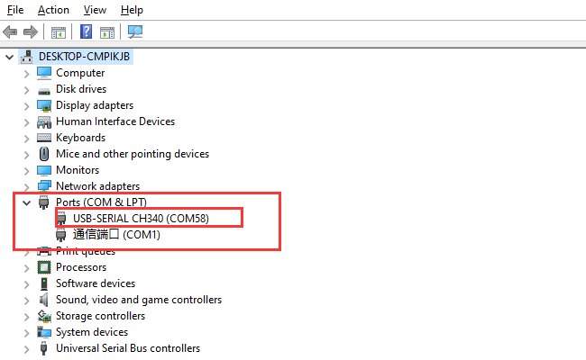
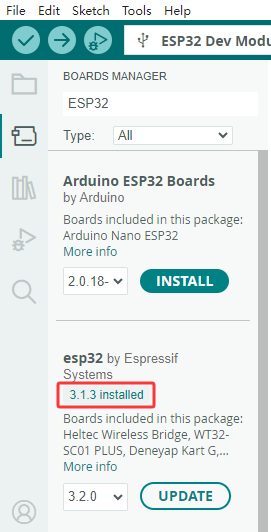
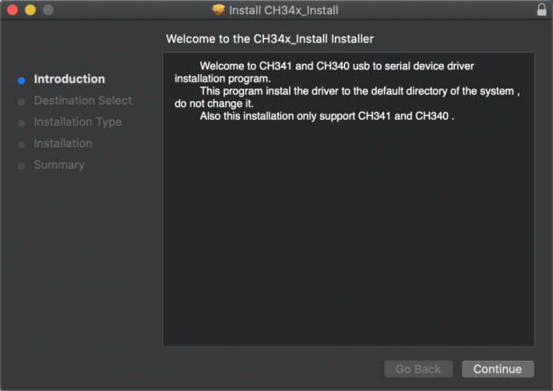
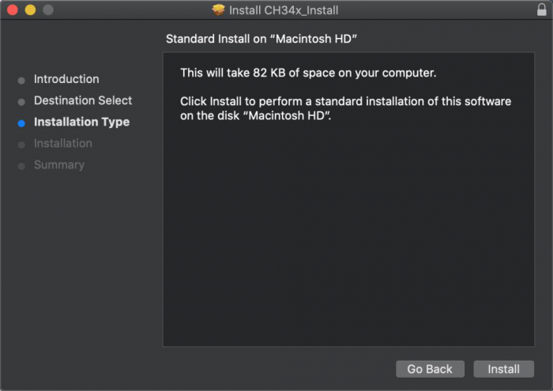
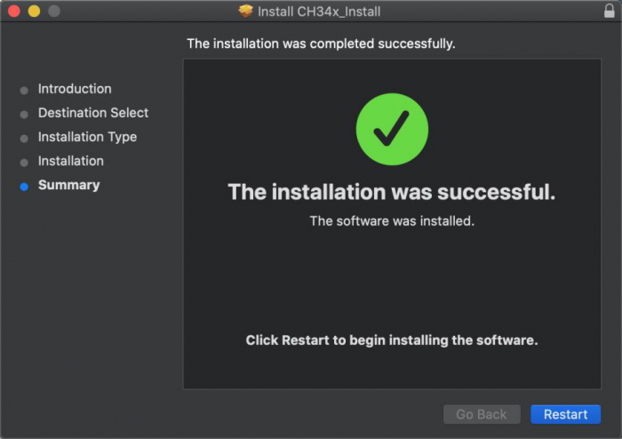
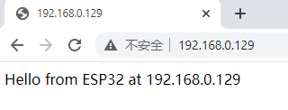

.. _5-arduino-tutorial:

5. Arduino Tutorial
===================

.. _51-resource-compression-package:

5.1 Resource compression package
--------------------------------

The resource package contains Code, Libraries, APP and Driver files. You
must have this resourse to continue learing.

:download:`Resource compression package <./Resource-compression-package.7z>`

.. _52-getting-started-with-arduino:

5.2 Getting started with Arduino
--------------------------------

.. _521-esp32-plus-development-board:

5.2.1 ESP32 PLUS Development board
~~~~~~~~~~~~~~~~~~~~~~~~~~~~~~~~~~

|image1|

ESP32PLUS is a universal WIFI plus Bluetooth development board based on
ESP32, integrated with ESP32-WOROOM-32 module and compatible with
Arduino.

It has a hall sensor, high-speed SDIO/SPI, UART, I2S as well as I2C.
Furthermore, equipped with freeRTOS operating system, which is quite
suitable for the Internet of things and smart home.

|image2|

.. _522-windows-system:

5.2.2 Windows System
~~~~~~~~~~~~~~~~~~~~

|image3|

.. _1-installing-arduino-ide:

1 Installing Arduino IDE
^^^^^^^^^^^^^^^^^^^^^^^^

When you get control board, you need to download Arduino IDE and driver
firstly.

You could download Arduino IDE from the official website:
https://www.arduino.cc/, click the **SOFTWARE** on the browse bar to
enter download page, as shown below:

|image4|

⚠️ **Special reminder:** If you cannot find the Arduino IDE in the
software on the aforementioned official website, you can click on this
link：\ https://www.arduino.cc/en/software to directly access the
Arduino IDE download page.

There are various versions of IDE for Arduino. Just download a version
compatible with your system. Here we will show you how to download and
install the windows version of Arduino IDE.

|image5|

You can choose between the Installer (.exe) and the Zip packages. We
suggest you use the first one that installs directly everything you need
to use the Arduino Software (IDE), including the drivers. With the Zip
package you need to install the drivers manually. The Zip file is also
useful if you want to create a portable installation.

|image6|

You just need to click JUST DOWNLOAD.

.. _2-install-a-driver:

2 Install a driver
^^^^^^^^^^^^^^^^^^

⚠️ **Special reminder: If you have installed the CH340 driver, just skip
it.**

Connect the main control board to your computer with a USB cable, and
the driver will be installed automatically on MacOS and Windows10
system. If the driver installation process fails, you need to install
the driver manually.

(1) Check whether the computer automatically installs the driver:

Right click Computer----- Click Properties-----Click Device Manager, the
following picture shows the successful installation:

|image7|

(2) Manual installation:

Right-click “\ **USB2.0-Serial**\ ” and click “\ **Update drive...**\ ”

|image8|

Click “\ **Browse my computer for driver software**\ ”

|image9|

Click“\ **Browse...**\ ”and select the“\ **usb_ch341_3.1.2009.06
folder**\ ”.

|image10|

Check the serial port connection status again, as shown in the following
figure, the driver is successfully installed.

|image11|

.. _3-add-the-esp32-environmentadd-version-310:

3 Add the ESP32 Environment(add version 3.1.0)
^^^^^^^^^^^^^^^^^^^^^^^^^^^^^^^^^^^^^^^^^^^^^^

（1）Open the arduino IDE，click File > Preferences，as shown below:

|image12|

（2）Copy the
link：\ ``https://espressif.github.io/arduino-esp32/package_esp32_index.json``
.

（3）Open the button marked below:

|image13|

(4) Paste it inside and click OK, as shown below

|image14|

|Img|

(5) Click Tools > Board > Boards Manager

|image15|

(6) Find the ESP32 from the pop up Boards Manager and then click
install. (add version 3.1.3)!!!Very important

|image16|

(7) Click Tools > Board >esp32 to choose the ESP32 Dev Module.

|image17|

.. _4-arduino-ide-setting:

4 Arduino IDE Setting
^^^^^^^^^^^^^^^^^^^^^

Click |image18| icon，open Arduino IDE.

|image19|

To avoid the errors when uploading the program to the board, you need to
select the correct Arduino board that matches the board connected to
your computer.

Then come back to the Arduino software, you should click Tools→Board,
select the board. (as shown below)

|image20|

Then select the correct COM port (you can see the corresponding COM port
after the driver is successfully installed)

|image21|

Before uploading the program to the board, let’s demonstrate the
function of each symbol in the Arduino IDE toolbar.

|image22|

1- Used to verify whether there is any compiling mistakes or not.

2- Used to upload the sketch to your ESP32 board.

3- Used to send the serial data received from board to the serial
plottle.

4- Used to send the serial data received from board to the serial
monitor.

.. _523-mac-system:

5.2.3 Mac System
~~~~~~~~~~~~~~~~

|image23|

.. _1-download-arduino-ide:

1 Download Arduino IDE
^^^^^^^^^^^^^^^^^^^^^^

|image24|

.. _2-download-the-ch340-driver:

2 Download the CH340 driver
^^^^^^^^^^^^^^^^^^^^^^^^^^^

We provide,please go to 5.1 resourse pack to get

|image-20250408105719588|

.. _3-how-to-install-the-ch340-driver:

3 How to install the CH340 driver
^^^^^^^^^^^^^^^^^^^^^^^^^^^^^^^^^

After the download, seen as below:

|image25|

Double-click installation package and tap Continue

|image26|

Click Install

|image27|

Input your user password and click Install Software

|image28|

Tap Continue Installation

|image29|

Wait to install

|image30|

Click Restart after the installation is finished

|image31|

.. _4-arduino-ide-setting-1:

4 Arduino IDE Setting:
^^^^^^^^^^^^^^^^^^^^^^

Except for COM ports, the setting method is the same as in chapter 1.4:

|image32|

.. _53-how-to-add-libraries:

5.3 How to Add Libraries?
-------------------------

.. _531-what-are-libraries-:

5.3.1 What are Libraries ?
~~~~~~~~~~~~~~~~~~~~~~~~~~

`Libraries <https://www.arduino.cc/en/Reference/Libraries>`__ are a
collection of code that makes it easy for you to drive a sensor,display,
module, etc.

For example, the built-in LiquidCrystal library helps talk to LCD
displays. There are hundreds of additional libraries available on the
Internet for download.

The built-in libraries and some of these additional libraries are listed
in the reference.

https://www.arduino.cc/en/Reference/Libraries

.. _532-add-zip-libraries:

5.3.2 Add ZIP Libraries
~~~~~~~~~~~~~~~~~~~~~~~

When you want to add a zip library, you need to download it as a ZIP
file, put in the proper directory. The Libraries needed to run the Smart
Home can be found on：

|image33|

Click Sketch---->Include Library—>Add.ZIP Library，then Then navigate to
the library file you downloaded and click "open."

|image34|

|image-20250329140352208|

Import the library. You can find it in the include library list.

|image35|

.. _54-arduino-projects:

5.4 Arduino Projects
--------------------

Code is provided for all projects and is available in the 5.1 resource
pack

|image-20250408110257525|

Alright, let’s get straight to our projects. We will make you know the
smart home deeply from the simple sensor.

**Note: In this course, the interface of each sensor / module marked
with (G,-, GND) indicates the negative pole, G is connected to G, - or
GND of sensor shield or control board; “V” is positive pole and
connected with V, VCC or 5V.**

.. _541-project-11-led-blink:

5.4.1 Project 1.1 LED Blink
~~~~~~~~~~~~~~~~~~~~~~~~~~~

.. _1-description:

**1 Description**
^^^^^^^^^^^^^^^^^

|image-20230927115910677|

We’ve installed the driver of ESP32 PLUS development board.

In the first lesson, we will conduct an experiment to make LED blink.

Let’s connect GND and VCC to power. The LED will be on when signal end S
is high level, on the contrary, LED will turn off when signal end S is
low level.

In addition, the different blinking frequency can be presented by
adjusting the delayed time.

.. _2-working-principle:

**2 Working Principle**
^^^^^^^^^^^^^^^^^^^^^^^

LED is also the light-emitting diode, which can be made into an
electronic module. It will shine if we control pins to output high
level, otherwise it will be off.

.. _3-parameters:

**3 Parameters**
^^^^^^^^^^^^^^^^

=============== =======
Working voltage DC 3~5V
=============== =======
Working current <20mA
Power           0.1W
=============== =======

.. _4-control-pin:

**4 Control Pin**
^^^^^^^^^^^^^^^^^

========== ==
Yellow LED 12
========== ==
\          
========== ==

.. _5-test-code:

**5 Test Code**
^^^^^^^^^^^^^^^

.. code:: c

   #define led_y 12  //Define the yellow led pin to 12

   void setup() {    //The code inside the setup function runs only once
     pinMode(led_y, OUTPUT);  //Set pin to output mode
   }

   void loop() {     //The code inside the loop function will always run in a loop
     digitalWrite(led_y, HIGH);  //Light up the LED
     delay(200);     //Delay statement, in ms
     digitalWrite(led_y, LOW);   //Close the LED
     delay(200);
   }

.. _6test-result:

**6.Test Result**
^^^^^^^^^^^^^^^^^

After uploading the code , you can see white and yellow LEDs flashing
together.

.. _542-project-12-breathing-led:

5.4.2 Project 1.2 Breathing LED
~~~~~~~~~~~~~~~~~~~~~~~~~~~~~~~

.. _1-description-1:

**1. Description**
^^^^^^^^^^^^^^^^^^

A“breathing LED”is a phenomenon where an LED's brightness smoothly
changes from dark to bright and back to dark, continuing to do so and
giving the illusion of an LED“breathing. However, how to control LED’s
brightness?

It makes sense to take advantage of PWM. Output the number of high level
and low level in unit time, the more time the high level occupies, the
larger the PWM value, the brighter the LED.

|image36|

We provide the PWM output library file < analogwrite.h > for ESP32,
therefore solely a simple statement analogWrite(); can control the PWM
output.

.. _2-test-code:

**2. Test Code**
^^^^^^^^^^^^^^^^

.. code:: c

   #include <Arduino.h>
   #define led_y 12    // Define LED pin

   void setup()
   {
     pinMode(led_y, OUTPUT);  // Set pin as output mode
   }

   void loop()
   {
     for(int i = 0; i < 255; i++)  // For loop: increment variable i until it reaches 255
     {
       analogWrite(led_y, i);  // PWM output to control LED brightness
       delay(3);
     }
     
     for(int i = 255; i > 0; i--)  // For loop: decrement variable i until it reaches 0
     {
       analogWrite(led_y, i);
       delay(3);
     }
   }

.. _3-test-result:

**3. Test Result**
^^^^^^^^^^^^^^^^^^

The LED gradually gets dimmer then brighter, cyclically, like human
breathe.

.. _543-project-21-read-the-button:

5.4.3 Project 2.1 Read the Button
~~~~~~~~~~~~~~~~~~~~~~~~~~~~~~~~~

.. _1-description-2:

**1. Description**
^^^^^^^^^^^^^^^^^^

The common table lamp uses LED lights and buttons, which can control the
light on and off pressing the button.

We will work to read the status value of the button and display it on
the serial monitor, so as to see it intuitively.

.. _2-button-principle:

**2. Button Principle**
^^^^^^^^^^^^^^^^^^^^^^^

The button module is a digital sensor, which can only read 0 or 1. When
the module is not pressed, it is in a high level state, that is, 1, when
pressed, it is a low level 0.

|image37|

.. _3-pins-of-the-button:

**3. Pins of the Button**
^^^^^^^^^^^^^^^^^^^^^^^^^

======== ==
Button 1 16
======== ==
Button 2 27
======== ==

.. _4-test-code:

**4. Test Code**
^^^^^^^^^^^^^^^^

.. code:: c

   #define btn1 16
   #define btn2 27

   void setup() {
     Serial.begin(9600);
     pinMode(btn1, INPUT);
     pinMode(btn2, INPUT);
   }

   void loop() {
     boolean btn1_val = digitalRead(btn1);
     boolean btn2_val = digitalRead(btn2);
     Serial.print("button1 = ");
     Serial.print(btn1_val);
     Serial.print("   ");
     Serial.print("button2 = ");
     Serial.println(btn2_val);
     delay(100);
   }

.. _5-test-result:

**5. Test Result**
^^^^^^^^^^^^^^^^^^

Open the serial monitor of the arduino IDE

|image38|

Press the button again to see the change of the button state value, as
shown below:

|image39|

.. _544-project-22-table-lamp:

5.4.4 Project 2.2. Table Lamp
~~~~~~~~~~~~~~~~~~~~~~~~~~~~~

.. _1-description-3:

**1. Description**
^^^^^^^^^^^^^^^^^^

For common simple table lamp, click the button it will be opened, click
it again, the lamp will be closed.

.. _2-test-code-1:

**2. Test Code**
^^^^^^^^^^^^^^^^

Calculate the clicked button times and take the remainder of 2, you can
get 0 or 1 two state values.

.. code:: c

   #define btn1 16
   #define led_y 12
   int btn_count = 0; // Counter for button presses

   void setup() 
   {
     Serial.begin(9600);
     pinMode(btn1, INPUT);
     pinMode(led_y, OUTPUT);
   }

   void loop() 
   {
     boolean btn1_val = digitalRead(btn1);
     if(btn1_val == 0) // If button is pressed
     {
       delay(10);  // 10ms delay for debouncing
       if(btn1_val == 0) // Confirm button is still pressed
       {
         boolean btn_state = 1;
         while(btn_state == 1) // Loop until button is released
         {
           boolean btn_val = digitalRead(btn1);
           if(btn_val == 1)  // If button is released
           {
             btn_count++;    // Increment press counter
             Serial.println(btn_count);
             btn_state = 0;  // Exit loop
           }
         }
       }
       boolean value = btn_count % 2; // Modulo operation (0 or 1)
       if(value == 1)
       {
         digitalWrite(led_y, HIGH); // Turn LED on
       }
       else
       {
         digitalWrite(led_y, LOW); // Turn LED off
       }
     }
   }

.. _3-test-result-1:

**3. Test Result**
^^^^^^^^^^^^^^^^^^

Open the serial monitor and print out the clicked button times, then
click the button once, the LED will be on, click it again, it will be
off.

|image40|

.. _545-project-31-read-the-pir-motion-sensor:

5.4.5 Project 3.1 Read the PIR Motion Sensor
~~~~~~~~~~~~~~~~~~~~~~~~~~~~~~~~~~~~~~~~~~~~

|image41|

.. _1-description-4:

**1. Description**
^^^^^^^^^^^^^^^^^^

The PIR motion sensor has many application scenarios in daily life, such
as automatic induction lamp of stairs, automatic induction faucet of
washbasin, etc.

It is also a digital sensor like buttons, which has two state

values 0 or 1. And it will be sensed when people are moving.

We will print out the value of the PIR motion sensor through the serial
monitor.

.. _2-control-pin:

**2. Control Pin**
^^^^^^^^^^^^^^^^^^

================= ==
PIR motion sensor 14
================= ==
\                 
================= ==

.. _3-test-code:

**3. Test Code**
^^^^^^^^^^^^^^^^

.. code:: c

   #define pyroelectric 14

   void setup() {
     Serial.begin(9600);
     pinMode(pyroelectric, INPUT);
   }

   void loop() {
     boolean pyroelectric_val = digitalRead(pyroelectric);
     Serial.print("pyroelectric value = ");
     Serial.println(pyroelectric_val);
     delay(200);
   }

.. _4-test-result:

**4. Test Result**
^^^^^^^^^^^^^^^^^^

When you stand still in front of the sensor, the reading value is 0,
move a little, it will change to 1.

|image42|

.. _546-project-32-pir-motion-sensor:

5.4.6 Project 3.2 PIR Motion Sensor
~~~~~~~~~~~~~~~~~~~~~~~~~~~~~~~~~~~

If someone moves in front of the sensor, the LED will light up.

.. _1-test-code:

**1. Test Code**
^^^^^^^^^^^^^^^^

.. code:: c

   #define pyroelectric 14
   #define led_y 12  // Yellow LED pin definition

   void setup() 
   {
     Serial.begin(9600);
     pinMode(pyroelectric, INPUT);
     pinMode(led_y, OUTPUT);  // Set pin as output mode
   }

   void loop() 
   {
     boolean pyroelectric_val = digitalRead(pyroelectric);
     
     Serial.print("pyroelectric value = ");
     Serial.println(pyroelectric_val);
     
     delay(200);
     
     if(pyroelectric_val == 1)
     {
       digitalWrite(led_y, HIGH);  // Turn LED on when motion detected
     }
     else
     {
       digitalWrite(led_y, LOW);   // Turn LED off when no motion
     }
   }

.. _2-test-result:

**2. Test Result**
^^^^^^^^^^^^^^^^^^

Move your hand in front of the sensor, the LED will turn on. After 5s of
immobility, the LED lights will turn off.

.. _547-project-41-play-happy-birthday:

5.4.7 Project 4.1 Play Happy Birthday
~~~~~~~~~~~~~~~~~~~~~~~~~~~~~~~~~~~~~

|image43|

.. _1-description-5:

**1. Description**
^^^^^^^^^^^^^^^^^^

There is a audio power amplifier element in the car expansion board,
which is as an external amplification equipment to play music.

In this project, we will work to play a piece of music by using it.

.. _2-component-knowledge:

**2. Component Knowledge**
^^^^^^^^^^^^^^^^^^^^^^^^^^

**Passive Buzzer:** The audio power amplifier (like the passive buzzer)
does not have internal oscillation. When controlling, we need to input
square waves of different frequencies to the positive pole of the
component and ground the negative pole to control the power amplifier to
chime sounds of different frequencies.

.. _3-control-pin:

**3. Control Pin**
^^^^^^^^^^^^^^^^^^

============== ==
Passive Buzzer 25
============== ==
\              
============== ==

.. _4-test-code-1:

**4. Test Code**
^^^^^^^^^^^^^^^^

.. code:: c

   #include <BuzzerESP32.h>

   BuzzerESP32 buzzer(25); // Initialize buzzer on GPIO25

   void setup() 
   {
     buzzer.setTimbre(30); // Set timbre (sound quality)
     birthday();          // Play birthday melody
   }

   void loop() 
   {
     // Empty loop as melody plays only once at startup
   }

   void birthday() 
   {
     // Play birthday melody - parameters are (frequency, duration)
     buzzer.playTone(294, 250);  // D4
     buzzer.playTone(440, 250);  // A4
     buzzer.playTone(392, 250);  // G4
     buzzer.playTone(532, 250);  // C5 (slightly sharp)
     buzzer.playTone(494, 250);  // B4
     buzzer.playTone(392, 250);  // G4
     buzzer.playTone(440, 250);  // A4
     buzzer.playTone(392, 250);  // G4
     buzzer.playTone(587, 250);  // D5
     buzzer.playTone(532, 250);  // C5 (slightly sharp)
     buzzer.playTone(392, 250);  // G4
     buzzer.playTone(784, 250);  // G5
     buzzer.playTone(659, 250);  // E5
     buzzer.playTone(532, 250);  // C5 (slightly sharp)
     buzzer.playTone(494, 250);  // B4
     buzzer.playTone(440, 250);  // A4
     buzzer.playTone(698, 250);  // F5
     buzzer.playTone(659, 250);  // E5
     buzzer.playTone(532, 250);  // C5 (slightly sharp)
     buzzer.playTone(587, 250);  // D5
     buzzer.playTone(532, 500);  // C5 (slightly sharp) - longer duration
     buzzer.playTone(0, 0);      // Turn off buzzer
   }

.. _5-test-result-1:

**5. Test Result**
^^^^^^^^^^^^^^^^^^

The passive buzzer will play happy Birthday.

.. _548-project-42-music-box:

5.4.8 Project 4.2 Music Box
~~~~~~~~~~~~~~~~~~~~~~~~~~~

we will make a music box and switch tunes by pressing buttons.

.. _1-test-code-1:

**1. Test Code**
^^^^^^^^^^^^^^^^

.. code:: c

   #include <musicESP32_home.h>   
   music Music(25);  // Initialize music player on GPIO25
   #define btn1 16    // Button pin
   int btn_count = 0; // Counter for button presses
   boolean music_flag = 0; // Flag to trigger music playback

   void setup() 
   {
     Serial.begin(9600);
     pinMode(btn1, INPUT);
     // Available music options:
     // Music.tetris();
     // Music.birthday();
     // Music.Ode_to_Joy();
     // Music.christmas();
     // Music.star_war_tone();
   }

   void loop() 
   {
     boolean btn1_val = digitalRead(btn1);
     
     if(btn1_val == 0) // If button is pressed
     {
       delay(10);  // 10ms delay for debouncing
       
       if(btn1_val == 0) // Confirm button is still pressed
       {
         boolean btn_state = 1;
         
         while(btn_state == 1) // Wait until button is released
         {
           boolean btn_val = digitalRead(btn1);
           
           if(btn_val == 1)  // If button is released
           {
             music_flag = 1;
             btn_count++;    // Increment press counter
             Serial.println(btn_count);
             
             // Cycle through 1-3 count
             if(btn_count == 4)
             {
               btn_count = 1;
             }
             
             // Play different song based on press count
             switch(btn_count)
             {
               case 1: 
                 if(music_flag == 1)
                 {
                   Music.Ode_to_Joy();
                   music_flag=0;
                 } 
                 break;
                 
               case 2: 
                 if(music_flag == 1)
                 {
                   Music.christmas();
                   music_flag=0;
                 } 
                 break;
                 
               case 3: 
                 if(music_flag == 1)
                 {
                   Music.tetris();
                   music_flag=0;
                 } 
                 break;
             }
             
             btn_state = 0;  // Exit wait loop
           }
         }
       }
     }
   }

.. _2-test-result-1:

**2. Test Result**
^^^^^^^^^^^^^^^^^^

Click button 1 once, it will play a Tetris, then click it again, it will
play *Ode to Joy*, after playing, click the button 1 for the third time,
it will play Christmas.

.. _549-project-51-control-the-door:

5.4.9 Project 5.1 Control the Door
~~~~~~~~~~~~~~~~~~~~~~~~~~~~~~~~~~

.. _1-description-6:

**1. Description**
^^^^^^^^^^^^^^^^^^

Automatic doors and windows need power device, which will become more
automatic with a 180 degree servo and some sensors. Adding a raindrop
sensor, you can achieve the effect of closing windows automatically when
raining. If adding a RFID, we can realize the effect of swiping to open
the door and so on.

.. _2-component-knowledge-1:

**2. Component Knowledge**
^^^^^^^^^^^^^^^^^^^^^^^^^^

**Servo:** Servo is a position servo driver device consists of a
housing, a circuit board, a coreless motor, a gear and a position
detector.

Its working principle is that the servo receives the signal sent by MCU
or receiver and produces a reference signal with a period of 20ms and
width of 1.5ms, then compares the acquired DC bias voltage to the
voltage of the potentiometer and obtain the voltage difference output.

The IC on the circuit board judges the direction of rotation, and then
drives the coreless motor to start rotation. The power is transmitted to
the swing arm through the reduction gear, and the signal is sent back by
the position detector to judge whether the positioning has been reached,
which is suitable for those control systems that require constant angle
change and can be maintained.

When the motor speed is constant, the potentiometer is driven to rotate
through the cascade reduction gear, which leads that the voltage
difference is 0, and the motor stops rotating. Generally, the angle
range of servo rotation is 0° --180 °.

The pulse period of the control servo is 20ms, the pulse width is 0.5ms
~ 2.5ms, and the corresponding position is -90°~ +90°. Here is an
example of a 180° servo:

|image44|

In general, servo has three lines in brown, red and orange. The brown
wire is grounded, the red one is a positive pole line and the orange one
is a signal line.

|image45|

|image46|

.. _3-pin:

**3. Pin**
^^^^^^^^^^

======================= ==
The servo of the window 5
======================= ==
The servo of the door   13
======================= ==

.. _4-test-code-2:

**4. Test Code**
^^^^^^^^^^^^^^^^

.. code:: c

   #include <ESP32Servo.h>
   Servo myservo;  // create servo object to control a servo
                   // 16 servo objects can be created on the ESP32
                   
   int pos = 0;    // variable to store the servo position
   // Recommended PWM GPIO pins on the ESP32 include 2,4,12-19,21-23,25-27,32-33 
   int servoPin = 13;
                   
   void setup() {
       // Allow allocation of all timers
       ESP32PWM::allocateTimer(0);
       ESP32PWM::allocateTimer(1);
       ESP32PWM::allocateTimer(2);
       ESP32PWM::allocateTimer(3);
       myservo.setPeriodHertz(50);    // standard 50 hz servo
       myservo.attach(servoPin, 1000, 2000); // attaches the servo on pin 18 to the servo object
       // using default min/max of 1000us and 2000us
       // different servos may require different min/max settings
       // for an accurate 0 to 180 sweep

   }

   void loop() {
       for (pos = 0; pos <= 180; pos += 1) { // goes from 0 degrees to 180 degrees
           // in steps of 1 degree
           myservo.write(pos);    // tell servo to go to position in variable 'pos'
           delay(15);             // waits 15ms for the servo to reach the position
       }
       for (pos = 180; pos >= 0; pos -= 1) { // goes from 180 degrees to 0 degrees
           myservo.write(pos);    // tell servo to go to position in variable 'pos'
           delay(15);             // waits 15ms for the servo to reach the position
       }

   }

.. _5-test-result-2:

**5. Test Result**
^^^^^^^^^^^^^^^^^^

The servo of the door turns with the door, back and forth

.. _5410-project-52-close-the-window:

5.4.10 Project 5.2 Close the Window
~~~~~~~~~~~~~~~~~~~~~~~~~~~~~~~~~~~

.. _1-description-7:

**1. Description**
^^^^^^^^^^^^^^^^^^

We will work to use a servo and a raindrop sensor to make an device
closing windows automatically when raining.

.. _2-component-knowledge-2:

**2. Component Knowledge**
^^^^^^^^^^^^^^^^^^^^^^^^^^

**Raindrop Sensor:** This is an analog input module, the greater the
area covered by water on the detection surface, the greater the value
returned (range 0~4096).

.. _3-test-code-1:

**3. Test Code**
^^^^^^^^^^^^^^^^

.. code:: c

   #include <ESP32Servo.h>

   #define servoPin 5
   #define waterPin 34
   Servo myservo;

   void setup() {
     Serial.begin(9600);
     pinMode(waterPin, INPUT);

       // Allow allocation of all timers
       ESP32PWM::allocateTimer(0);
       ESP32PWM::allocateTimer(1);
       ESP32PWM::allocateTimer(2);
       ESP32PWM::allocateTimer(3);
       myservo.setPeriodHertz(50);    // standard 50 hz servo
       myservo.attach(servoPin, 1000, 2000); // attaches the servo on pin 18 to the servo object
       // using default min/max of 1000us and 2000us
       // different servos may require different min/max settings
       // for an accurate 0 to 180 sweep

     delay(200);
   }

   void loop() {
     int water_val = analogRead(waterPin);
     Serial.println(water_val);
     if(water_val > 1500) {
       myservo.write(0);
       delay(200);
     }
     else {
       myservo.write(176);
       delay(200);
     }
   }

.. _4-test-result-1:

**4. Test Result**
^^^^^^^^^^^^^^^^^^

At first, the window opens automatically, and when you touch the
raindrop sensor with your hand (which has water on the skin), the window
will close.

.. _5411-project-61-control-sk6812:

5.4.11 Project 6.1 Control SK6812
~~~~~~~~~~~~~~~~~~~~~~~~~~~~~~~~~

.. _1-description-8:

**1. Description**
^^^^^^^^^^^^^^^^^^

The atmosphere lamp of smart home is 4 SK6812RGB LEDs. RGB LED belongs
to a simple luminous module, which can adjust the color to bring out the
lamp effect of different colors. Furthermore, it can be widely used in
buildings, bridges, roads, gardens, courtyards, floors and other fields
of decorative lighting and venue layout, Christmas, Halloween,
Valentine's Day, Easter, National Day as well as other festivals during
the atmosphere and other scenes.

In this experiment, we will make various lighting effects.

.. _2-component-knowledge-3:

**2. Component Knowledge**
^^^^^^^^^^^^^^^^^^^^^^^^^^

From the schematic diagram, we can see that these four RGB LEDs are all
connected in series. In fact, no matter how many they are, we can use a
pin to control a RGB LED and let it display any color. Each RGBLED is an
independent pixel, composed of R, G and B colors, which can achieve 256
levels of brightness display and complete the full true color display of
16777216 colors.

What’s more, the pixel point contains a data latch signal shaping
amplifier drive circuit and a signal shaping circuit, which effectively
ensures the color of the pixel point light is highly consistent.

|image47|

|image48|

.. _3-pin-1:

**3. Pin**
^^^^^^^^^^

====== ==
SK6812 26
====== ==
\      
====== ==

.. _4-test-code-3:

**4. Test Code**
^^^^^^^^^^^^^^^^

::

   #include <Adafruit_NeoPixel.h>
   #ifdef __AVR__
    #include <avr/power.h>                              // Required for 16 MHz Adafruit Trinket
   #endif
   #define LED_PIN    26                                // Which pin on the Arduino is connected to the NeoPixels?
   #define LED_COUNT 4                                  // How many NeoPixels are attached to the Arduino?
   Adafruit_NeoPixel strip(LED_COUNT, LED_PIN, NEO_GRB + NEO_KHZ800); // Declare our NeoPixel strip object:

   void setup() {
   #if defined(__AVR_ATtiny85__) && (F_CPU == 16000000)
     clock_prescale_set(clock_div_1);                   // These lines are specifically to support the Adafruit Trinket 5V 16 MHz.
   #endif
     strip.begin();                                     // INITIALIZE NeoPixel strip object (REQUIRED)
     strip.show();                                      // Turn OFF all pixels ASAP
     strip.setBrightness(50);                           // Set BRIGHTNESS to about 1/5 (max = 255)
   }

   void loop() {
     colorWipe(strip.Color(255,   0,   0), 50);         // Red
     colorWipe(strip.Color(  0, 255,   0), 50);         // Green
     colorWipe(strip.Color(  0,   0, 255), 50);         // Blue

     theaterChase(strip.Color(127, 127, 127), 50);      // White, half brightness
     theaterChase(strip.Color(127,   0,   0), 50);      // Red, half brightness
     theaterChase(strip.Color(  0,   0, 127), 50);      // Blue, half brightness

     rainbow(10);                                       // Flowing rainbow cycle along the whole strip
     theaterChaseRainbow(50);                           // Rainbow-enhanced theaterChase variant
   }

   void colorWipe(uint32_t color, int wait) {
     for(int i=0; i<strip.numPixels(); i++) {           // For each pixel in strip...
       strip.setPixelColor(i, color);                   // Set pixel's color (in RAM)
       strip.show();                                    // Update strip to match
       delay(wait);                                     // Pause for a moment
     }
   }

   void theaterChase(uint32_t color, int wait) {
     for(int a=0; a<10; a++) {                         // Repeat 10 times...
       for(int b=0; b<3; b++) {                        // 'b' counts from 0 to 2...
         strip.clear();                                // Set all pixels in RAM to 0 (off)
         for(int c=b; c<strip.numPixels(); c += 3) {    // 'c' counts up from 'b' to end of strip in steps of 3...
           strip.setPixelColor(c, color);               // Set pixel 'c' to value 'color'
         }
         strip.show();                                 // Update strip with new contents
         delay(wait);                                  // Pause for a moment
       }
     }
   }

   void rainbow(int wait) {
     for(long firstPixelHue = 0; firstPixelHue < 5*65536; firstPixelHue += 256) {
       for(int i=0; i<strip.numPixels(); i++) {        // For each pixel in strip...
         int pixelHue = firstPixelHue + (i * 65536L / strip.numPixels());
         strip.setPixelColor(i, strip.gamma32(strip.ColorHSV(pixelHue)));
       }
       strip.show();                                   // Update strip with new contents
       delay(wait);                                   // Pause for a moment
     }
   }

   void theaterChaseRainbow(int wait) {
     int firstPixelHue = 0;                           // First pixel starts at red (hue 0)
     for(int a=0; a<30; a++) {                        // Repeat 30 times...
       for(int b=0; b<3; b++) {                       // 'b' counts from 0 to 2...
         strip.clear();                               // Set all pixels in RAM to 0 (off)
         for(int c=b; c<strip.numPixels(); c += 3) {  // 'c' counts up from 'b' to end of strip in increments of 3...
           int      hue   = firstPixelHue + c * 65536L / strip.numPixels();
           uint32_t color = strip.gamma32(strip.ColorHSV(hue)); // hue -> RGB
           strip.setPixelColor(c, color);             // Set pixel 'c' to value 'color'
         }
         strip.show();                               // Update strip with new contents
         delay(wait);                               // Pause for a moment
         firstPixelHue += 65536 / 90;               // One cycle of color wheel over 90 frames
       }
     }
   }

.. _5-test-result-3:

**5. Test Result**
^^^^^^^^^^^^^^^^^^

The atmosphere lamps of the smart home will display a variety of colors
and light effects.

.. _5412-project-62-button:

5.4.12 Project 6.2 Button
~~~~~~~~~~~~~~~~~~~~~~~~~

.. _1-description-9:

**1. Description**
^^^^^^^^^^^^^^^^^^

There are two buttons to switch the color of the atmosphere lamp.

.. _2-test-code-2:

**2. Test Code**
^^^^^^^^^^^^^^^^

::

   #define btn1 16    // Button 1 pin
   #define btn2 27    // Button 2 pin

   #include <Adafruit_NeoPixel.h>
   #ifdef __AVR__
    #include <avr/power.h> // Required for 16 MHz Adafruit Trinket
   #endif

   #define LED_PIN    26    // NeoPixel data pin
   #define LED_COUNT 4      // Number of NeoPixels
   Adafruit_NeoPixel strip(LED_COUNT, LED_PIN, NEO_GRB + NEO_KHZ800);

   int btn_count = 0; // Counter for button presses

   void setup() 
   {
     Serial.begin(9600);
     pinMode(btn1, INPUT);
     pinMode(btn2, INPUT);
     
     #if defined(__AVR_ATtiny85__) && (F_CPU == 16000000)
       clock_prescale_set(clock_div_1);
     #endif

     strip.begin();           // Initialize NeoPixel strip
     strip.show();            // Turn off all pixels
     strip.setBrightness(50); // Set brightness (max 255)
   }

   void loop() 
   {
     boolean btn1_val = digitalRead(btn1);
     boolean btn2_val = digitalRead(btn2);
     
     // Button 1 (Decrement) handling
     if(btn1_val == 0) // If button is pressed
     {
       delay(10);  // Debounce delay
       if(btn1_val == 0) // Confirm button press
       {
         boolean btn_state = 1;
         while(btn_state == 1) // Wait for button release
         {
           boolean btn_val = digitalRead(btn1);
           if(btn_val == 1)  // If button released
           {
             btn_count--;    // Decrement counter
             if(btn_count <= 0) // Limit minimum value
             {
               btn_count = 0;
             }
             Serial.println(btn_count);
             btn_state = 0;  // Exit loop
           }
         }
       }
     }
       
     // Button 2 (Increment) handling  
     if(btn2_val == 0) // If button is pressed
     {
       delay(10);  // Debounce delay
       if(btn2_val == 0) // Confirm button press
       {
         boolean btn_state2 = 1;
         while(btn_state2 == 1) // Wait for button release
         {
           boolean btn2_val = digitalRead(btn2);
           if(btn2_val == 1)  // If button released
           {
             btn_count++;    // Increment counter
             if(btn_count >= 6) // Limit maximum value
             {
               btn_count = 6;
             }
             Serial.println(btn_count);
             btn_state2 = 0;  // Exit loop
           }
         }
       }
     }

     // Change LED color based on button count
     switch(btn_count)
     {
       case 0: colorWipe(strip.Color(0,   0,   0), 50); break;    // Off
       case 1: colorWipe(strip.Color(255,  0,   0), 50); break;   // Red
       case 2: colorWipe(strip.Color(0,   255,   0), 50); break;  // Green
       case 3: colorWipe(strip.Color(0,   0,   255), 50); break;  // Blue
       case 4: colorWipe(strip.Color(255, 255,   0), 50); break;  // Yellow
       case 5: colorWipe(strip.Color(255, 0,   255), 50); break;  // Magenta
       case 6: colorWipe(strip.Color(255, 255, 255), 50); break;  // White
     }
   }

   // Fill strip with one color
   void colorWipe(uint32_t color, int wait) 
   {
     for(int i=0; i<strip.numPixels(); i++) 
     { 
       strip.setPixelColor(i, color); // Set pixel color
       strip.show();                  // Update strip
       delay(wait);                   // Pause
     }
   }

.. _3-test-result-2:

**3. Test Result**
^^^^^^^^^^^^^^^^^^

We can switch the color of the atmosphere lamp by clicking buttons 1 and
2.

.. _5413-project-71-control-the-fan:

5.4.13 Project 7.1 Control the Fan
~~~~~~~~~~~~~~~~~~~~~~~~~~~~~~~~~~

.. _1-description-10:

**1. Description**
^^^^^^^^^^^^^^^^^^

In this project, we will learn how to make a small fan.

.. _2-component-knowledge-4:

**2. Component Knowledge**
^^^^^^^^^^^^^^^^^^^^^^^^^^

The small fan uses a 130 DC motor and safe fan blades. You can use PWM
output to control the fan speed.

|image49|

.. _3-control-method:

**3. Control Method**
^^^^^^^^^^^^^^^^^^^^^

Two pins are required to control the motor of the fan, one for INA and
two for INB. The PWM value range is 0~255. When the PWM output of the
two pins is different, the fan can rotate.

================== ====================
INA - INB <= -45   Rotate clockwise
================== ====================
INA - INB >= 45    Rotate anticlockwise
INA == 0, INB == 0 Stop
================== ====================

.. _4-control-pins:

**4. Control Pins**
^^^^^^^^^^^^^^^^^^^

=== ==
INA 19
=== ==
INB 18
=== ==

.. _5-test-code-1:

**5. Test Code**
^^^^^^^^^^^^^^^^

.. code:: c

   #define fanPin1 19
   #define fanPin2 18

   void setup() {
     pinMode(fanPin1, OUTPUT);
     pinMode(fanPin2, OUTPUT);
   }

   void loop() {
     digitalWrite(fanPin1, LOW); //pwm = 0
     analogWrite(fanPin2, 180);
     delay(3000);
     digitalWrite(fanPin1, LOW);
     digitalWrite(fanPin2, LOW);
     delay(1000);
     digitalWrite(fanPin1, HIGH); //pwm = 255
     analogWrite(fanPin2, 210);
     delay(3000);
     digitalWrite(fanPin1, LOW);
     digitalWrite(fanPin2, LOW);
     delay(1000);

   }

.. _6-test-result:

**6. Test Result**
^^^^^^^^^^^^^^^^^^

The fan will rotate clockwise and anticlockwise at different speeds.

.. _5414-project-72-switch-on-or-off-the-fan:

5.4.14 Project 7.2 Switch On or Off the Fan
~~~~~~~~~~~~~~~~~~~~~~~~~~~~~~~~~~~~~~~~~~~

One button switches the fan on and the other button controls the speed
of the fan.

.. _1-test-code-2:

**1. Test Code**
^^^^^^^^^^^^^^^^

.. code:: c

   #define fanPin1 19    // Fan control pin 1
   #define fanPin2 18    // Fan control pin 2
   #define btn1 16       // Button 1 pin
   #define btn2 27       // Button 2 pin

   int btn_count = 0;    // Counter for button 1 presses
   int btn_count2 = 0;   // Counter for button 2 presses
   int speed_val = 130;  // Initial fan speed (PWM value)

   void setup() {
     Serial.begin(9600);
     pinMode(btn1, INPUT);
     pinMode(btn2, INPUT);
     pinMode(fanPin1, OUTPUT);
     pinMode(fanPin2, OUTPUT);
   }

   void loop() {
     boolean btn1_val = digitalRead(btn1);
     
     // Button 1 (Power/Speed Control) handling
     if(btn1_val == 0) // If button is pressed
     {
       delay(10);  // Debounce delay
       if(btn1_val == 0) // Confirm button press
       {
         boolean btn_state = 1;
         while(btn_state == 1) // Wait for button release
         {
           boolean btn_val = digitalRead(btn1);
           if(btn_val == 1)  // If button released
           {
             btn_count++;    // Increment press counter
             Serial.println(btn_count);
             btn_state = 0;  // Exit loop
           }
         }
       }
       
       boolean power_state = btn_count % 2; // Toggle power state (0 or 1)
       
       while(power_state == 1) // While fan is on
       {
         digitalWrite(fanPin1, LOW);  // Set direction
         analogWrite(fanPin2, speed_val); // Set speed
         
         // Button 2 (Speed Adjustment) handling
         boolean btn2_val = digitalRead(btn2);
         if(btn2_val == 0) // If speed button pressed
         {
           delay(10); // Debounce delay
           if(btn2_val == 0) // Confirm press
           {
             boolean btn_state2 = 1;
             while(btn_state2 == 1) // Wait for release
             {
               boolean btn2_val = digitalRead(btn2);
               if(btn2_val == 1) // If released
               {
                 btn_count2++; // Increment speed level
                 if(btn_count2 > 3) // Cycle through 1-3
                 {
                   btn_count2 = 1;
                 }
                 
                 // Set speed based on count
                 switch(btn_count2)
                 {
                   case 1: 
                     speed_val = 130; // Low speed
                     Serial.println(speed_val);
                     break;
                   case 2: 
                     speed_val = 180; // Medium speed
                     Serial.println(speed_val);
                     break;
                   case 3: 
                     speed_val = 230; // High speed
                     Serial.println(speed_val);
                     break;
                 }
                 btn_state2 = 0;
               }
             }
           }
         }
         
         // Check for power off
         btn1_val = digitalRead(btn1);
         if(btn1_val == 0) // If power button pressed
         {
           delay(10); // Debounce delay
           if(btn1_val == 0) // Confirm press
           {
             digitalWrite(fanPin1, LOW); // Stop fan
             analogWrite(fanPin2, 0);
             power_state = 0;  // Exit fan control loop
           }
         }
       }
     }
   }

.. _2-test-result-2:

**2. Test Result**
^^^^^^^^^^^^^^^^^^

Click button 1, the fan starts to rotate, click button 2, the speed can
be adjusted(there are three different speeds), press the button 1 again,
the fan stops.

.. _5415-project-81-display-characters:

5.4.15 Project 8.1 Display Characters
~~~~~~~~~~~~~~~~~~~~~~~~~~~~~~~~~~~~~

.. _1-description-11:

**1. Description**
^^^^^^^^^^^^^^^^^^

As we all know, screen is one of the best ways for people to interact
with electronic devices.

.. _2-component-knowledge-5:

**2. Component Knowledge**
^^^^^^^^^^^^^^^^^^^^^^^^^^

1602 is a line that can display 16 characters. There are two lines,
which use IIC communication protocol.

|image50|

.. _3-control-pins:

**3. Control Pins**
^^^^^^^^^^^^^^^^^^^

=== ===
SDA SDA
=== ===
SCL SCL
=== ===

.. _4-test-code-4:

**4. Test Code**
^^^^^^^^^^^^^^^^

.. code:: c

   #include <Wire.h>
   #include <LiquidCrystal_I2C.h>
   LiquidCrystal_I2C mylcd(0x27,16,2);

   void setup(){
     mylcd.init();
     mylcd.backlight();
   }

   void loop(){
     mylcd.setCursor(0, 0);
     mylcd.print("hello");
     mylcd.setCursor(0, 1);
     mylcd.print("keyestudio");
     //mylcd.clear();
   }

.. _5-test-result-4:

**5. Test Result**
^^^^^^^^^^^^^^^^^^

The first line of the LCD1602 shows hello and the second line shows
keyestudio.

.. _5416-project-82-dangerous-gas-alarm:

5.4.16 Project 8.2 Dangerous Gas Alarm
~~~~~~~~~~~~~~~~~~~~~~~~~~~~~~~~~~~~~~

.. _1-description-12:

**1. Description**
^^^^^^^^^^^^^^^^^^

When a gas sensor detects a high concentration of dangerous gas, the
buzzer will sound an alarm and the display will show dangerous.

.. _2-component-knowledge-6:

**2. Component Knowledge**
^^^^^^^^^^^^^^^^^^^^^^^^^^

**MQ2 Smoke Sensor**: It is a gas leak monitoring device for homes and
factories, which is suitable for liquefied gas, benzene, alkyl, alcohol,
hydrogen as well as smoke detection. Our sensor leads to digital pin D
and analog output pin A, which is connected to D as a digital sensor in
this project.

|image51|

.. _3-test-code-2:

**3. Test Code**
^^^^^^^^^^^^^^^^

.. code:: c

   #include <Wire.h>
   #include <LiquidCrystal_I2C.h>

   // Initialize LCD with I2C address 0x27, 16 columns and 2 rows
   LiquidCrystal_I2C mylcd(0x27, 16, 2);

   #define gasPin 23    // Gas sensor input pin
   #define buzPin 25    // Buzzer output pin

   // State flags for LCD display updates
   boolean dangerDisplayed = 1;
   boolean safetyDisplayed = 1;

   void setup() {
     Serial.begin(9600);
     
     // Initialize LCD
     mylcd.init();
     mylcd.backlight();
     
     // Set pin modes
     pinMode(buzPin, OUTPUT);
     pinMode(gasPin, INPUT);
     
     // Display initial message
     mylcd.setCursor(0, 0);
     mylcd.print("safety");
   }

   void loop() {
     boolean gasVal = digitalRead(gasPin);  // Read gas sensor value
     Serial.println(gasVal);
     
     if(gasVal == 0)  // If dangerous gas detected
     {
       while(dangerDisplayed == 1)  // Update display if needed
       {
         mylcd.clear();
         mylcd.setCursor(0, 0);
         mylcd.print("dangerous");
         dangerDisplayed = 0;
         safetyDisplayed = 1;
       }
       
       // Sound alarm buzzer (short pulses)
       digitalWrite(buzPin, HIGH);
       delay(1);
       digitalWrite(buzPin, LOW);
       delay(1);
     }
     else  // No dangerous gas detected
     {
       digitalWrite(buzPin, LOW);  // Ensure buzzer is off
       
       while(safetyDisplayed == 1)  // Update display if needed
       {
         mylcd.clear();
         mylcd.setCursor(0, 0);
         mylcd.print("safety");
         dangerDisplayed = 1;
         safetyDisplayed = 0;
       }
     }
   }

.. _4-test-result-2:

**4. Test Result**
^^^^^^^^^^^^^^^^^^

The screen displays "safety" in normal state. However, when the gas
sensor detects some dangerous gases, such as carbon monoxide, at a
certain concentration, the buzzer will sound an alarm and the screen
displays "dangerous".

.. _5417-project-9-temperature-and-humidity-tester:

5.4.17 Project 9 Temperature and Humidity Tester
~~~~~~~~~~~~~~~~~~~~~~~~~~~~~~~~~~~~~~~~~~~~~~~~

.. _1-component-knowledge:

**1. Component Knowledge**
^^^^^^^^^^^^^^^^^^^^^^^^^^

Its communication mode is serial data and single bus. The temperature
measurement range is -20 ~ +60℃, accuracy is ±2℃. However, the humidity
range is 5 ~ 95%RH, the accuracy is ±5%RH.

|image52|

.. _2-control-pin-1:

**2. Control Pin**
^^^^^^^^^^^^^^^^^^

=============================== ==
Temperature and Humidity Sensor 17
=============================== ==
\                               
=============================== ==

.. _3-test-code-3:

**3. Test Code**
^^^^^^^^^^^^^^^^

.. code:: c

   #include <Wire.h>
   #include <LiquidCrystal_I2C.h>
   LiquidCrystal_I2C mylcd(0x27,16,2);
   #include <dht11.h>

   // Define the pin constants
   const int DHT11PIN = 17; // Temperature and humidity sensor pin
   dht11 DHT11; // Initialize dht11

   void setup() {
     Serial.begin(9600);//Start the serial monitor and set the baud rate to 9600
     mylcd.init();
     mylcd.backlight();
     mylcd.clear();
   }

   void loop() {
      //Define two temperature and humidity values
      int Temperature;
      int Humidity;
      //Obtain data
      int chk = DHT11.read(DHT11PIN); 
      Temperature = DHT11.temperature;
      Humidity = DHT11.humidity;
      // Display the temperature information at the corresponding position on the LCD
      mylcd.setCursor(0, 0);
      mylcd.print("Temp:");
      mylcd.setCursor(5, 0);
      mylcd.print(Temperature); 
      mylcd.setCursor(8, 0);
      mylcd.print("C");
      // Display humidity information at the corresponding position on the LCD
      mylcd.setCursor(0, 1);
      mylcd.print("Hum:");
      mylcd.setCursor(5, 1);
      mylcd.print(Humidity);
      mylcd.setCursor(8, 1);
      mylcd.print("%RH");
      delay(500);
   }

.. _4-test-result-3:

**4. Test Result**
^^^^^^^^^^^^^^^^^^

The LCD1602 displays the temperature (T = \*\* C) and humidity (H = \*\*
%RH). When you breathe into the T/H sensor, you can see that the
humidity rises.

.. _5418-project-10-open-the-door:

5.4.18 Project 10 Open the Door
~~~~~~~~~~~~~~~~~~~~~~~~~~~~~~~

.. _1-component-knowledge-1:

**1. Component Knowledge**
^^^^^^^^^^^^^^^^^^^^^^^^^^

Radio frequency identification, the card reader is composed of a radio
frequency module and a high-level magnetic field. The Tag transponder is
a sensing device, which doesn’t contain a battery. It only contains tiny
integrated circuit chips and media for storing data and antennas for
receiving and transmitting signals.

To read the data in the tag, first put it into the reading range of the
card reader. The reader will generate a magnetic field, which can
produce electricity according to Lenz's law, then the RFID tag will
supply power, thereby activating the device.

|image53|

.. _2-control-pins:

**2. Control Pins**
^^^^^^^^^^^^^^^^^^^

Use IIC communication

=== ===
SDA SDA
=== ===
SCL SCL
=== ===

.. _3-test-code-4:

**3. Test Code**
^^^^^^^^^^^^^^^^

.. code:: c

   //**********************************************************************************
   /*  
    * Filename    : RFID
    * Description : RFID reader UID
    * Auther      : http//www.keyestudio.com
   */
   #include <Wire.h>
   #include <LiquidCrystal_I2C.h>
   LiquidCrystal_I2C mylcd(0x27,16,2);
   #include <ESP32Servo.h>
   Servo myservo;
   #include <Wire.h>
   #include "MFRC522_I2C.h"
   // IIC pins default to GPIO21 and GPIO22 of ESP32
   // 0x28 is the i2c address of SDA, if doesn't match，please check your address with i2c.
   MFRC522 mfrc522(0x28);   // create MFRC522.
   #define servoPin  13
   #define btnPin 16
   boolean btnFlag = 0;

   String password = "";

   void setup() {
     Serial.begin(115200);           // initialize and PC's serial communication
     mylcd.init();
     mylcd.backlight();
     Wire.begin();                   // initialize I2C
     mfrc522.PCD_Init();             // initialize MFRC522
     ShowReaderDetails();            // dispaly PCD - MFRC522 read carder
     Serial.println(F("Scan PICC to see UID, type, and data blocks..."));

       // Allow allocation of all timers
       ESP32PWM::allocateTimer(0);
       ESP32PWM::allocateTimer(1);
       ESP32PWM::allocateTimer(2);
       ESP32PWM::allocateTimer(3);
       myservo.setPeriodHertz(50);    // standard 50 hz servo
       myservo.attach(servoPin, 1000, 2000); // attaches the servo on pin 18 to the servo object
       // using default min/max of 1000us and 2000us
       // different servos may require different min/max settings
       // for an accurate 0 to 180 sweep

     mylcd.setCursor(0, 0);
     mylcd.print("Card");
   }

   void loop() {
     // 
     if ( ! mfrc522.PICC_IsNewCardPresent() || ! mfrc522.PICC_ReadCardSerial() ) {
       delay(50);
       password = "";
       if(btnFlag == 1)
       {
         boolean btnVal = digitalRead(btnPin);
         if(btnVal == 0)  //If door close button is pressed (active-low)
         {
           Serial.println("close");
           mylcd.setCursor(0, 0);
           mylcd.print("close");
           myservo.write(0);
           btnFlag = 0;
         }
       }
       return;
     }
     
     // select one of door cards. UID and SAK are mfrc522.uid.
     
     // save UID
     Serial.print(F("Card UID:"));
     for (byte i = 0; i < mfrc522.uid.size; i++) {
       Serial.print(mfrc522.uid.uidByte[i] < 0x10 ? " 0" : " ");
       //Serial.print(mfrc522.uid.uidByte[i], HEX);
       Serial.print(mfrc522.uid.uidByte[i]);
       password = password + String(mfrc522.uid.uidByte[i]);
     }
     if(password == "")  //Card number is correct,open the door
     {
       Serial.println("open");
       mylcd.setCursor(0, 0);
       mylcd.clear();
       mylcd.print("open");
       myservo.write(180);
       password = "";
       btnFlag = 1;
     }
     else   //Card number error,dispaly error
     {
       password = "";
       mylcd.setCursor(0, 0);
       mylcd.print("error");
     }
     //Serial.println(password);
   }

   void ShowReaderDetails() {
     //  attain the MFRC522 software
     byte v = mfrc522.PCD_ReadRegister(mfrc522.VersionReg);
     Serial.print(F("MFRC522 Software Version: 0x"));
     Serial.print(v, HEX);
     if (v == 0x91)
       Serial.print(F(" = v1.0"));
     else if (v == 0x92)
       Serial.print(F(" = v2.0"));
     else
       Serial.print(F(" (unknown)"));
     Serial.println("");
     // when returning to 0x00 or 0xFF, may fail to transmit communication signals
     if ((v == 0x00) || (v == 0xFF)) {
       Serial.println(F("WARNING: Communication failure, is the MFRC522 properly connected?"));
     }
   }
   //**********************************************************************************

.. _4-test-result-4:

**4. Test Result**
^^^^^^^^^^^^^^^^^^

Upload the code, display "Card" on the LCD1602, open the serial monitor,
and set the baud rate to "115200".

Close the provided card to the RFID induction area, display "error" on
the LCD1602,but the serial monitor output is as shown in the figure:

|image54|

Input the "Card UID" from the image into the position shown in the
figure (remove spaces in "Card UID" and in the serial monitor's **Card
UID**, remove leading **0** only if it appears **before any digits**
(e.g., ``" 0123"`` → ``"123"``), but keep **0** if it follows a number
(e.g., ``"601"`` remains ``"601"``).):

|image55|

Upload the code,close the provided card to the RFID induction area,the
door will turn and open, and LCD1602 shows "open".

Click button 1 and the door turns and closes. However, when swiping
another blue induction block, the LCD1602 shows "Error".

.. _5419-project-11-morse-code-open-the-door:

5.4.19 Project 11 Morse Code Open the Door
~~~~~~~~~~~~~~~~~~~~~~~~~~~~~~~~~~~~~~~~~~

Morse code, also known as Morse password, is an on-again, off-again
signal code that expresses different letters, numbers, and punctuation
marks in different sequences. Now we use it as our password gate.

The Morse code corresponds to the following characters:

|image56|

.. _1-description-13:

**1. Description**
^^^^^^^^^^^^^^^^^^

We use |image57|\ as the correct password. What’s more, there is a
button library file OneButton, which is very simple to click, double
click, long press and other functions. For Morse password, click is“.”,
long press and release is “-”.

.. _2-test-code-3:

**2. Test Code**
^^^^^^^^^^^^^^^^

.. code:: c

   #include <Wire.h>
   #include <LiquidCrystal_I2C.h>
   LiquidCrystal_I2C mylcd(0x27,16,2);
   #include "OneButton.h"
   // Setup a new OneButton on pin 16.  
   OneButton button1(16, true);
   // Setup a new OneButton on pin 27.  
   OneButton button2(27, true);
   #include <ESP32Servo.h>
   Servo myservo;
   int servoPin = 13;
   String password = "";
   String correct_p = "-.-";  //password

   // setup code here, to run once:
   void setup() {
     Serial.begin(115200);
     mylcd.init();
     mylcd.backlight();
     // link the button 1 functions.
     button1.attachClick(click1);
     button1.attachLongPressStop(longPressStop1);
     // link the button 2 functions.
     button2.attachClick(click2);
     button2.attachLongPressStop(longPressStop2);

       // Allow allocation of all timers
       ESP32PWM::allocateTimer(0);
       ESP32PWM::allocateTimer(1);
       ESP32PWM::allocateTimer(2);
       ESP32PWM::allocateTimer(3);
       myservo.setPeriodHertz(50);    // standard 50 hz servo
       myservo.attach(servoPin, 1000, 2000); // attaches the servo on pin 18 to the servo object
       // using default min/max of 1000us and 2000us
       // different servos may require different min/max settings
       // for an accurate 0 to 180 sweep
     
     mylcd.setCursor(0, 0);
     mylcd.print("Enter password");
   }

   void loop() {
     // keep watching the push buttons:
     button1.tick();
     button2.tick();
     delay(10);
   }

   // ----- button 1 callback functions
   // This function will be called when the button1 was pressed 1 time (and no 2. button press followed).
   void click1() {
     Serial.print(".");
     password = password + '.';
     mylcd.setCursor(0, 1);
     mylcd.print(password);
   } // click1

   // This function will be called once, when the button1 is released after beeing pressed for a long time.
   void longPressStop1() {
     Serial.print("-");
     password = password + '-';
     mylcd.setCursor(0, 1);
     mylcd.print(password);
   } // longPressStop1

   // ... and the same for button 2:
   void click2() {
     Serial.println(password);
     if(password == correct_p)
     {
       myservo.write(180);  //open the door if the password correct
       mylcd.clear();
       mylcd.setCursor(0, 0);
       mylcd.print("open");
     }
     else
     {
       mylcd.clear();
       mylcd.setCursor(0, 0);
       mylcd.print("error");
       delay(2000);
       mylcd.clear();
       mylcd.setCursor(0, 0);
       mylcd.print("input again");
     }
     password = "";
   } // click2

   void longPressStop2() {
     //Serial.println("Button 2 longPress stop");
      myservo.write(0);  //open door
      mylcd.clear();
      mylcd.setCursor(0, 0);
      mylcd.print("close");
   } // longPressStop2

.. _3-test-result-3:

**3. Test Result**
^^^^^^^^^^^^^^^^^^

At first, the LCD1602 displays "Enter password", then click or long
press button 1 to tap the password. If we input the correct password
"-.-", then click button 2, the door will open, and the LCD1602 will
display "open".

If other incorrect passwords are entered, the door will not move, the
LCD1602 will display “error” and then “enter again” 2s later.
Furthermore, long press button 2 can close the door.

.. _5420-project-121-wifi-test:

5.4.20 Project 12.1 wifi test
~~~~~~~~~~~~~~~~~~~~~~~~~~~~~

The easiest way to access the Internet is to use a WiFi to connect. The
ESP32 main control board comes with a WiFi module, making our smart home
accessible to the Internet easily.

|image58|

.. _1-description-14:

**1. Description**
^^^^^^^^^^^^^^^^^^

We connect the smart home to a LAN, which is the WiFi in your home or
the hot spot of your phone. After the connection is successful, an
address will be assigned, which can be used for communication. We will
print the assigned address in the serial monitor.

.. _2-test-code-4:

**2. Test Code**
^^^^^^^^^^^^^^^^

⚠️ \ **ATTENTION:**\  After opening the code file, you need to modify
the WiFi name and passwords that the ESP32 development board needs to
connect to. Replace ``ChinaNet-2.4G-0DF0`` and ``ChinaNet@233`` with
your own WiFi name and password respectively. You must do this before
uploading the code; otherwise, the ESP32 board will not be able to
connect to the network.

.. code:: c

   const char* ssid = "ChinaNet-2.4G-0DF0";  // Enter your own WiFi name
   const char* password = "ChinaNet@233"; // Enter your own WiFi passwords

⚠️ **NOTE: Please ensure that the WiFi name and passwords in the code
are the same as the network connected to your computer, mobile
phone/tablet, ESP32 development board and router. They must be within
the same local area network (WiFi).**

⚠️ **NOTE: The WiFi must be on a 2.4Ghz frequency; otherwise, the ESP32
cannot connect to WiFi.**

.. code:: c

   #include <Arduino.h>
   #include <WiFi.h>
   #include <ESPmDNS.h>
   #include <WiFiClient.h>

   // Network Configuration
   const char* ssid = "ChinaNet-2.4G-0DF0";
   const char* password = "ChinaNet@233";
   WiFiServer server(80);

   // Global Variables
   String requestPath = "/";  // Stores the HTTP request path

   void setup() {
     Serial.begin(115200);
     
     // Connect to WiFi
     Serial.println("\nConnecting to WiFi...");
     WiFi.begin(ssid, password);
     
     while (WiFi.status() != WL_CONNECTED) {
       delay(500);
       Serial.print(".");
     }
     
     // Network information
     Serial.println("\nWiFi connected");
     printNetworkInfo();
     
     // Start server and mDNS
     server.begin();
     if (!MDNS.begin("esp32")) {
       Serial.println("Error setting up MDNS responder!");
     }
     MDNS.addService("http", "tcp", 80);
     Serial.println("HTTP server started");
   }

   void loop() {
     WiFiClient client = server.available();
     
     if (!client) {
       return;
     }
     
     // Wait for client data
     while (client.connected() && !client.available()) {
       delay(1);
     }
     
     // Read HTTP request
     String request = client.readStringUntil('\r');
     parseHttpRequest(request);
     
     // Handle request
     String response;
     if (requestPath == "/") {
       response = buildHomepageResponse();
       Serial.println("Serving homepage");
     } else {
       response = buildNotFoundResponse();
       Serial.println("Unknown request: " + requestPath);
     }
     
     // Send HTTP response
     client.println(response);
     client.stop();
     
     // Small delay between requests
     delay(100);
   }

   // Helper Functions
   void printNetworkInfo() {
     Serial.print("SSID: ");
     Serial.println(WiFi.SSID());
     Serial.print("IP Address: ");
     Serial.println(WiFi.localIP());
   }

   void parseHttpRequest(String req) {
     int addr_start = req.indexOf(' ');
     int addr_end = req.indexOf(' ', addr_start + 1);
     
     if (addr_start == -1 || addr_end == -1) {
       Serial.print("Invalid request: ");
       Serial.println(req);
       requestPath = "/404";
       return;
     }
     
     requestPath = req.substring(addr_start + 1, addr_end);
     Serial.println("Requested path: " + requestPath);
   }

   String buildHomepageResponse() {
     IPAddress ip = WiFi.localIP();
     String ipStr = String(ip[0]) + '.' + ip[1] + '.' + ip[2] + '.' + ip[3];
     
     String html = "HTTP/1.1 200 OK\r\n";
     html += "Content-Type: text/html\r\n";
     html += "Connection: close\r\n";
     html += "\r\n";
     html += "<!DOCTYPE HTML>\n";
     html += "<html><head><title>ESP32 Web Server</title></head>\n";
     html += "<body><h1>Hello from ESP32</h1>\n";
     html += "
IP Address: " + ipStr + "
\n";
     html += "</body></html>\n";
     
     return html;
   }

   String buildNotFoundResponse() {
     String html = "HTTP/1.1 404 Not Found\r\n";
     html += "Content-Type: text/html\r\n";
     html += "Connection: close\r\n";
     html += "\r\n";
     html += "<!DOCTYPE HTML>\n";
     html += "<html><head><title>404 Not Found</title></head>\n";
     html += "<body><h1>404</h1>
Page not found
</body></html>\n";
     
     return html;
   }

.. _3-test-result-4:

**3. Test Result**
^^^^^^^^^^^^^^^^^^

⚠️ **Note: The mobile phone or tablet must be connected to the ESP32
development board via the same WiFi. Otherwise, it will not be able to
access the control page. Also, when the ESP32 development board uses the
WiFi function, it consumes a lot of power. An external DC power supply
is required to meet its power demand for operation. If the power demand
is not met, the ESP32 board will keep resetting, resulting in the code
not running normally.**

If the WiFi is connected successfully, the serial monitor will print out
the assigned IP address.

|image59|

Open a browser to access the IP address, then we will read the contents
of the string S sent out by the client.println(s); in the code.

|image60|

.. _5421-project-122-wifi-control-led-and-fan:

5.4.21 Project 12.2 WiFi Control LED and Fan
~~~~~~~~~~~~~~~~~~~~~~~~~~~~~~~~~~~~~~~~~~~~

.. _1-description-15:

**1. Description**
^^^^^^^^^^^^^^^^^^

In this project, we will learn how to realize different functions of the
smart home through accessing different strings under the address. There
is a LCD screen that can print out the IP address, which is much more
convenient.

.. _2-test-code-5:

**2. Test Code**
^^^^^^^^^^^^^^^^

⚠️ \ **ATTENTION:**\  After opening the code file, you need to modify
the WiFi name and passwords that the ESP32 development board needs to
connect to. Replace ``ChinaNet-2.4G-0DF0`` and ``ChinaNet@233`` with
your own WiFi name and password respectively. You must do this before
uploading the code; otherwise, the ESP32 board will not be able to
connect to the network.

.. code:: c

   const char* ssid = "ChinaNet-2.4G-0DF0";  // Enter your own WiFi name
   const char* password = "ChinaNet@233"; // Enter your own WiFi passwords

⚠️ **NOTE: Please ensure that the WiFi name and passwords in the code
are the same as the network connected to your computer, mobile
phone/tablet, ESP32 development board and router. They must be within
the same local area network (WiFi).**

⚠️ **NOTE: The WiFi must be on a 2.4Ghz frequency; otherwise, the ESP32
cannot connect to WiFi.**

.. code:: c

   #include <Arduino.h>
   #include <WiFi.h>
   #include <ESPmDNS.h>
   #include <WiFiClient.h>

   String item = "0";
   const char* ssid = "ChinaNet-2.4G-0DF0";
   const char* password = "ChinaNet@233";
   WiFiServer server(80);

   #include <Wire.h>
   #include <LiquidCrystal_I2C.h>
   LiquidCrystal_I2C mylcd(0x27,16,2);
   //#include <analogWrite.h>
   #define fanPin1 19
   #define fanPin2 18
   #define led_y 12  //Define yellow LED pin as 12

   void setup() {
     Serial.begin(115200);
     mylcd.init();
     mylcd.backlight();
     pinMode(led_y, OUTPUT);
     pinMode(fanPin1, OUTPUT);
     pinMode(fanPin2, OUTPUT);
     
     WiFi.begin(ssid, password);
     while (WiFi.status() != WL_CONNECTED) {
       delay(500);
       Serial.print(".");
     }
     Serial.println("");
     Serial.print("Connected to ");
     Serial.println(ssid);
     Serial.print("IP address: ");
     Serial.println(WiFi.localIP());
     server.begin();
     Serial.println("TCP server started");
     MDNS.addService("http", "tcp", 80);
     mylcd.setCursor(0, 0);
     mylcd.print("ip:");
     mylcd.setCursor(0, 1);
     mylcd.print(WiFi.localIP());  //LCD displays IP address
   }

   void loop() {
     WiFiClient client = server.available();
     if (!client) {
         return;
     }
     while(client.connected() && !client.available()){
         delay(1);
     }
     String req = client.readStringUntil('\r');
     int addr_start = req.indexOf(' ');
     int addr_end = req.indexOf(' ', addr_start + 1);
     if (addr_start == -1 || addr_end == -1) {
         Serial.print("Invalid request: ");
         Serial.println(req);
         return;
     }
     req = req.substring(addr_start + 1, addr_end);
     item=req;
     Serial.println(item);
     String s;
     if (req == "/")  //Browser can read the information sent by client.println(s) when accessing the address
     {
         IPAddress ip = WiFi.localIP();
         String ipStr = String(ip[0]) + '.' + String(ip[1]) + '.' + String(ip[2]) + '.' + String(ip[3]);
         s = "HTTP/1.1 200 OK\r\nContent-Type: text/html\r\n\r\n<!DOCTYPE HTML>\r\n<html>Hello from ESP32 at ";
         s += ipStr;
         s += "</html>\r\n\r\n";
         Serial.println("Sending 200");
         client.println(s);  //Send the content of string S. When accessing the E-smart home address using a browser, the information can be read.
     }
     if(req == "/led/on") //Browser accesses IP address/led/on
     {
       client.println("turn on the LED");
       digitalWrite(led_y, HIGH);
     }
     if(req == "/led/off") //Browser accesses IP address/led/off
     {
       client.println("turn off the LED");
       digitalWrite(led_y, LOW);
     }
     if(req == "/fan/on") //Browser accesses IP address/fan/on
     {
       client.println("turn on the fan");
       digitalWrite(fanPin1, LOW); //pwm = 0
       analogWrite(fanPin2, 180);
     }
     if(req == "/fan/off") //Browser accesses IP address/fan/on
     {
       client.println("turn off the fan");
       digitalWrite(fanPin1, LOW); //pwm = 0
       analogWrite(fanPin2, 0);
     }
     //client.print(s);
     client.stop();
   }

.. _3-test-result-5:

**3. Test Result**
^^^^^^^^^^^^^^^^^^

⚠️ **Note: The mobile phone or tablet must be connected to the ESP32
development board via the same WiFi. Otherwise, it will not be able to
access the control page. Also, when the ESP32 development board uses the
WiFi function, it consumes a lot of power. An external DC power supply
is required to meet its power demand for operation. If the power demand
is not met, the ESP32 board will keep resetting, resulting in the code
not running normally.**

If the smart home is successfully connected to WiFi, the LCD screen will
display the assigned address.

|image61|

Accessing address must add / led/on when using the browser, such as my
address is 192.168.0.129/ led/on. Then the smart home LED lights will be
turned on, if accessing 192.168.0.129/ led /off, then the LED lights
will be off.

|image62|

When the browser accesses 192.168.0.129/fan/ on, the fan of the smart
home will be turned on and at 192.168.0.129/fan/ off will be turned off.

|image63|

.. _5422-project-131-mobile-phone-app-test:

5.4.22 Project 13.1: Mobile Phone APP test
~~~~~~~~~~~~~~~~~~~~~~~~~~~~~~~~~~~~~~~~~~

.. _1-download-app:

**1. Download APP**
^^^^^^^^^^^^^^^^^^^

**Android APP：**

**Method One：** The Android apk installation package is available in
our resource pack, as shown below:

|image64|

You can transfer Android apk to your mobile phone via a USB cable, and
then install it.

**Method Two：** Download from Google play:

Please search for **keyes IoT home** on Google play to download it.

|image65|

**APP Interface**

|image66|

**Download iOS APP**

Please search for **keyes IoT home** on APP Store to download it.

|image67|

**APP Interface**

|image68|

.. _2-description:

**2. Description**
^^^^^^^^^^^^^^^^^^

We will use APP to control the smart home LED lights and fan switches.

.. _3-test-code-5:

**3. Test Code**
^^^^^^^^^^^^^^^^

⚠️ \ **ATTENTION:**\  After opening the code file, you need to modify
the WiFi name and passwords that the ESP32 development board needs to
connect to. Replace ``ChinaNet-2.4G-0DF0`` and ``ChinaNet@233`` with
your own WiFi name and password respectively. You must do this before
uploading the code; otherwise, the ESP32 board will not be able to
connect to the network.

.. code:: c

   const char* ssid = "ChinaNet-2.4G-0DF0";  // Enter your own WiFi name
   const char* pwd = "ChinaNet@233"; // Enter your own WiFi passwords

⚠️ **NOTE: Please ensure that the WiFi name and passwords in the code
are the same as the network connected to your computer, mobile
phone/tablet, ESP32 development board and router. They must be within
the same local area network (WiFi).**

⚠️ **NOTE: The WiFi must be on a 2.4Ghz frequency; otherwise, the ESP32
cannot connect to WiFi.**

.. code:: c

   #include <Arduino.h>
   #ifdef ESP32
   #include <WiFi.h>
   #elif defined(ESP8266)
   #include <ESP8266WiFi.h>
   #endif

   #include <LiquidCrystal_I2C.h>

   #define fanPin1 19 //IN+ pin
   #define fanPin2 18 //IN- pin
   #define led_y 12  //Define the yellow led pin as 12

   const char* ssid = "ChinaNet-2.4G-0DF0";
   const char* pwd = "ChinaNet@233";

   #include <Wire.h>
   //Initialize the LCD address, columns and rows
   LiquidCrystal_I2C lcd(0x27, 16, 2);

   WiFiServer server(80);  //Initialize the WiFi service

   //Define the variable as the detected value
   String request;

   unsigned long prevTask = 0;

   void setup() {
     Serial.begin(9600);
     //Connect to wifi
     WiFi.begin(ssid, pwd);
     //Determine whether it is connected
     Serial.println("Connecting to WiFi...");
     while (WiFi.status() != WL_CONNECTED) {
       delay(1000);
       Serial.print(".");
     }
     delay(1000);
     //The serial monitor will display the name and IP address of the wireless network
     Serial.println("Connected to WiFi");
     Serial.print("WiFi NAME:");
     Serial.println(ssid);
     Serial.print("IP:");
     Serial.println(WiFi.localIP());

     //Initialize the LCD
     lcd.init();
     //Turn on the LCD backlight
     lcd.backlight();
     //lcd.noBacklight();
     lcd.clear();
     //Set the position of the cursor
     lcd.setCursor(0, 0);
     //LCD printing
     lcd.print("IP:");
     //Set the position of the cursor
     lcd.setCursor(0, 1);
     //LCD printing
     lcd.print(WiFi.localIP());

     //Set pin modes
     pinMode(led_y, OUTPUT);
     pinMode(fanPin1, OUTPUT);
     pinMode(fanPin2, OUTPUT);
     //Start the service
     server.begin();
   }

   void loop() {
     //Check whether the client has been connected to the network server
     //When the client establishes a connection with the server, the "server.available()" function returns a WiFiClient object for client-side communication.
     WiFiClient client = server.available();
     if (client) {
       Serial.println("New client connected");
       while (client.connected()) {
         //Determine whether the server sends data
         if (client.available()) {
           request = client.readStringUntil('s');
           Serial.print("Received message: ");
           Serial.println(request);
         }

         //LED
         if (request == "a") {
           digitalWrite(led_y, HIGH);
         } else if (request == "A") {
           digitalWrite(led_y, LOW);
         }

         //fan
         if (request == "f") {
           digitalWrite(fanPin1, LOW); //pwm = 0
           analogWrite(fanPin2, 100); //LEDC channel 5 is bound to the specified left motor output PWM value as 100.
         } else if (request == "F") {
           digitalWrite(fanPin1, LOW); //pwm = 0
           analogWrite(fanPin2, 0); //LEDC channel 5 is bound to the specified left motor output PWM value as 0.
         }

         request = "";
       }
       Serial.println("Client disconnected");
     }
   }

.. _4-test-result-5:

**4. Test Result**
^^^^^^^^^^^^^^^^^^

⚠️ **Note: The mobile phone or tablet must be connected to the ESP32
development board via the same WiFi. Otherwise, it will not be able to
access the control page. Also, when the ESP32 development board uses the
WiFi function, it consumes a lot of power. An external DC power supply
is required to meet its power demand for operation. If the power demand
is not met, the ESP32 board will keep resetting, resulting in the code
not running normally.**

1. Open the APP and select WIFI

|image69|

2. APP controls LED and the fan

The mobile phone and the smart home must share the same WiFi, or the
smart home connects to the hotspot of the mobile phone.

APP input IP address (LCD1602 displays the assigned IP address), then
click connect, the connection is successful if ESP32 IP: 192.168.xx.xx
is displayed.

Next, you can click the LED, then the smart home LED will be turned on.
Click the fan button and the fan will be turned on, as shown below:

|image70|

.. _5423-project-132-iot-smart-home:

5.4.23 Project 13.2 IoT Smart Home
~~~~~~~~~~~~~~~~~~~~~~~~~~~~~~~~~~

.. _1-description-16:

**1. Description**
^^^^^^^^^^^^^^^^^^

The IOT smart home connects to the family WiFi through WiFi, and the
mobile phone used for operation should also be connected to the same
WiFi.

What’s more, the smart home also can connect to the hotspot of the
mobile phone. If the connection is successful, the LCD1602 will display
the IP address. Using the phone APP to input the corresponding IP for
communication is enable to realize the APP control of various functions
of the smart home.

.. _2-test-code-6:

**2. Test Code**
^^^^^^^^^^^^^^^^

⚠️ \ **ATTENTION:**\  After opening the code file, you need to modify
the WiFi name and passwords that the ESP32 development board needs to
connect to. Replace ``ChinaNet-2.4G-0DF0`` and ``ChinaNet@233`` with
your own WiFi name and password respectively. You must do this before
uploading the code; otherwise, the ESP32 board will not be able to
connect to the network.

.. code:: c

   const char* ssid = "ChinaNet-2.4G-0DF0";  // Enter your own WiFi name
   const char* pwd = "ChinaNet@233"; // Enter your own WiFi passwords

⚠️ **NOTE: Please ensure that the WiFi name and passwords in the code
are the same as the network connected to your computer, mobile
phone/tablet, ESP32 development board and router. They must be within
the same local area network (WiFi).**

⚠️ **NOTE: The WiFi must be on a 2.4Ghz frequency; otherwise, the ESP32
cannot connect to WiFi.**

::

   #include <Arduino.h>
   #ifdef ESP32
   #include <WiFi.h>
   #elif defined(ESP8266)
   #include <ESP8266WiFi.h>
   #endif

   #include <Wire.h>
   #include <Adafruit_NeoPixel.h>
   #define LED_PIN    26
   #define LED_COUNT 4     // Number of NeoPixels attached
   Adafruit_NeoPixel strip(LED_COUNT, LED_PIN, NEO_GRB + NEO_KHZ800);

   //Define the variable as the detected value
   String request;
   const char* ssid = "ChinaNet-2.4G-0DF0";
   const char* pwd = "ChinaNet@233";
   WiFiServer server(80);  //Initialize the WiFi service

   #include <LiquidCrystal_I2C.h>
   LiquidCrystal_I2C lcd(0x27,16,2);

   #include <dht11.h>
   #define DHT11PIN 17
   dht11 DHT11; // Initialize dht11

   #include <BuzzerESP32.h>
   #define buzzer_pin 25
   BuzzerESP32 buzzer(buzzer_pin);   // GPIO25

   #define waterPin 34
   #define fanPin1 19
   #define fanPin2 18
   #define led_y 12           // Yellow LED pin definition
   #define gasPin 23
   #define pyroelectric 14

   // Servo channels
   int channel_PWM1 = 13;
   int channel_PWM2 = 10;
   int freq_PWM = 50; 
   int resolution_PWM = 10;
   const int PWM_Pin1 = 5;
   const int PWM_Pin2 = 13;

   String dataBuffer = "4095,0,0,32,65";

   int Rainwater, gas, pir, t, h;  //Define variables
   unsigned long prevTask = 0;

   void setup() {
     Serial.begin(9600);
     //Connect to wifi
     WiFi.begin(ssid, pwd);
     //Determine whether it is connected
     Serial.println("Connecting to WiFi...");
     while (WiFi.status() != WL_CONNECTED) {
       delay(1000);
       Serial.print(".");
     }
     delay(1000);
     //The serial monitor will display the name and IP address of the wireless network
     Serial.println("Connected to WiFi");
     Serial.print("WiFi NAME:");
     Serial.println(ssid);
     Serial.print("IP:");
     Serial.println(WiFi.localIP());

     //Initialize LCD
     lcd.init();
     //Turn on the LCD backlight
     lcd.backlight();
     //lcd.noBacklight();
     lcd.clear();
     //Set the position of the cursor
     lcd.setCursor(0, 0);
     //LCD printing
     lcd.print("IP:");
     //Set the position of the cursor
     lcd.setCursor(0, 1);
     //LCD printing
     lcd.print(WiFi.localIP());

     pinMode(led_y, OUTPUT);
     pinMode(fanPin1, OUTPUT);
     pinMode(fanPin2, OUTPUT);
     pinMode(waterPin, INPUT);

     buzzer.setTimbre(30);                                  // Set timbre
     buzzer.playTone(0,0);                                  // Turn off buzzer

     pinMode(gasPin, INPUT);
     pinMode(pyroelectric, INPUT);

     ledcAttach(PWM_Pin1, freq_PWM, resolution_PWM);
     ledcAttachChannel(PWM_Pin1, freq_PWM, resolution_PWM, channel_PWM1);
     ledcAttach(PWM_Pin2, freq_PWM, resolution_PWM);
     ledcAttachChannel(PWM_Pin2, freq_PWM, resolution_PWM, channel_PWM2);
     ledcWrite(PWM_Pin1, 25);
     delay(500);
     ledcWrite(PWM_Pin2, 25);
     delay(500);
     //Start the service
     server.begin();
   }

   void loop() {
     //Check whether the client has been connected to the network server
     //When the client establishes a connection with the server, the "server.available()" function returns a WiFiClient object for client-side communication.
     WiFiClient client = server.available();
     if (client) {
       Serial.println("New client connected");
       while (client.connected()) {
         //Determine whether the server sends data
         if (client.available()) {
           request = client.readStringUntil('s');
           Serial.print("Received message: ");
           Serial.println(request);
         }
         //Obtain all sensor data
         getSensorsData();
         //Put all the data into "dataBuffer"
         dataBuffer = "";
         dataBuffer += String(Rainwater);
         dataBuffer += ",";
         dataBuffer += String(gas);
         dataBuffer += ",";
         dataBuffer += String(pir);
         dataBuffer += ",";
         dataBuffer += String(t);
         dataBuffer += ",";
         dataBuffer += String(h);
         //Send the data to the server and then transfer it to the application.
         if (millis() - prevTask >= 1000) {  // Execute every second
           prevTask = millis();
           client.print(dataBuffer);
         }

         delay(500);

         //LED
         if (request == "a") {
           digitalWrite(led_y, HIGH);
         } else if (request == "A") {
           digitalWrite(led_y, LOW);
         }

         //window servo
         if (request == "b") {
           ledcWrite(PWM_Pin1, 100); //The high level of 20ms is approximately 2.5ms, that is, 2.5/20*1024, and the servo rotates at the specified Angle.
           delay(500);
         } else if (request == "B") {
           ledcWrite(PWM_Pin1, 25);  //The high level of 20ms is approximately 0.5ms, that is, 0.5/20*1024, and the servo rotates at the specified Angle.
           delay(500);
         }

         //buzzer plays music
         if (request == "c") {
           birthday();
           buzzer.playTone(0,0);
         } else if (request == "C") {
           buzzer.playTone(0,0);
         }

         //The buzzer sounds
         if (request == "d") {
           buzzer.playTone(392,250);
         } else if (request == "D") {
           buzzer.playTone(0,0);
         }

         //door servo
         if (request == "e") {
           ledcWrite(PWM_Pin2, 120);
           delay(500);
         } else if (request == "E") {
           ledcWrite(PWM_Pin2, 25);
           delay(500);
         }
    
         //fan
         if (request == "f") {
           digitalWrite(fanPin2, LOW); //pwm = 0
           analogWrite(fanPin1, 100); //LEDC channel 5 is bound to the specified left motor output PWM value as 100.
         } else if (request == "F") {
           digitalWrite(fanPin2, LOW); //pwm = 0
           analogWrite(fanPin1, 0); //LEDC channel 5 is bound to the specified left motor output PWM value as 0.
         }

         //SK6812RGB turns on and off its red light
         if (request == "g") {
           colorWipe(strip.Color(255,   0,   0), 50);
         } else if (request == "G") {
           colorWipe(strip.Color(0,   0,   0), 50);
         }
    
         //SK6812RGB turns on and off its orange light
         if (request == "h") {
           colorWipe(strip.Color(200,   100,   0), 50);
         } else if (request == "H") {
           colorWipe(strip.Color(0,   0,   0), 50);
         }
    
         //SK6812RGB turns on and off its yellow light
         if (request == "i") {
           colorWipe(strip.Color(200,   200,   0), 50);
         } else if (request == "I") {
           colorWipe(strip.Color(0,   0,   0), 50);
         }

         //SK6812RGB turns on and off its green light
         if (request == "j") {
           colorWipe(strip.Color(0,   255,   0), 50);
         } else if (request == "J") {
           colorWipe(strip.Color(0,   0,   0), 50);
         }
    
         //SK6812RGB turns on and off its blue-green light
         if (request == "k") {
           colorWipe(strip.Color(0,   100,   255), 50);
         } else if (request == "K") {
           colorWipe(strip.Color(0,   0,   0), 50);
         }

         //SK6812RGB turns on and off its blue light
         if (request == "l") {
           colorWipe(strip.Color(0,   0,   255), 50);
         } else if (request == "L") {
           colorWipe(strip.Color(0,   0,   0), 50);
         }
    
         //SK6812RGB turns on and off its purple light
         if (request == "m") {
           colorWipe(strip.Color(100,   0,   255), 50);
         } else if (request == "M") {
           colorWipe(strip.Color(0,   0,   0), 50);
         }

         //SK6812RGB turns on and off its white light
         if (request == "n") {
           colorWipe(strip.Color(255,   255,   255), 50);
         } else if (request == "N") {
           colorWipe(strip.Color(0,   0,   0), 50);
         }

         //SK6812RGB-sfx1
         if (request == "o") {
           rainbow(10);
         } else if (request == "O") {
           colorWipe(strip.Color(0,   0,   0), 50);
         }

         //SK6812RGB-sfx2
         if (request == "p") {
           theaterChaseRainbow(50);
         } else if (request == "P") {
           colorWipe(strip.Color(0,   0,   0), 50);
         }
         request = "";
       }
       Serial.println("Client disconnected");
     }
   }

   void getSensorsData() { 
      //Obtain data
      int chk = DHT11.read(DHT11PIN); 
      t = DHT11.temperature;
      h = DHT11.humidity;
         
      //steam sensor
      Rainwater = analogRead(waterPin); //read steam sensor analog value and assign it to variable Rainwater

      //gas sensor
      gas = digitalRead(gasPin); //read gas sensor analog value and assign it to variable gas

      //PIR motion sensor
      pir = digitalRead(pyroelectric); //read PIR motion sensor analog value and assign it to variable gas
   }

   //Convert the data into percentages
   String dataHandle(int data) {
     // Convert the analog values to percentages
     int percentage = (data / 4095.0) * 100;
     // If the converted percentage is greater than 100, output 10.
     percentage = percentage > 100 ? 100 : percentage;
     // Six characters are used to store a hexadecimal string, with one serving as the terminator
     char hexString[3];
     // Convert the hexadecimal value to a 6-bit hexadecimal string and add leading zeros in front: 0 represents 00, 1 represents 01...
     sprintf(hexString, "%02X", percentage);

     return hexString;
   }

   void birthday()
   {
     buzzer.playTone(294,250);  //The four parameters are frequency, delay, etc
     buzzer.playTone(440,250);
     buzzer.playTone(392,250);
     buzzer.playTone(532,250);
     buzzer.playTone(494,250);
     buzzer.playTone(392,250);
     buzzer.playTone(440,250);
     buzzer.playTone(392,250);
     buzzer.playTone(587,250);
     buzzer.playTone(532,250);
     buzzer.playTone(392,250);
     buzzer.playTone(784,250);
     buzzer.playTone(659,250);
     buzzer.playTone(532,250);
     buzzer.playTone(494,250);
     buzzer.playTone(440,250);
     buzzer.playTone(698,250);
     buzzer.playTone(659,250);
     buzzer.playTone(532,250);
     buzzer.playTone(587,250);
     buzzer.playTone(532,500);
     buzzer.playTone(0,0);  //off
   }

   void colorWipe(uint32_t color, int wait) {
     for(int i=0; i<strip.numPixels(); i++) { // For each pixel in the strip...
       strip.setPixelColor(i, color);         // Set the color of the pixels (in RAM)
       strip.show();                          // Update the stripe to match
       delay(wait);                           // delay
     }
   }

   // The rainbow circulates along the entire band. Transfer the delay time (in milliseconds) between frames.
   void rainbow(int wait) {
     for(long firstPixelHue = 0; firstPixelHue < 5*65536; firstPixelHue += 256) {
       for(int i=0; i<strip.numPixels(); i++) { // For each pixel in strip...
         int pixelHue = firstPixelHue + (i * 65536L / strip.numPixels());
         strip.setPixelColor(i, strip.gamma32(strip.ColorHSV(pixelHue)));
       }
       strip.show(); // Update strip content
       delay(wait);  // delay
     }
   }

   // Rainbow-enhanced Marquise-style. Transfer delay time (milliseconds) between frames
   void theaterChaseRainbow(int wait) {
     int firstPixelHue = 0;     // The first pixel starts from red (hue 0).
     for(int a=0; a<30; a++) {  // Repeat 30 times...
       for(int b=0; b<3; b++) { // 'b' counts from 0 to 2...
         strip.clear();         // Set all pixels in RAM to 0(off)
         // 'c' is counted starting from 'b' and increments in units of 3...
         for(int c=b; c<strip.numPixels(); c += 3) {
           int      hue   = firstPixelHue + c * 65536L / strip.numPixels();
           uint32_t color = strip.gamma32(strip.ColorHSV(hue)); // color -> RGB
           strip.setPixelColor(c, color); // Set the value of pixel c to color
         }
         strip.show();                // Update strip content
         delay(wait);                 // delay
         firstPixelHue += 65536 / 90; // The color wheel of one cycle exceeds 90 frames
       }
     }
   }

.. _3-test-result-6:

**3. Test Result**
^^^^^^^^^^^^^^^^^^

⚠️ **Note: The mobile phone or tablet must be connected to the ESP32
development board via the same WiFi. Otherwise, it will not be able to
access the control page. Also, when the ESP32 development board uses the
WiFi function, it consumes a lot of power. An external DC power supply
is required to meet its power demand for operation. If the power demand
is not met, the ESP32 board will keep resetting, resulting in the code
not running normally.**

A. Enter the IP address in the APP (The allocated IP address will be
displayed on the LCD1602 or in the serial monitor window of the IDE.)

B. Click "CONNECT" to connect to the IP address.

C. The successful connection is indicated by the word "Connected"
popping up. Please pay attention to it.

D. After the IP address is connected, click the corresponding button on
the APP interface to control the corresponding sensor module to work.

|image71|

.. |image1| image:: media/201911d851d2d7fa6e854d6428bb5b67.png

.. |image3| image:: media/6cf6312dc7c7db27794b54d58a8bf80c.png
.. |image4| image:: media/83a843a56d49e93ec9f99bfb33fee269.png

.. |image6| image:: media/0ab58d5303a100e9638be44131a34b51.png

.. |image8| image:: media/378b65e69d5a926721245ecb4d2209a7.png

.. |image18| image:: media/9035a01879f001b75827e908d7dceb2d.png

.. |image28| image:: media/fafdebb694a110227b53ca6369ebc96a.png
.. |image29| image:: media/55c6bd90dc3ce4762e2598f76700e978.png

.. |image32| image:: media/37972c9e070bd6bcf9cdcb3f84679223.jpeg

.. |image36| image:: media/704984700612966b997127cb9bde5c96.jpeg

.. |image44| image:: media/708316fde05c62113a3024e0efb0c237.jpeg
.. |image45| image:: media/35084ae289a08e35bdb8c89ceb134ba4.png
.. |image46| image:: media/6cbf6f177ea204f7632b872497fde010.png
.. |image47| image:: media/86e292d0666046b72a1e0e68adfb17e8.png
.. |image48| image:: media/c0df93f61c6b9272f62b1847ccfbdb10.png
.. |image49| image:: media/33da52918e88862a94035d61a9050f2e.png
.. |image50| image:: media/066e093f1711ada67d3309ddc9bdc66e.png
.. |image51| image:: media/4550c4935e6c08e595a1e8707b54b551.png
.. |image52| image:: media/0b9c44c3e4f3706638b9cf15871b861c.png
.. |image53| image:: media/982ac6a9da0e8f55465ca5a969ac0dfe.png

.. |image56| image:: media/1a5e70c0d091e2617acbfc274827b4fd.png
.. |image57| image:: media/9491f7768f28ee4901e6fdb83632c27c.png

.. |image59| image:: media/978de9389d1f427010faadcfe2669e08.png

.. |image61| image:: media/b61227cbbfd35940c62fac04a680484e.png

.. |image63| image:: media/1af74f12f1a18d08dfc4c88f0b65f89b.png

.. |image69| image:: media/ac7304f39a53b2318825db72e5085753.png

