## 5.1 Resource compressiepakket

Het resourcepakket bevat Code, Libraries, APP en Driver-bestanden. Je
moet dit resourcepakket hebben om verder te kunnen leren.

[Resource compressiepakket](../Resource-compression-package.7z)

## 5.2 Aan de slag met Arduino

---

### 5.2.1 ESP32 PLUS Development board

ESP32PLUS is een universeel WiFi plus Bluetooth ontwikkelbord gebaseerd
op ESP32, geïntegreerd met het ESP32-WOROOM-32 module en compatibel met
Arduino.

Het heeft een hallsensor, high-speed SDIO/SPI, UART, I2S en ook I2C.
Verder is het uitgerust met het freeRTOS besturingssysteem, wat het zeer
geschikt maakt voor het Internet of Things en smart home toepassingen.

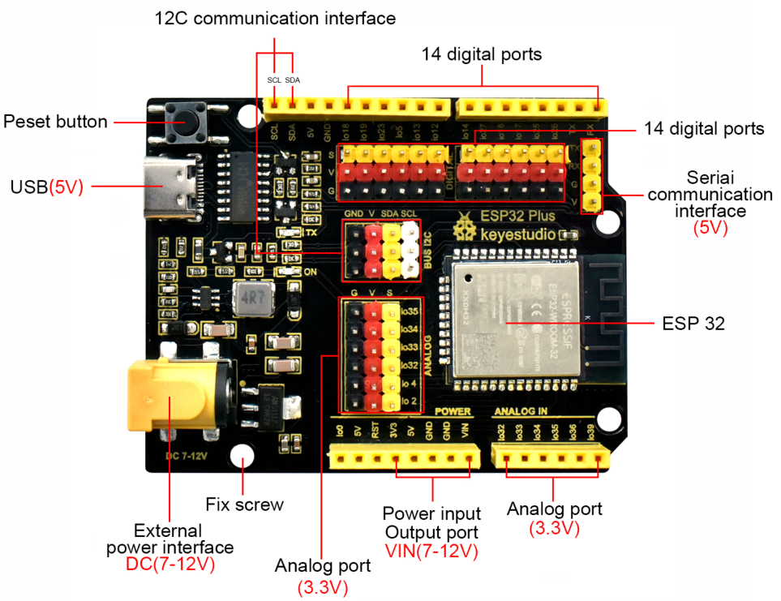

---

### 5.2.2 Windows-systeem

#### 1 Arduino IDE installeren

Wanneer je het control board ontvangt, moet je eerst de Arduino IDE en
de driver downloaden.

Je kunt de Arduino IDE downloaden van de officiële website:
https://www.arduino.cc/, klik op **SOFTWARE** in de browsebalk om de
downloadpagina te openen, zoals hieronder weergegeven:

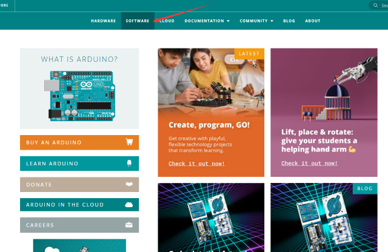

⚠️ **Bijzondere herinnering:** Als je de Arduino IDE niet kunt vinden in
de software op de eerder genoemde officiële website, kun je op deze
link klikken：\ https://www.arduino.cc/en/software om direct naar de
Arduino IDE downloadpagina te gaan.

Er zijn verschillende versies van de IDE voor Arduino. Download gewoon
een versie die compatibel is met jouw systeem. Hier laten we zien hoe je
de Windows-versie van de Arduino IDE downloadt en installeert.

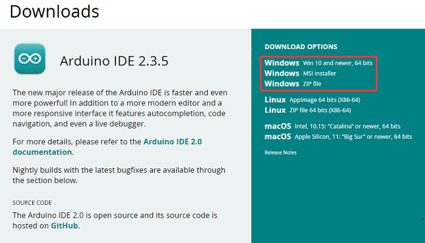

Je kunt kiezen tussen de Installer (.exe) en de Zip-pakketten. Wij raden
aan de eerste te gebruiken die direct alles installeert wat je nodig
hebt om de Arduino-software (IDE) te gebruiken, inclusief de drivers.
Met het Zip-pakket moet je de drivers handmatig installeren. Het Zip-bestand
is ook handig als je een draagbare installatie wilt maken.

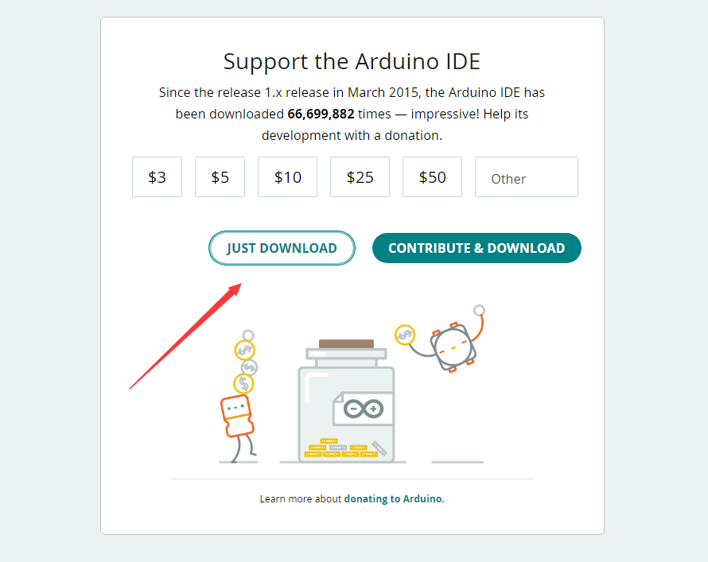

Je hoeft alleen maar op JUST DOWNLOAD te klikken.

#### 2 Een driver installeren

⚠️ **Bijzondere herinnering: Als je de CH340-driver al hebt
geïnstalleerd, sla deze stap dan over.**

Verbind het main control board met je computer met een USB-kabel, en de
driver wordt automatisch geïnstalleerd op MacOS en Windows10 systemen. Als
het installatieproces van de driver faalt, moet je de driver handmatig
installeren.

(1) Controleer of de computer de driver automatisch installeert:

Klik met de rechtermuisknop op Computer----- Klik Eigenschappen-----Klik
Apparaatbeheer, de volgende afbeelding toont de succesvolle installatie:

(2) Handmatige installatie:

Klik met de rechtermuisknop op “\ **USB2.0-Serial**\ ” en klik “\ **Update
driver...**\ ”

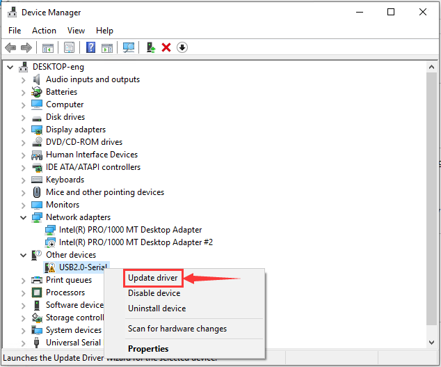

Klik “\ **Browse my computer for driver software**\ ”

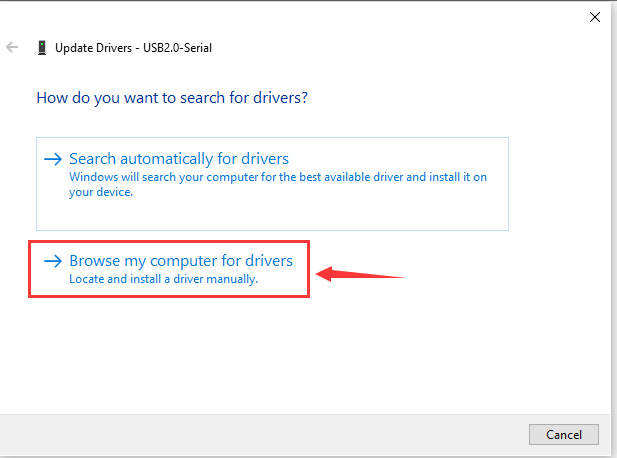

Klik“\ **Browse...**\ ”en selecteer de“\ **usb_ch341_3.1.2009.06
folder**\ ”.

Controleer de seriële poortverbinding opnieuw, zoals weergegeven in de
volgende figuur; de driver is succesvol geïnstalleerd.

#### 3 Voeg de ESP32-omgeving toe (voeg versie 3.1.0 toe)

（1）Open de arduino IDE，click File > Preferences，zoals hieronder:

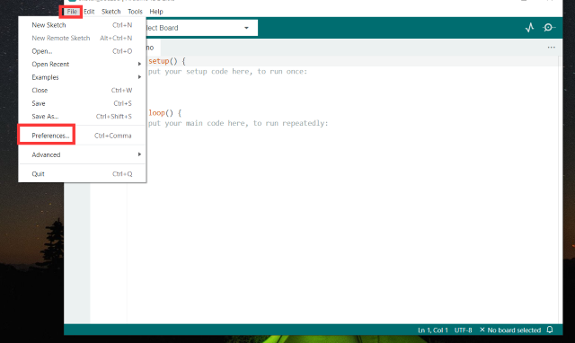

（2）Kopieer de link：\ `https://espressif.github.io/arduino-esp32/package_esp32_index.json`
.

（3）Open de knop die hieronder is gemarkeerd:

(4) Plak deze erin en klik OK, zoals hieronder

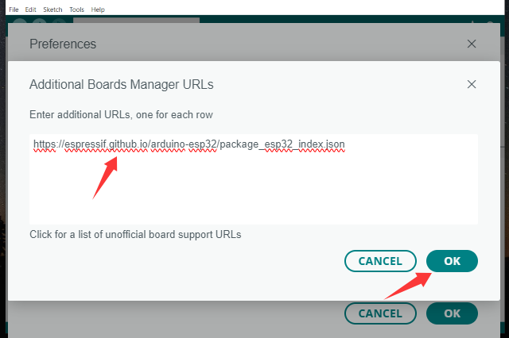

(5) Klik Tools > Board > Boards Manager

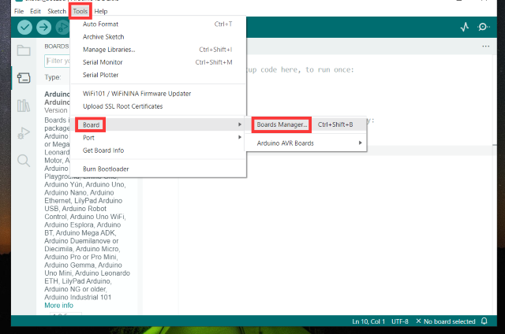

(6) Zoek de ESP32 in de pop-up Boards Manager en klik vervolgens op
installeren. (voeg versie 3.1.3 toe)!!! Zeer belangrijk

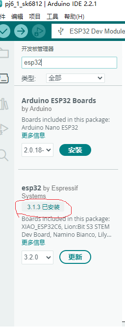

(7) Klik Tools > Board >esp32 om de ESP32 Dev Module te kiezen.

#### 4 Arduino IDE-instellingen

Klik 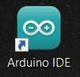 icoon, open Arduino IDE.

Om fouten te voorkomen bij het uploaden van het programma naar het bord,
moet je het juiste Arduino-bord selecteren dat overeenkomt met het bord
dat met je computer is verbonden.

Ga daarna terug naar de Arduino-software, je moet klikken op Tools→Board
en het bord selecteren. (zoals hieronder weergegeven)

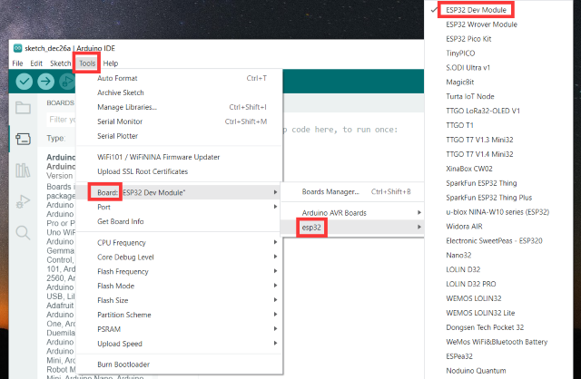

Selecteer vervolgens de juiste COM-poort (je kunt de bijbehorende COM-poort
zien nadat de driver succesvol is geïnstalleerd)

Voordat je het programma naar het bord uploadt, laten we de functie van
elk symbool in de Arduino IDE werkbalk demonstreren.

1- Wordt gebruikt om te verifiëren of er compilerfouten zijn.

2- Wordt gebruikt om de sketch naar je ESP32 bord te uploaden.

3- Wordt gebruikt om de seriële data die vanaf het bord ontvangen wordt
naar de serial plotter te sturen.

4- Wordt gebruikt om de seriële data die vanaf het bord ontvangen wordt
naar de serial monitor te sturen.

---

### 5.2.3 Mac-systeem

#### 1 Arduino IDE downloaden

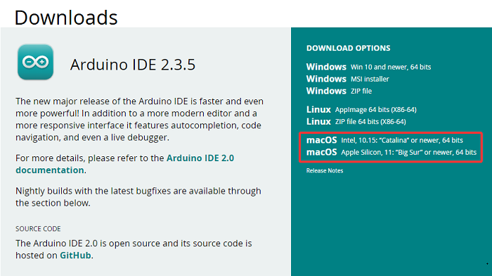

#### 2 Download de CH340-driver

We leveren deze; ga naar het 5.1 resource-pakket om deze te halen

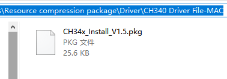

#### 3 Hoe de CH340-driver te installeren

Na het downloaden zie je het volgende:

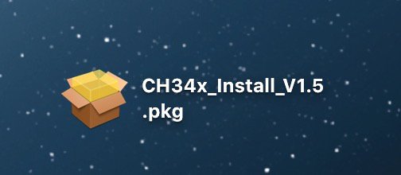

Dubbelklik op het installatiepakket en tik op Doorgaan

Klik op Install

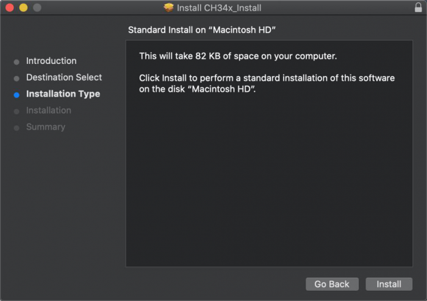

Voer je gebruikerswachtwoord in en klik op Install Software

Tik op Continue Installation

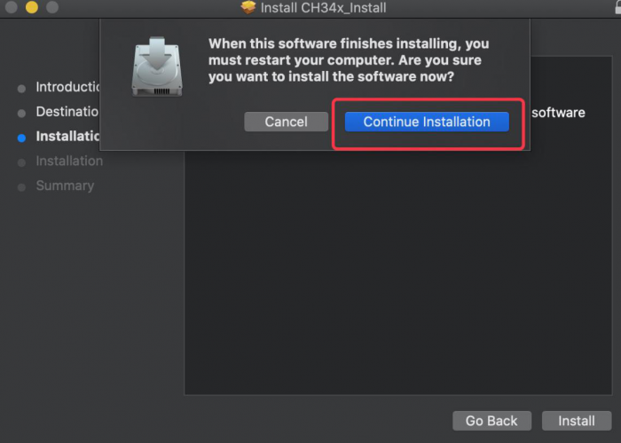

Wacht tot de installatie is voltooid

Klik op Restart nadat de installatie is voltooid

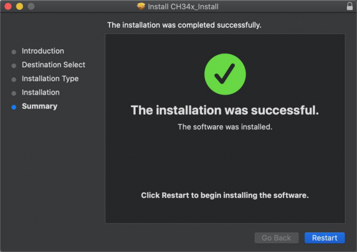

#### 4 Arduino IDE-instellingen:

Behalve voor COM-poorten is de instelling hetzelfde als in hoofdstuk 1.4:

## 5.3 Hoe bibliotheken toe te voegen?

---

### 5.3.1 Wat zijn bibliotheken?

[Libraries](https://www.arduino.cc/en/Reference/Libraries) zijn een
verzameling code die het eenvoudig maakt om een sensor, display,
module, enz. aan te sturen.

Bijvoorbeeld, de ingebouwde LiquidCrystal library helpt bij het communiceren
met LCD-displays. Er zijn honderden extra bibliotheken beschikbaar op het
Internet om te downloaden.

De ingebouwde bibliotheken en enkele van deze extra bibliotheken worden
opgenomen in de reference.

https://www.arduino.cc/en/Reference/Libraries

---

### 5.3.2 ZIP-bibliotheken toevoegen

Wanneer je een zip-bibliotheek wilt toevoegen, moet je deze als een ZIP
bestand downloaden en in de juiste map plaatsen. De bibliotheken die
nodig zijn om de Smart Home te laten werken zijn te vinden op：

Klik Sketch---->Include Library—>Add.ZIP Library，ga vervolgens naar het
bibliotheekbestand dat je hebt gedownload en klik "open."

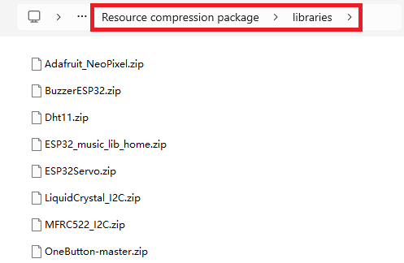

Importeer de bibliotheek. Je kunt deze vinden in de include library-lijst.

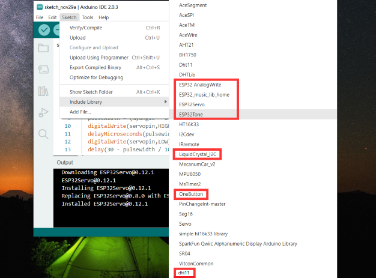
