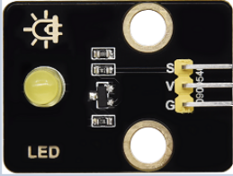

### 5.4.1 Projet 1.1 Clignotement LED


#### **1 Description**



Nous avons installé le pilote de la carte de développement ESP32 PLUS.

Dans la première leçon, nous réaliserons une expérience pour faire clignoter la LED.

Connectez GND et VCC pour l'alimentation. La LED s'allume lorsque la borne de signal S est au niveau haut ; à l'inverse, elle s'éteint lorsque la borne de signal S est au niveau bas.

De plus, différentes fréquences de clignotement peuvent être obtenues en ajustant le délai.


#### **2 Principe de fonctionnement**

La LED est aussi une diode électroluminescente, qui peut être fabriquée en module électronique. Elle s'allume si nous commandons les broches pour sortir un niveau haut, sinon elle reste éteinte.


#### **3 Paramètres**

| Tension de fonctionnement | DC 3~5V |
| --- | --- |
| Courant de fonctionnement | <20mA |
| Puissance | 0.1W |


#### **4 Broche de contrôle**

| LED jaune | 12 |
| --- | --- |
| \ |   |


#### **5 Code de test**

```c
#define led_y 12  //Define the yellow led pin to 12

void setup() {    //The code inside the setup function runs only once
  pinMode(led_y, OUTPUT);  //Set pin to output mode
}

void loop() {     //The code inside the loop function will always run in a loop
  digitalWrite(led_y, HIGH);  //Light up the LED
  delay(200);     //Delay statement, in ms
  digitalWrite(led_y, LOW);   //Close the LED
  delay(200);
}
```

#### **6. Résultat du test**

Après avoir téléversé le code, vous pouvez voir les LED blanches et jaunes clignoter ensemble.