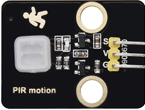
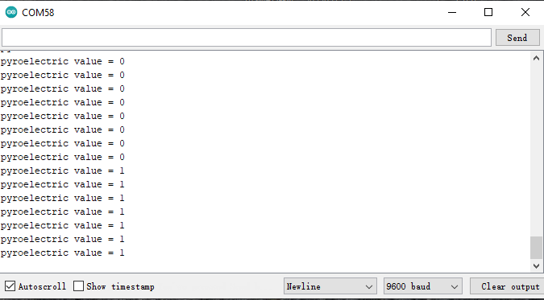

### 5.4.5 Project 3.1 Read the PIR Motion Sensor




#### **1. Description**

The PIR motion sensor has many application scenarios in daily life, such
as automatic induction lamp of stairs, automatic induction faucet of
washbasin, etc.

It is also a digital sensor like buttons, which has two state

values 0 or 1. And it will be sensed when people are moving.

We will print out the value of the PIR motion sensor through the serial
monitor.


#### **2. Control Pin**

| PIR motion sensor | 14 |
| --- | --- |
| \ |   |


#### **3. Test Code**

```c
#define pyroelectric 14

void setup() {
  Serial.begin(9600);
  pinMode(pyroelectric, INPUT);
}

void loop() {
  boolean pyroelectric_val = digitalRead(pyroelectric);
  Serial.print("pyroelectric value = ");
  Serial.println(pyroelectric_val);
  delay(200);
}
```

#### **4. Test Result**

When you stand still in front of the sensor, the reading value is 0,
move a little, it will change to 1.



