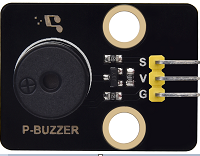

### 5.4.7 Project 4.1 Play Happy Birthday




#### **1. Description**

There is a audio power amplifier element in the car expansion board,
which is as an external amplification equipment to play music.

In this project, we will work to play a piece of music by using it.


#### **2. Component Knowledge**

**Passive Buzzer:** The audio power amplifier (like the passive buzzer)
does not have internal oscillation. When controlling, we need to input
square waves of different frequencies to the positive pole of the
component and ground the negative pole to control the power amplifier to
chime sounds of different frequencies.


#### **3. Control Pin**

| Passive Buzzer | 25 |
| --- | --- |
| \ |   |


#### **4. Test Code**

```c
#include <BuzzerESP32.h>

BuzzerESP32 buzzer(25); // Initialize buzzer on GPIO25

void setup()
{
  buzzer.setTimbre(30); // Set timbre (sound quality)
  birthday();          // Play birthday melody
}

void loop()
{
  // Empty loop as melody plays only once at startup
}

void birthday()
{
  // Play birthday melody - parameters are (frequency, duration)
  buzzer.playTone(294, 250);  // D4
  buzzer.playTone(440, 250);  // A4
  buzzer.playTone(392, 250);  // G4
  buzzer.playTone(532, 250);  // C5 (slightly sharp)
  buzzer.playTone(494, 250);  // B4
  buzzer.playTone(392, 250);  // G4
  buzzer.playTone(440, 250);  // A4
  buzzer.playTone(392, 250);  // G4
  buzzer.playTone(587, 250);  // D5
  buzzer.playTone(532, 250);  // C5 (slightly sharp)
  buzzer.playTone(392, 250);  // G4
  buzzer.playTone(784, 250);  // G5
  buzzer.playTone(659, 250);  // E5
  buzzer.playTone(532, 250);  // C5 (slightly sharp)
  buzzer.playTone(494, 250);  // B4
  buzzer.playTone(440, 250);  // A4
  buzzer.playTone(698, 250);  // F5
  buzzer.playTone(659, 250);  // E5
  buzzer.playTone(532, 250);  // C5 (slightly sharp)
  buzzer.playTone(587, 250);  // D5
  buzzer.playTone(532, 500);  // C5 (slightly sharp) - longer duration
  buzzer.playTone(0, 0);      // Turn off buzzer
}
```

#### **5. Test Result**

The passive buzzer will play happy Birthday.

