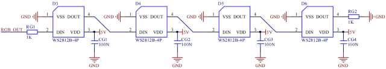

### 5.4.11 Projekt 6.1 Steuerung SK6812


#### **1. Beschreibung**

Die Atmosphärenlampe des Smart Home besteht aus 4 SK6812RGB LEDs. RGB LED gehört zu einem einfachen Leuchtmodul, das die Farbe anpassen kann, um verschiedene Lichteffekte zu erzeugen. Darüber hinaus kann es vielseitig in Gebäuden, Brücken, Straßen, Gärten, Höfen, Etagen und anderen Bereichen der dekorativen Beleuchtung und Veranstaltungsgestaltung sowie zu Weihnachten, Halloween, Valentinstag, Ostern, Nationalfeiertag und anderen Festen und Szenarien eingesetzt werden.

In diesem Experiment erzeugen wir verschiedene Lichteffekte.


#### **2. Komponentenkenntnisse**

Aus dem Schaltplan ist ersichtlich, dass diese vier RGB LEDs alle in Reihe geschaltet sind. Tatsächlich kann man, unabhängig von der Anzahl, mit einem Pin ein RGB LED steuern und es jede beliebige Farbe anzeigen lassen. Jede RGBLED ist ein unabhängiges Pixel, das aus den Farben R, G und B besteht und 256 Helligkeitsstufen sowie die vollständige True-Color-Anzeige von 16777216 Farben erreichen kann.

Außerdem enthält der Pixelpunkt einen Datenlatch-Signalformungs-Verstärker-Treiberschaltkreis und eine Signalformungsschaltung, die effektiv sicherstellt, dass die Farbe der Pixellichter sehr konsistent ist.




#### **3. Pin**

| SK6812 | 26 |
| --- | --- |
| \ |   |


#### **4. Testcode**

```c

#include <Adafruit_NeoPixel.h>
#ifdef __AVR__
 #include <avr/power.h>                              // Required for 16 MHz Adafruit Trinket
#endif
#define LED_PIN    26                                // Which pin on the Arduino is connected to the NeoPixels?
#define LED_COUNT 4                                  // How many NeoPixels are attached to the Arduino?
Adafruit_NeoPixel strip(LED_COUNT, LED_PIN, NEO_GRB + NEO_KHZ800); // Declare our NeoPixel strip object:

void setup() {
#if defined(__AVR_ATtiny85__) && (F_CPU == 16000000)
  clock_prescale_set(clock_div_1);                   // These lines are specifically to support the Adafruit Trinket 5V 16 MHz.
#endif
  strip.begin();                                     // INITIALIZE NeoPixel strip object (REQUIRED)
  strip.show();                                      // Turn OFF all pixels ASAP
  strip.setBrightness(50);                           // Set BRIGHTNESS to about 1/5 (max = 255)
}

void loop() {
  colorWipe(strip.Color(255,   0,   0), 50);         // Red
  colorWipe(strip.Color(  0, 255,   0), 50);         // Green
  colorWipe(strip.Color(  0,   0, 255), 50);         // Blue

  theaterChase(strip.Color(127, 127, 127), 50);      // White, half brightness
  theaterChase(strip.Color(127,   0,   0), 50);      // Red, half brightness
  theaterChase(strip.Color(  0,   0, 127), 50);      // Blue, half brightness

  rainbow(10);                                       // Flowing rainbow cycle along the whole strip
  theaterChaseRainbow(50);                           // Rainbow-enhanced theaterChase variant
}

void colorWipe(uint32_t color, int wait) {
  for(int i=0; i<strip.numPixels(); i++) {           // For each pixel in strip...
    strip.setPixelColor(i, color);                   // Set pixel's color (in RAM)
    strip.show();                                    // Update strip to match
    delay(wait);                                     // Pause for a moment
  }
}

void theaterChase(uint32_t color, int wait) {
  for(int a=0; a<10; a++) {                         // Repeat 10 times...
    for(int b=0; b<3; b++) {                        // 'b' counts from 0 to 2...
      strip.clear();                                // Set all pixels in RAM to 0 (off)
      for(int c=b; c<strip.numPixels(); c += 3) {    // 'c' counts up from 'b' to end of strip in steps of 3...
        strip.setPixelColor(c, color);               // Set pixel 'c' to value 'color'
      }
      strip.show();                                 // Update strip with new contents
      delay(wait);                                  // Pause for a moment
    }
  }
}

void rainbow(int wait) {
  for(long firstPixelHue = 0; firstPixelHue < 5*65536; firstPixelHue += 256) {
    for(int i=0; i<strip.numPixels(); i++) {        // For each pixel in strip...
      int pixelHue = firstPixelHue + (i * 65536L / strip.numPixels());
      strip.setPixelColor(i, strip.gamma32(strip.ColorHSV(pixelHue)));
    }
    strip.show();                                   // Update strip with new contents
    delay(wait);                                   // Pause for a moment
  }
}

void theaterChaseRainbow(int wait) {
  int firstPixelHue = 0;                           // First pixel starts at red (hue 0)
  for(int a=0; a<30; a++) {                        // Repeat 30 times...
    for(int b=0; b<3; b++) {                       // 'b' counts from 0 to 2...
      strip.clear();                               // Set all pixels in RAM to 0 (off)
      for(int c=b; c<strip.numPixels(); c += 3) {  // 'c' counts up from 'b' to end of strip in increments of 3...
        int      hue   = firstPixelHue + c * 65536L / strip.numPixels();
        uint32_t color = strip.gamma32(strip.ColorHSV(hue)); // hue -> RGB
        strip.setPixelColor(c, color);             // Set pixel 'c' to value 'color'
      }
      strip.show();                               // Update strip with new contents
      delay(wait);                               // Pause for a moment
      firstPixelHue += 65536 / 90;               // One cycle of color wheel over 90 frames
    }
  }
}
```


#### **5. Testergebnis**

Die Atmosphärenlampen des Smart Home zeigen eine Vielzahl von Farben und Lichteffekten.