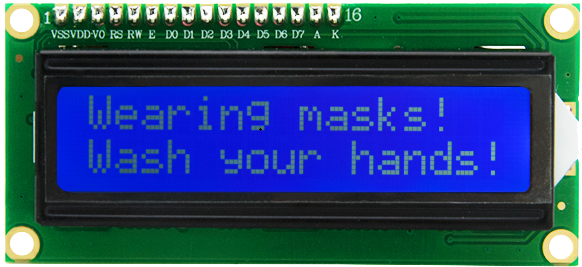

### 5.4.15 Progetto 8.1 Visualizzare caratteri


#### **1. Descrizione**

Come è noto, lo schermo è uno dei modi migliori per far interagire le persone
con i dispositivi elettronici.


#### **2. Conoscenze sul componente**

1602 è un modulo che può visualizzare 16 caratteri. Ci sono due righe,
che utilizzano il protocollo di comunicazione IIC.




#### **3. Pin di controllo**

| SDA | SDA |
| --- | --- |
| SCL | SCL |


#### **4. Codice di test**

```c
#include <Wire.h>
#include <LiquidCrystal_I2C.h>
LiquidCrystal_I2C mylcd(0x27,16,2);

void setup(){
  mylcd.init();
  mylcd.backlight();
}

void loop(){
  mylcd.setCursor(0, 0);
  mylcd.print("hello");
  mylcd.setCursor(0, 1);
  mylcd.print("keyestudio");
  //mylcd.clear();
}
```

#### **5. Risultato del test**

La prima riga del LCD1602 mostra hello e la seconda riga mostra
keyestudio.