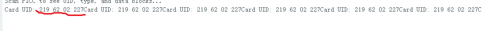

### 5.4.18 Project 10 Deur openen


#### **1. Kennis van componenten**

RFID, de kaartlezer is samengesteld uit een radiofrequentiemodule en een sterk magnetisch veld. De Tag-transponder is een sensorapparaat zonder batterij. Het bevat alleen kleine geïntegreerde schakelingen, opslagmedia voor gegevens en antennes om signalen te ontvangen en te zenden.

Om de gegevens op de tag te lezen, brengt u deze eerst binnen het leesbereik van de kaartlezer. De lezer genereert een magnetisch veld dat volgens de wet van Lenz elektriciteit kan opwekken. De RFID-tag levert vervolgens stroom en activeert daarmee het apparaat.


#### **2. Controlepinnen**

Gebruik IIC-communicatie

| SDA | SDA |
| --- | --- |
| SCL | SCL |


#### **3. Testcode**

```c
//**********************************************************************************
/*
 * Filename    : RFID
 * Description : RFID reader UID
 * Auther      : http//www.keyestudio.com
*/
#include <Wire.h>
#include <LiquidCrystal_I2C.h>
LiquidCrystal_I2C mylcd(0x27,16,2);
#include <ESP32Servo.h>
Servo myservo;
#include <Wire.h>
#include "MFRC522_I2C.h"
// IIC pins default to GPIO21 and GPIO22 of ESP32
// 0x28 is the i2c address of SDA, if doesn't match，please check your address with i2c.
MFRC522 mfrc522(0x28);   // create MFRC522.
#define servoPin  13
#define btnPin 16
boolean btnFlag = 0;

String password = "";

void setup() {
  Serial.begin(115200);           // initialize and PC's serial communication
  mylcd.init();
  mylcd.backlight();
  Wire.begin();                   // initialize I2C
  mfrc522.PCD_Init();             // initialize MFRC522
  ShowReaderDetails();            // dispaly PCD - MFRC522 read carder
  Serial.println(F("Scan PICC to see UID, type, and data blocks..."));

    // Allow allocation of all timers
    ESP32PWM::allocateTimer(0);
    ESP32PWM::allocateTimer(1);
    ESP32PWM::allocateTimer(2);
    ESP32PWM::allocateTimer(3);
    myservo.setPeriodHertz(50);    // standard 50 hz servo
    myservo.attach(servoPin, 1000, 2000); // attaches the servo on pin 18 to the servo object
    // using default min/max of 1000us and 2000us
    // different servos may require different min/max settings
    // for an accurate 0 to 180 sweep

  mylcd.setCursor(0, 0);
  mylcd.print("Card");
}

void loop() {
  //
  if ( ! mfrc522.PICC_IsNewCardPresent() || ! mfrc522.PICC_ReadCardSerial() ) {
    delay(50);
    password = "";
    if(btnFlag == 1)
    {
      boolean btnVal = digitalRead(btnPin);
      if(btnVal == 0)  //If door close button is pressed (active-low)
      {
        Serial.println("close");
        mylcd.setCursor(0, 0);
        mylcd.print("close");
        myservo.write(0);
        btnFlag = 0;
      }
    }
    return;
  }

  // select one of door cards. UID and SAK are mfrc522.uid.

  // save UID
  Serial.print(F("Card UID:"));
  for (byte i = 0; i < mfrc522.uid.size; i++) {
    Serial.print(mfrc522.uid.uidByte[i] < 0x10 ? " 0" : " ");
    //Serial.print(mfrc522.uid.uidByte[i], HEX);
    Serial.print(mfrc522.uid.uidByte[i]);
    password = password + String(mfrc522.uid.uidByte[i]);
  }
  if(password == "")  //Card number is correct,open the door
  {
    Serial.println("open");
    mylcd.setCursor(0, 0);
    mylcd.clear();
    mylcd.print("open");
    myservo.write(180);
    password = "";
    btnFlag = 1;
  }
  else   //Card number error,dispaly error
  {
    password = "";
    mylcd.setCursor(0, 0);
    mylcd.print("error");
  }
  //Serial.println(password);
}

void ShowReaderDetails() {
  //  attain the MFRC522 software
  byte v = mfrc522.PCD_ReadRegister(mfrc522.VersionReg);
  Serial.print(F("MFRC522 Software Version: 0x"));
  Serial.print(v, HEX);
  if (v == 0x91)
    Serial.print(F(" = v1.0"));
  else if (v == 0x92)
    Serial.print(F(" = v2.0"));
  else
    Serial.print(F(" (unknown)"));
  Serial.println("");
  // when returning to 0x00 or 0xFF, may fail to transmit communication signals
  if ((v == 0x00) || (v == 0xFF)) {
    Serial.println(F("WARNING: Communication failure, is the MFRC522 properly connected?"));
  }
}
//**********************************************************************************
```

#### **4. Testresultaat**

Upload de code, de LCD1602 toont "Card", open de seriële monitor en stel de baudrate in op "115200".

Houd de meegeleverde kaart dicht bij het RFID-inductiegebied, de LCD1602 toont "error", maar de uitvoer van de seriële monitor is zoals in de figuur:



Voer de "Card UID" uit de afbeelding in op de positie zoals in de figuur (verwijder spaties in de "Card UID" en in de **Card UID** van de seriële monitor, verwijder een leidende **0** alleen als deze **voor de overige cijfers** staat (bijv. `" 0123"` → `"123"`), maar behoud **0** als deze een cijfer volgt (bijv. `"601"` blijft `"601"`).):


Upload de code, houd de meegeleverde kaart dicht bij het RFID-inductiegebied, de deur draait en gaat open, en de LCD1602 toont "open".

Klik op knop 1 en de deur draait en sluit. Echter, bij het gebruik van een ander blauw inductieblok toont de LCD1602 "Error".