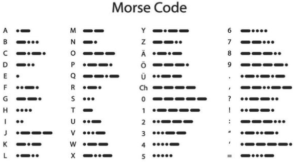

### 5.4.19 Project 11 Morsecode: Deur openen

Morsecode, ook bekend als Morse-wachtwoord, is een aan-uit signaalsysteem dat verschillende letters, cijfers en leestekens in verschillende reeksen uitdrukt. Nu gebruiken we het als ons wachtwoordpoortje.

De Morsecode komt overeen met de volgende tekens:




#### **1. Beschrijving**

We gebruiken \ als het correcte wachtwoord. Bovendien is er een knopbibliotheekbestand OneButton, waarmee klikken, dubbelklikken, lang indrukken en andere functies heel eenvoudig zijn. Voor het Morse-wachtwoord is klikken “.”, lang indrukken en loslaten is “-”.


#### **2. Testcode**

```c
#include <Wire.h>
#include <LiquidCrystal_I2C.h>
LiquidCrystal_I2C mylcd(0x27,16,2);
#include "OneButton.h"
// Setup a new OneButton on pin 16.
OneButton button1(16, true);
// Setup a new OneButton on pin 27.
OneButton button2(27, true);
#include <ESP32Servo.h>
Servo myservo;
int servoPin = 13;
String password = "";
String correct_p = "-.-";  //password

// setup code here, to run once:
void setup() {
  Serial.begin(115200);
  mylcd.init();
  mylcd.backlight();
  // link the button 1 functions.
  button1.attachClick(click1);
  button1.attachLongPressStop(longPressStop1);
  // link the button 2 functions.
  button2.attachClick(click2);
  button2.attachLongPressStop(longPressStop2);

    // Allow allocation of all timers
    ESP32PWM::allocateTimer(0);
    ESP32PWM::allocateTimer(1);
    ESP32PWM::allocateTimer(2);
    ESP32PWM::allocateTimer(3);
    myservo.setPeriodHertz(50);    // standard 50 hz servo
    myservo.attach(servoPin, 1000, 2000); // attaches the servo on pin 18 to the servo object
    // using default min/max of 1000us and 2000us
    // different servos may require different min/max settings
    // for an accurate 0 to 180 sweep

  mylcd.setCursor(0, 0);
  mylcd.print("Enter password");
}

void loop() {
  // keep watching the push buttons:
  button1.tick();
  button2.tick();
  delay(10);
}

// ----- button 1 callback functions
// This function will be called when the button1 was pressed 1 time (and no 2. button press followed).
void click1() {
  Serial.print(".");
  password = password + '.';
  mylcd.setCursor(0, 1);
  mylcd.print(password);
} // click1

// This function will be called once, when the button1 is released after beeing pressed for a long time.
void longPressStop1() {
  Serial.print("-");
  password = password + '-';
  mylcd.setCursor(0, 1);
  mylcd.print(password);
} // longPressStop1

// ... and the same for button 2:
void click2() {
  Serial.println(password);
  if(password == correct_p)
  {
    myservo.write(180);  //open the door if the password correct
    mylcd.clear();
    mylcd.setCursor(0, 0);
    mylcd.print("open");
  }
  else
  {
    mylcd.clear();
    mylcd.setCursor(0, 0);
    mylcd.print("error");
    delay(2000);
    mylcd.clear();
    mylcd.setCursor(0, 0);
    mylcd.print("input again");
  }
  password = "";
} // click2

void longPressStop2() {
  //Serial.println("Button 2 longPress stop");
   myservo.write(0);  //open door
   mylcd.clear();
   mylcd.setCursor(0, 0);
   mylcd.print("close");
} // longPressStop2
```

#### **3. Testresultaat**

Eerst geeft de LCD1602 "Voer wachtwoord in" weer, klik of houd knop 1 ingedrukt om het wachtwoord in te voeren. Als we het juiste wachtwoord "-.-" invoeren en vervolgens knop 2 klikken, zal de deur opengaan en toont de LCD1602 "open".

Als er een verkeerd wachtwoord wordt ingevoerd, zal de deur niet bewegen, toont de LCD1602 "error" en vervolgens na 2s "opnieuw invoeren". Bovendien kan lang indrukken van knop 2 de deur sluiten.