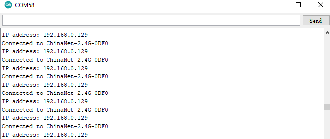
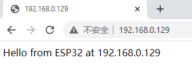

### 5.4.20 Project 12.1 WiFi test

The easiest way to access the Internet is to use a WiFi to connect. The
ESP32 main control board comes with a WiFi module, making our smart home
accessible to the Internet easily.


#### **1. Description**

We connect the smart home to a LAN, which is the WiFi in your home or
the hot spot of your phone. After the connection is successful, an
address will be assigned, which can be used for communication. We will
print the assigned address in the serial monitor.


#### **2. Test Code**

⚠️ \ **ATTENTION:**\  After opening the code file, you need to modify
the WiFi name and passwords that the ESP32 development board needs to
connect to. Replace `ChinaNet-2.4G-0DF0` and `ChinaNet@233` with
your own WiFi name and password respectively. You must do this before
uploading the code; otherwise, the ESP32 board will not be able to
connect to the network.

```c
const char* ssid = "ChinaNet-2.4G-0DF0";  // Enter your own WiFi name
const char* password = "ChinaNet@233"; // Enter your own WiFi passwords
```
⚠️ **NOTE: Please ensure that the WiFi name and passwords in the code
are the same as the network connected to your computer, mobile
phone/tablet, ESP32 development board and router. They must be within
the same local area network (WiFi).**

⚠️ **NOTE: The WiFi must be on a 2.4Ghz frequency; otherwise, the ESP32
cannot connect to WiFi.**

```c
#include <Arduino.h>
#include <WiFi.h>
#include <ESPmDNS.h>
#include <WiFiClient.h>

// Network Configuration
const char* ssid = "ChinaNet-2.4G-0DF0";
const char* password = "ChinaNet@233";
WiFiServer server(80);

// Global Variables
String requestPath = "/";  // Stores the HTTP request path

void setup() {
  Serial.begin(115200);

  // Connect to WiFi
  Serial.println("\nConnecting to WiFi...");
  WiFi.begin(ssid, password);

  while (WiFi.status() != WL_CONNECTED) {
    delay(500);
    Serial.print(".");
  }

  // Network information
  Serial.println("\nWiFi connected");
  printNetworkInfo();

  // Start server and mDNS
  server.begin();
  if (!MDNS.begin("esp32")) {
    Serial.println("Error setting up MDNS responder!");
  }
  MDNS.addService("http", "tcp", 80);
  Serial.println("HTTP server started");
}

void loop() {
  WiFiClient client = server.available();

  if (!client) {
    return;
  }

  // Wait for client data
  while (client.connected() && !client.available()) {
    delay(1);
  }

  // Read HTTP request
  String request = client.readStringUntil('\r');
  parseHttpRequest(request);

  // Handle request
  String response;
  if (requestPath == "/") {
    response = buildHomepageResponse();
    Serial.println("Serving homepage");
  } else {
    response = buildNotFoundResponse();
    Serial.println("Unknown request: " + requestPath);
  }

  // Send HTTP response
  client.println(response);
  client.stop();

  // Small delay between requests
  delay(100);
}

// Helper Functions
void printNetworkInfo() {
  Serial.print("SSID: ");
  Serial.println(WiFi.SSID());
  Serial.print("IP Address: ");
  Serial.println(WiFi.localIP());
}

void parseHttpRequest(String req) {
  int addr_start = req.indexOf(' ');
  int addr_end = req.indexOf(' ', addr_start + 1);

  if (addr_start == -1 || addr_end == -1) {
    Serial.print("Invalid request: ");
    Serial.println(req);
    requestPath = "/404";
    return;
  }

  requestPath = req.substring(addr_start + 1, addr_end);
  Serial.println("Requested path: " + requestPath);
}

String buildHomepageResponse() {
  IPAddress ip = WiFi.localIP();
  String ipStr = String(ip[0]) + '.' + ip[1] + '.' + ip[2] + '.' + ip[3];

  String html = "HTTP/1.1 200 OK\r\n";
  html += "Content-Type: text/html\r\n";
  html += "Connection: close\r\n";
  html += "\r\n";
  html += "<!DOCTYPE HTML>\n";
  html += "<html><head><title>ESP32 Web Server</title></head>\n";
  html += "<body><h1>Hello from ESP32</h1>\n";
  html += "<p>IP Address: " + ipStr + "</p>\n";
  html += "</body></html>\n";

  return html;
}

String buildNotFoundResponse() {
  String html = "HTTP/1.1 404 Not Found\r\n";
  html += "Content-Type: text/html\r\n";
  html += "Connection: close\r\n";
  html += "\r\n";
  html += "<!DOCTYPE HTML>\n";
  html += "<html><head><title>404 Not Found</title></head>\n";
  html += "<body><h1>404</h1><p>Page not found</p></body></html>\n";

  return html;
}
```

#### **3. Test Result**

⚠️ **Note: The mobile phone or tablet must be connected to the ESP32
development board via the same WiFi. Otherwise, it will not be able to
access the control page. Also, when the ESP32 development board uses the
WiFi function, it consumes a lot of power. An external DC power supply
is required to meet its power demand for operation. If the power demand
is not met, the ESP32 board will keep resetting, resulting in the code
not running normally.**

If the WiFi is connected successfully, the serial monitor will print out
the assigned IP address.



Open a browser to access the IP address, then we will read the contents
of the string S sent out by the client.println(s); in the code.



