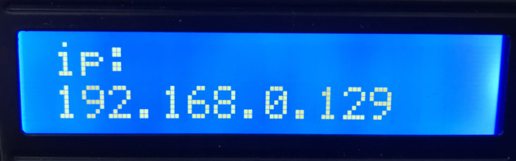
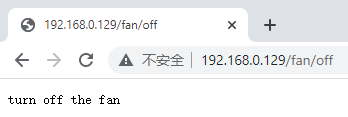

### 5.4.21 Proyecto 12.2 Control por WiFi de LED y ventilador


#### **1. Descripción**

En este proyecto aprenderemos cómo realizar diferentes funciones de la casa inteligente accediendo a distintas cadenas mediante la dirección. Hay una pantalla LCD que puede imprimir la dirección IP, lo que resulta mucho más conveniente.


#### **2. Código de prueba**

⚠️ \ **ATENCIÓN:**\  Después de abrir el archivo de código, debe modificar el nombre y la contraseña de la WiFi a la que la placa de desarrollo ESP32 necesita conectarse. Reemplace `ChinaNet-2.4G-0DF0` y `ChinaNet@233` por su propio nombre y contraseña de WiFi respectivamente. Debe hacer esto antes de cargar el código; de lo contrario, la placa ESP32 no podrá conectarse a la red.

```c
const char* ssid = "ChinaNet-2.4G-0DF0";  // Enter your own WiFi name
const char* password = "ChinaNet@233"; // Enter your own WiFi passwords
```
⚠️ **NOTA: Por favor asegúrese de que el nombre y la contraseña de la WiFi en el código sean los mismos que los de la red a la que están conectados su ordenador, teléfono móvil/tableta, ESP32 development board y router. Deben estar en la misma red de área local (WiFi).**

⚠️ **NOTA: La WiFi debe estar en la frecuencia 2.4Ghz; de lo contrario, el ESP32 no podrá conectarse a la WiFi.**

```c
#include <Arduino.h>
#include <WiFi.h>
#include <ESPmDNS.h>
#include <WiFiClient.h>

String item = "0";
const char* ssid = "ChinaNet-2.4G-0DF0";
const char* password = "ChinaNet@233";
WiFiServer server(80);

#include <Wire.h>
#include <LiquidCrystal_I2C.h>
LiquidCrystal_I2C mylcd(0x27,16,2);
//#include <analogWrite.h>
#define fanPin1 19
#define fanPin2 18
#define led_y 12  //Define yellow LED pin as 12

void setup() {
  Serial.begin(115200);
  mylcd.init();
  mylcd.backlight();
  pinMode(led_y, OUTPUT);
  pinMode(fanPin1, OUTPUT);
  pinMode(fanPin2, OUTPUT);

  WiFi.begin(ssid, password);
  while (WiFi.status() != WL_CONNECTED) {
    delay(500);
    Serial.print(".");
  }
  Serial.println("");
  Serial.print("Connected to ");
  Serial.println(ssid);
  Serial.print("IP address: ");
  Serial.println(WiFi.localIP());
  server.begin();
  Serial.println("TCP server started");
  MDNS.addService("http", "tcp", 80);
  mylcd.setCursor(0, 0);
  mylcd.print("ip:");
  mylcd.setCursor(0, 1);
  mylcd.print(WiFi.localIP());  //LCD displays IP address
}

void loop() {
  WiFiClient client = server.available();
  if (!client) {
      return;
  }
  while(client.connected() && !client.available()){
      delay(1);
  }
  String req = client.readStringUntil('\r');
  int addr_start = req.indexOf(' ');
  int addr_end = req.indexOf(' ', addr_start + 1);
  if (addr_start == -1 || addr_end == -1) {
      Serial.print("Invalid request: ");
      Serial.println(req);
      return;
  }
  req = req.substring(addr_start + 1, addr_end);
  item=req;
  Serial.println(item);
  String s;
  if (req == "/")  //Browser can read the information sent by client.println(s) when accessing the address
  {
      IPAddress ip = WiFi.localIP();
      String ipStr = String(ip[0]) + '.' + String(ip[1]) + '.' + String(ip[2]) + '.' + String(ip[3]);
      s = "HTTP/1.1 200 OK\r\nContent-Type: text/html\r\n\r\n<!DOCTYPE HTML>\r\n<html>Hello from ESP32 at ";
      s += ipStr;
      s += "</html>\r\n\r\n";
      Serial.println("Sending 200");
      client.println(s);  //Send the content of string S. When accessing the E-smart home address using a browser, the information can be read.
  }
  if(req == "/led/on") //Browser accesses IP address/led/on
  {
    client.println("turn on the LED");
    digitalWrite(led_y, HIGH);
  }
  if(req == "/led/off") //Browser accesses IP address/led/off
  {
    client.println("turn off the LED");
    digitalWrite(led_y, LOW);
  }
  if(req == "/fan/on") //Browser accesses IP address/fan/on
  {
    client.println("turn on the fan");
    digitalWrite(fanPin1, LOW); //pwm = 0
    analogWrite(fanPin2, 180);
  }
  if(req == "/fan/off") //Browser accesses IP address/fan/on
  {
    client.println("turn off the fan");
    digitalWrite(fanPin1, LOW); //pwm = 0
    analogWrite(fanPin2, 0);
  }
  //client.print(s);
  client.stop();
}
```

#### **3. Resultado de la prueba**

⚠️ **Nota: El teléfono móvil o la tableta deben estar conectados a la placa de desarrollo ESP32 a través de la misma WiFi. De lo contrario, no podrán acceder a la página de control. Además, cuando la placa ESP32 utiliza la función WiFi, consume mucha energía. Se requiere una fuente de alimentación DC externa para satisfacer su demanda de energía durante la operación. Si no se cumple la demanda de energía, la placa ESP32 se reiniciará continuamente, lo que provocará que el código no se ejecute con normalidad.**

Si la casa inteligente se conecta correctamente a la WiFi, la pantalla LCD mostrará la dirección asignada.



Al acceder a la dirección desde el navegador, debe añadirse /led/on; por ejemplo, mi dirección es 192.168.0.129/led/on. Entonces las luces LED de la casa inteligente se encenderán; si se accede a 192.168.0.129/led/off, las luces LED se apagarán.


Cuando el navegador accede a 192.168.0.129/fan/on, el ventilador de la casa inteligente se encenderá y al acceder a 192.168.0.129/fan/off se apagará.

