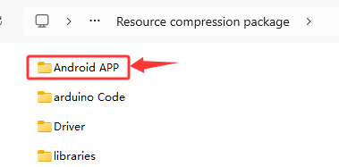
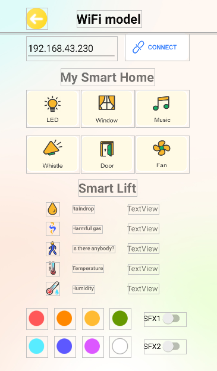
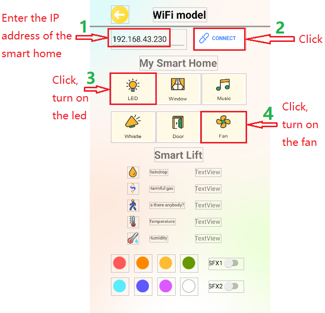

### 5.4.22 Projekt 13.1: Smartphone-APP-Test


#### **1. Download der APP**

**Android-APP：**

**Methode Eins：** Die Android apk-Installationsdatei ist in
unserem Ressourcenpaket verfügbar, wie unten gezeigt:



Sie können die Android apk über ein USB-Kabel auf Ihr Smartphone
übertragen und dann installieren.

**Methode Zwei：** Download über Google Play:

Bitte suchen Sie in Google Play nach **keyes IoT home**, um sie herunterzuladen.


**APP-Oberfläche**



**iOS-APP herunterladen**

Bitte suchen Sie im App Store nach **keyes IoT home**, um sie herunterzuladen.


**APP-Oberfläche**


#### **2. Beschreibung**

Wir verwenden die APP, um die smarten Home-LEDs und die Lüfter-Schalter zu steuern.


#### **3. Testcode**

⚠️ \ **ACHTUNG:**\  Nachdem Sie die Code-Datei geöffnet haben, müssen
Sie den WiFi-Namen und das Passwort ändern, mit denen das ESP32
Entwicklungsboard sich verbinden soll. Ersetzen Sie `ChinaNet-2.4G-0DF0`
und `ChinaNet@233` durch Ihren eigenen WiFi-Namen bzw. Ihr eigenes Passwort.
Sie müssen dies tun, bevor Sie den Code hochladen; andernfalls kann das
ESP32-Board keine Netzwerkverbindung herstellen.

```c
const char* ssid = "ChinaNet-2.4G-0DF0";  // Enter your own WiFi name
const char* pwd = "ChinaNet@233"; // Enter your own WiFi passwords
```
⚠️ **HINWEIS: Bitte stellen Sie sicher, dass der WiFi-Name und das Passwort
im Code mit dem Netzwerk übereinstimmen, mit dem Ihr Computer, Smartphone/Tablet,
ESP32-Entwicklungsboard und Router verbunden sind. Sie müssen sich im selben
lokalen Netzwerk (WiFi) befinden.**

⚠️ **HINWEIS: Das WiFi muss auf einer 2.4Ghz-Frequenz betrieben werden;
ansonsten kann das ESP32 sich nicht mit dem WiFi verbinden.**

```c
#include <Arduino.h>
#ifdef ESP32
#include <WiFi.h>
#elif defined(ESP8266)
#include <ESP8266WiFi.h>
#endif

#include <LiquidCrystal_I2C.h>

#define fanPin1 19 //IN+ pin
#define fanPin2 18 //IN- pin
#define led_y 12  //Define the yellow led pin as 12

const char* ssid = "ChinaNet-2.4G-0DF0";
const char* pwd = "ChinaNet@233";

#include <Wire.h>
//Initialize the LCD address, columns and rows
LiquidCrystal_I2C lcd(0x27, 16, 2);

WiFiServer server(80);  //Initialize the WiFi service

//Define the variable as the detected value
String request;

unsigned long prevTask = 0;

void setup() {
  Serial.begin(9600);
  //Connect to wifi
  WiFi.begin(ssid, pwd);
  //Determine whether it is connected
  Serial.println("Connecting to WiFi...");
  while (WiFi.status() != WL_CONNECTED) {
    delay(1000);
    Serial.print(".");
  }
  delay(1000);
  //The serial monitor will display the name and IP address of the wireless network
  Serial.println("Connected to WiFi");
  Serial.print("WiFi NAME:");
  Serial.println(ssid);
  Serial.print("IP:");
  Serial.println(WiFi.localIP());

  //Initialize the LCD
  lcd.init();
  //Turn on the LCD backlight
  lcd.backlight();
  //lcd.noBacklight();
  lcd.clear();
  //Set the position of the cursor
  lcd.setCursor(0, 0);
  //LCD printing
  lcd.print("IP:");
  //Set the position of the cursor
  lcd.setCursor(0, 1);
  //LCD printing
  lcd.print(WiFi.localIP());

  //Set pin modes
  pinMode(led_y, OUTPUT);
  pinMode(fanPin1, OUTPUT);
  pinMode(fanPin2, OUTPUT);
  //Start the service
  server.begin();
}

void loop() {
  //Check whether the client has been connected to the network server
  //When the client establishes a connection with the server, the "server.available()" function returns a WiFiClient object for client-side communication.
  WiFiClient client = server.available();
  if (client) {
    Serial.println("New client connected");
    while (client.connected()) {
      //Determine whether the server sends data
      if (client.available()) {
        request = client.readStringUntil('s');
        Serial.print("Received message: ");
        Serial.println(request);
      }

      //LED
      if (request == "a") {
        digitalWrite(led_y, HIGH);
      } else if (request == "A") {
        digitalWrite(led_y, LOW);
      }

      //fan
      if (request == "f") {
        digitalWrite(fanPin1, LOW); //pwm = 0
        analogWrite(fanPin2, 100); //LEDC channel 5 is bound to the specified left motor output PWM value as 100.
      } else if (request == "F") {
        digitalWrite(fanPin1, LOW); //pwm = 0
        analogWrite(fanPin2, 0); //LEDC channel 5 is bound to the specified left motor output PWM value as 0.
      }

      request = "";
    }
    Serial.println("Client disconnected");
  }
}
```

#### **4. Testergebnis**

⚠️ **Hinweis: Das Smartphone oder Tablet muss über dasselbe WiFi
mit dem ESP32-Entwicklungsboard verbunden sein. Andernfalls kann die
Steuerungsseite nicht erreicht werden. Außerdem verbraucht das ESP32 beim
Einsatz der WiFi-Funktion viel Strom. Eine externe Gleichstromversorgung
ist erforderlich, um den Betriebsstrombedarf zu decken. Wenn die
Stromversorgung unzureichend ist, wird das ESP32-Board ständig neu starten,
was dazu führt, dass der Code nicht normal ausgeführt wird.**

1. Öffnen Sie die APP und wählen Sie WiFi


1. APP steuert LED und den Lüfter

Das Smartphone und das Smart Home müssen dasselbe WiFi nutzen, oder das
Smart Home verbindet sich mit dem Hotspot des Smartphones.

APP eingeben der IP-Adresse (LCD1602 zeigt die zugewiesene IP-Adresse an), dann auf Verbinden klicken; die Verbindung ist erfolgreich, wenn ESP32 IP: 192.168.xx.xx angezeigt wird.

Anschließend können Sie auf die LED klicken, dann wird die Smart-Home-LED eingeschaltet.
Klicken Sie auf die Lüfter-Taste und der Lüfter wird eingeschaltet, wie unten gezeigt:

