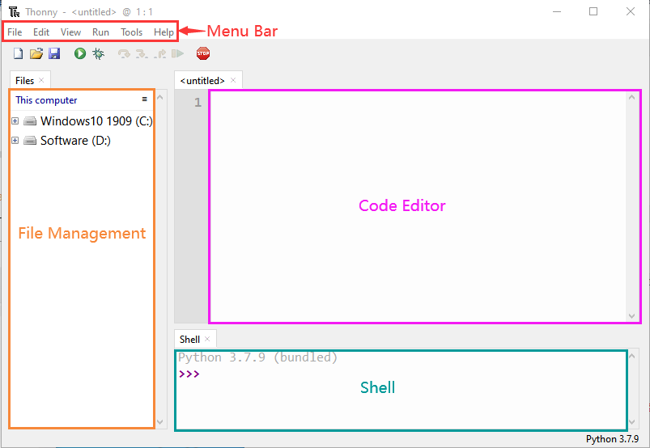
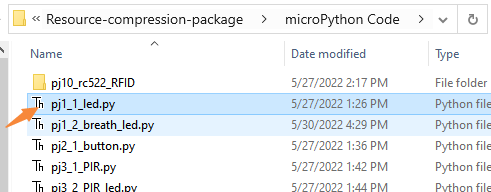
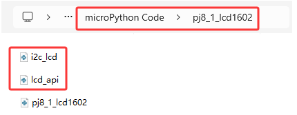
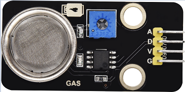

# Python tutorial

## get starter with thonny

### Open the Thonny Package

Please refer to the folder shown below:


### Thonny Interface

Open the Thonny


Main interface functions:




### Select ESP32 Development Environment

Click Python.exe，then select Configure interpreter


Select MicroPython(ESP32) from the Interpreter interface


### Installing Firmware

Download link：<https://micropython.org/download/esp32/>

Choose to download version V1.17


Of course, we also provide the downloaded firmware, as shown below.


Burn microPython firmware

Connect the smart home to your computer with a USB.

Click Install or update firmware


Select Port


Click Browser to find the the downloaded version V1.17 firmware


Click install


Choose Port or WebREPL as the driver of ESP32 mainboard CH340(COM)


The ESP32 environment has been installed.

Thonny interface


## Python Projects

Please refer to the file below：


### Project 1: Control LED

we will first learn how to control LED.


**Working Principle**

LED is also the light-emitting diode, which can be made into an electronic module. It will shine if we control pins to output high level, otherwise it will be off.

**Parameters**

| **Working voltage** | **DC 3\~5V** |
| ------------------- | ------------ |
| **Working current** | **\<20mA**   |
| **Power**           | **0.1W**     |

**Control Pin**

| Yellow LED | 12   |
| ---------- | ---- |
|    |    |


### Project 1.1 LED Flashing

#### **Description**

We can make the LED pin output high level and low level to make the LED flash.

#### **Test Code**

```python
from machine import Pin
import time

led = Pin(12, Pin.OUT)# Build an LED object, connect the external LED light to pin 0, and set pin 0 to output mode
while True:
    led.value(1)# turn on led
    time.sleep(1)# delay 1s
    led.value(0)# turn off led
    time.sleep(1)# delay 1s
```

Open the sample code




Operation and test result

Click the button


We can see that the yellow LED is flashing .

### Project 1.2 Breathing LED

#### **Description**

A“breathing LED”is a phenomenon where an LED's brightness smoothly changes from dark to bright and back to dark, continuing to do so and giving the illusion of an LED“breathing. However, how to control LED’s brightness?

It makes sense to take advantage of PWM. Output the number of high level and low level in unit time, the more time the high level occupies, the larger the PWM value, the brighter the LED.


#### **Test Code**

```python
import time
from machine import Pin,PWM

#The way that the ESP32 PWM pins output is different from traditionally controllers.
#It can change frequency and duty cycle by configuring PWM’s parameters at the initialization stage.
#Define GPIO 0’s output frequency as 10000Hz and its duty cycle as 0, and assign them to PWM.
pwm =PWM(Pin(12,Pin.OUT),10000)

try:
    while True: 
#The range of duty cycle is 0-1023, so we use the first for loop to control PWM to change the duty
#cycle value,making PWM output 0% -100%; Use the second for loop to make PWM output 100%-0%.  
        for i in range(0,1023):
            pwm.duty(i)
            time.sleep_ms(1)
            
        for i in range(0,1023):
            pwm.duty(1023-i)
            time.sleep_ms(1)  
except:
#Each time PWM is used, the hardware Timer will be turned ON to cooperate it. Therefore, after each use of PWM,
#deinit() needs to be called to turned OFF the timer. Otherwise, the PWM may fail to work next time.
    pwm.deinit()
```

#### **Test Result**

Click the button.


The LED gradually gets dimmer then brighter, cyclically, like human breathe.

### Project 2: Table Lamp

#### **Description**

The common table lamp uses LED lights and buttons, which can control the light on and off pressing the button.

#### **Button Principle**

The button module is a digital sensor, which can only read 0 or 1. When the module is not pressed, it is in a high level state, that is, 1, when pressed, it is a low level 0.


#### **Pins of the Button**

| **Button 1** | **16** |
| ------------ | ------ |
| **Button 2** | **27** |

### Project 2.1 Read the Button

#### **1. Description**

We will work to read the status value of the button and display it on the serial monitor, so as to see it intuitively.

#### **2. Test Code**

```python
from machine import Pin
import time

button1 = Pin(16, Pin.IN, Pin.PULL_UP)
button2 = Pin(27, Pin.IN, Pin.PULL_UP)

while True:
    btnVal1 = button1.value()  # Reads the value of button 1
    btnVal2 = button2.value()
    print("button1 =",btnVal1)  #Print it out in the shell
    print("button2 =",btnVal2)
    time.sleep(0.1) #delay 0.1s
```

#### **3. Test Result**

Click the run button, then you can see the status values of button1 and button 2 printed in shell. Click the button of the smart home, and you can see the change of the status values.


### Project 2.2. Table Lamp

#### **Description**

For common simple table lamp, click the button it will be opened, click it again, the lamp will be closed.

#### **Test Code**

Calculate the clicked button times and take the remainder of 2, you can get 0 or 1 two state values.

```python
from machine import Pin
import time

button1 = Pin(16, Pin.IN, Pin.PULL_UP)
led = Pin(12, Pin.OUT)
count = 0

while True:
    btnVal1 = button1.value()  # Reads the value of button 1
    #print("button1 =",btnVal1)  #Print it out in the shell
    if(btnVal1 == 0):
        time.sleep(0.01)
        while(btnVal1 == 0):
            btnVal1 = button1.value()
            if(btnVal1 == 1):
                count = count + 1
                print(count)
    val = count % 2
    if(val == 1):
        led.value(1)
    else:
        led.value(0)
    time.sleep(0.1) #delay 0.1s
    


```

#### **Test Result**

The shell will print out the clicked button times, then click the button once, the LED will be on, click it again, it will be off.


### Project 3: PIR Motion Sensor

#### **Description**

The PIR motion sensor has many application scenarios in daily life, such as automatic induction lamp of stairs, automatic induction faucet of washbasin, etc.

It is also a digital sensor like buttons, which has two state values 0 or 1. And it will be sensed when people are moving.


#### **Control Pin**

| PIR motion sensor | 14   |
| ----------------- | ---- |
|    |    |

### Project 3.1 Read the PIR Motion Sensor

We will print out the value of the PIR motion sensor through the serial monitor.

#### **Test Code**

```python
from machine import Pin
import time

PIR = Pin(14, Pin.IN)
while True:
    value = PIR.value()
    print(value, end = " ")
    if value == 1:
        print("Some body is in this area!")
    else:
        print("No one!")
    time.sleep(0.1)
```

#### **Test Result**

When you stand still in front of the sensor, the reading value is 0, move a little, it will change to 1.


### Project 3.2 PIR Motion Sensor

If someone moves in front of the sensor, the LED will light up.

#### **Test Code**

```python
from machine import Pin
import time

PIR = Pin(14, Pin.IN)
led = Pin(12, Pin.OUT)

while True:
    value = PIR.value()
    print(value)
    if value == 1:
        led.value(1)# turn on led
    else:
        led.value(0)
    time.sleep(0.1)
```

#### **Test Result**

Move your hand in front of the sensor, the LED will turn on. After a few seconds of immobility, the LED will turn off.

### Project 4: Play Music

#### **1. Description**

There is a audio power amplifier element in the car expansion board, which is as an external amplification equipment to play music.

In this project, we will work to play a piece of music by using it.

#### **2. Component Knowledge**

**Passive Buzzer:** 

The audio power amplifier (like the passive buzzer) does not have internal oscillation. When controlling, we need to input square waves of different frequencies to the positive pole of the component and ground the negative pole to control the power amplifier to chime sounds of different frequencies.


#### **Control Pin**

| Passive Buzzer | 25   |
| -------------- | ---- |
|    |    |

### Project 4.1 Play Happy Birthday

#### **1. Test Code**

```python
from machine import Pin, PWM
from time import sleep
buzzer = PWM(Pin(25))

buzzer.duty(1000) 

# Happy birthday
buzzer.freq(294)
sleep(0.25)
buzzer.freq(440)
sleep(0.25)
buzzer.freq(392)
sleep(0.25)
buzzer.freq(532)
sleep(0.25)
buzzer.freq(494)
sleep(0.25)
buzzer.freq(392)
sleep(0.25)
buzzer.freq(440)
sleep(0.25)
buzzer.freq(392)
sleep(0.25)
buzzer.freq(587)
sleep(0.25)
buzzer.freq(532)
sleep(0.25)
buzzer.freq(392)
sleep(0.25)
buzzer.freq(784)
sleep(0.25)
buzzer.freq(659)
sleep(0.25)
buzzer.freq(532)
sleep(0.25)
buzzer.freq(494)
sleep(0.25)
buzzer.freq(440)
sleep(0.25)
buzzer.freq(698)
sleep(0.25)
buzzer.freq(659)
sleep(0.25)
buzzer.freq(532)
sleep(0.25)
buzzer.freq(587)
sleep(0.25)
buzzer.freq(532)
sleep(0.5)
buzzer.duty(0)
```

#### **2. Test Result**

The passive buzzer will play happy Birthday.

### Project 5: Automatic Doors and Windows

**Description**

Automatic doors and windows need power device, which will become more automatic with a 180 degree servo and some sensors. Adding a raindrop sensor, you can achieve the effect of closing windows automatically when raining. If adding a RFID, we can realize the effect of swiping to open the door and so on.

**Component Knowledge**

**Servo:** 

Servo is a position servo driver device consists of a housing, a circuit board, a coreless motor, a gear and a position detector.

Its working principle is that the servo receives the signal sent by MCU or receiver and produces a reference signal with a period of 20ms and width of 1.5ms, then compares the acquired DC bias voltage to the voltage of the potentiometer and obtain the voltage difference output.

The IC on the circuit board judges the direction of rotation, and then drives the coreless motor to start rotation. The power is transmitted to the swing arm through the reduction gear, and the signal is sent back by the position detector to judge whether the positioning has been reached, which is suitable for those control systems that require constant angle change and can be maintained.

When the motor speed is constant, the potentiometer is driven to rotate through the cascade reduction gear, which leads that the voltage difference is 0, and the motor stops rotating. Generally, the angle range of servo rotation is 0° --180 °.

The pulse period of the control servo is 20ms, the pulse width is 0.5ms \~ 2.5ms, and the corresponding position is -90°\~ +90°. Here is an example of a 180° servo:


In general, servo has three lines in brown, red and orange. The brown wire is grounded, the red one is a positive pole line and the orange one is a signal line.


**Pin**

| The servo of the window | 5  |
|-------------------------|----|
| The servo of the door   | 13 |

### Project 5.1 Control the Door

#### **1. Test Code**

```python
from machine import Pin, PWM
import time
pwm = PWM(Pin(13))  
pwm.freq(50)

'''
Duty cycle corresponding to the Angle
0°----2.5%----25
45°----5%----51.2
90°----7.5%----77
135°----10%----102.4
180°----12.5%----128
'''
angle_0 = 25
angle_90 = 77
angle_180 = 128

while True:
    pwm.duty(angle_0)
    time.sleep(1)
    pwm.duty(angle_90)
    time.sleep(1)
    pwm.duty(angle_180)
    time.sleep(1)
```

#### **2. Test Result**

The servo of the door turns with the door, back and forth

### Project 5.2 Close the Window

#### **Description**

We will work to use a servo and a raindrop sensor to make an device closing windows automatically when raining.

#### **Component Knowledge**

**Raindrop Sensor:** This is an analog input module, the greater the area covered by water on the detection surface, the greater the value returned (range 0\~4096).

#### **Test Code**

```python
# Import Pin, ADC and DAC modules.
from machine import ADC,Pin,DAC,PWM
import time
pwm = PWM(Pin(5))  
pwm.freq(50)

# Turn on and configure the ADC with the range of 0-3.3V 
adc=ADC(Pin(34))
adc.atten(ADC.ATTN_11DB)
adc.width(ADC.WIDTH_12BIT)

# Read ADC value once every 0.1seconds, convert ADC value to DAC value and output it, and print these data to “Shell”. 
try:
    while True:
        adcVal=adc.read()
        dacVal=adcVal//16
        voltage = adcVal / 4095.0 * 3.3
        print("ADC Val:",adcVal,"DACVal:",dacVal,"Voltage:",voltage,"V")
        if(voltage > 0.6):
            pwm.duty(46)
        else:
            pwm.duty(100)
        time.sleep(0.1)
except:
    pass
```

#### **Test Result**

At first, the window opens automatically, and when you touch the raindrop sensor with your hand (which has water on the skin), the window will close.

### Project 6: Atmosphere Lamp

#### **Description**

The atmosphere lamp of smart home is 4 SK6812RGB LEDs. RGB LED belongs to a simple luminous module, which can adjust the color to bring out the lamp effect of different colors. Furthermore, it can be widely used in buildings, bridges, roads, gardens, courtyards, floors and other fields of decorative lighting and venue layout, Christmas, Halloween, Valentine's Day, Easter, National Day as well as other festivals during the atmosphere and other scenes.

In this experiment, we will make various lighting effects.

#### **Component Knowledge**

From the schematic diagram, we can see that these four RGB LEDs are all connected in series. In fact, no matter how many they are, we can use a pin to control a RGB LED and let it display any color. Each RGBLED is an independent pixel, composed of R, G and B colors, which can achieve 256 levels of brightness display and complete the full true color display of 16777216 colors.

What’s more, the pixel point contains a data latch signal shaping amplifier drive circuit and a signal shaping circuit, which effectively ensures the color of the pixel point light is highly consistent.


#### **Pin**

| SK6812 | 26   |
| ------ | ---- |
|    |    |

### Project 6.1 Control SK6812

We will control SK6812 to display various lighting effects.

#### **1. Test Code**

```python
#Import Pin, neopiexl and time modules.
from machine import Pin
import neopixel
import time

#Define the number of pin and LEDs connected to neopixel.
pin = Pin(26, Pin.OUT)
np = neopixel.NeoPixel(pin, 4) 

#brightness :0-255
brightness=100                                
colors=[[brightness,0,0],                    #red
        [0,brightness,0],                    #green
        [0,0,brightness],                    #blue
        [brightness,brightness,brightness],  #white
        [0,0,0]]                             #close

#Nest two for loops to make the module repeatedly display five states of red, green, blue, white and OFF.    
while True:
    for i in range(0,5):
        for j in range(0,4):
            np[j]=colors[i]
            np.write()
            time.sleep_ms(50)
        time.sleep_ms(500)
    time.sleep_ms(500)
```

#### **2. Test Result**

The atmosphere lamps of the smart home will display red,greenish blue as well as white.

### Project 6.2 Button

#### **Description**

There are two switch buttons to change the color of the atmosphere lamp.

#### **Test Code**

```python
#Import Pin, neopiexl and time modules.
from machine import Pin
import neopixel
import time

button1 = Pin(16, Pin.IN, Pin.PULL_UP)
button2 = Pin(27, Pin.IN, Pin.PULL_UP)
count = 0

#Define the number of pin and LEDs connected to neopixel.
pin = Pin(26, Pin.OUT)
np = neopixel.NeoPixel(pin, 4) 

#brightness :0-255
brightness=100                                
colors=[[0,0,0],
        [brightness,0,0],                    #red
        [0,brightness,0],                    #green
        [0,0,brightness],                    #blue
        [brightness,brightness,brightness]  #white
        ]                             #close

def func_color(val):
    for j in range(0,4):
        np[j]=colors[val]
        np.write()
        time.sleep_ms(50)
        
#Nest two for loops to make the module repeatedly display five states of red, green, blue, white and OFF.    
while True:
    btnVal1 = button1.value()  # Reads the value of button 1
    #print("button1 =",btnVal1)  #Print it out in the shell
    if(btnVal1 == 0):
        time.sleep(0.01)
        while(btnVal1 == 0):
            btnVal1 = button1.value()
            if(btnVal1 == 1):
                count = count - 1
                print(count)
                if(count <= 0):
                    count = 0
                
    btnVal2 = button2.value()        
    if(btnVal2 == 0):
        time.sleep(0.01)
        while(btnVal2 == 0):
            btnVal2 = button2.value()
            if(btnVal2 == 1):
                count = count + 1
                print(count)
                if(count >= 4):
                    count = 4
    
    if(count == 0):
        func_color(0)
    elif(count == 1):
        func_color(1)
    elif(count == 2):
        func_color(2)
    elif(count == 3):
        func_color(3)
    elif(count == 4):
        func_color(4)
```

#### **Test Result**

We can switch the color of the atmosphere lamp by clicking buttons 1 and 2.

### Project 7: Fan

**Description**

In this project, we will learn how to make a small fan.

**Component Knowledge**

The small fan uses a 130 DC motor and safe fan blades. You can use PWM output to control the fan speed.


**Control Method**

Two pins are required to control the motor of the fan, one for INA and two for INB. The PWM value range is 0\~255. When the PWM output of the two pins is different, the fan can rotate.

| INA - INB \<= -45 | Rotate clockwise     |
| ----------------- | -------------------- |
| INA - INB \>= 45  | Rotate anticlockwise |
| INA ==0, INB == 0 | Stop                 |

**Control Pins**

| INA | 19 |
|-----|----|
| INB | 18 |

### Project 7.1 Control the Fan

We can control the [anticlockwise](C:/Users/NINGMEI/AppData/Local/youdao/dict/Application/8.10.7.0/resultui/html/index.html#/javascript:;) and clockwise rotation speed of the fan.

#### **1. Test Code**

```python
from machine import Pin,PWM
import time
#Two pins of the motor
INA =PWM(Pin(19,Pin.OUT),10000)#INA corresponds to IN+
INB =PWM(Pin(18,Pin.OUT),10000)#INB corresponds to IN- 

try:
    while True:
        #Counterclockwise 2s
        INA.duty(0) #The range of duty cycle is 0-1023
        INB.duty(700)
        time.sleep(2)
        #stop 1s
        INA.duty(0)
        INB.duty(0)
        time.sleep(1)
        #Turn clockwise for 2s
        INA.duty(600)
        INB.duty(0)
        time.sleep(2)
        #stop 1s
        INA.duty(0)
        INB.duty(0)
        time.sleep(1)
except:
    INA.duty(0)
    INB.duty(0)
    INA.deinit()
    INB.deinit()
```

#### **2. Test Result**

The fan will rotate clockwise and anticlockwise at different speeds.

### Project 7.2 Switch On or Off the Fan

Button one controls the fan switch.

#### **1. Test Code**

```python
from machine import Pin,PWM
import time
#Two pins of the motor
INA =PWM(Pin(19,Pin.OUT),10000)#INA corresponds to IN+
INB =PWM(Pin(18,Pin.OUT),10000)#INB corresponds to IN-
button1 = Pin(16, Pin.IN, Pin.PULL_UP)
count = 0

try:
    while True:
        btnVal1 = button1.value()  # Reads the value of button 1
        if(btnVal1 == 0):
            time.sleep(0.01)
            while(btnVal1 == 0):
                btnVal1 = button1.value()
                if(btnVal1 == 1):
                    count=count + 1
                    print(count)
        val = count % 2
        if(val == 1):
            INA.duty(0) #The range of duty cycle is 0-1023
            INB.duty(700)
        else:
            INA.duty(0)
            INB.duty(0)
except:
    INA.duty(0)
    INB.duty(0)
    INA.deinit()
    INB.deinit()


```

#### **2. Test Result**

Click button 1, the fan starts to rotate,  the press the button 1 again, the fan stops.

### Project 8: LCD1602 Display

**Description**

As we all know, screen is one of the best ways for people to interact with electronic devices.

**Component Knowledge**

1602 is a line that can display 16 characters. There are two lines, which use IIC communication protocol.


**Control Pins**

| SDA | SDA |
|-----|-----|
| SCL | SCL |

### Project 8.1 Display Characters

#### **Description**

We will use library file i2c_lcd.py and lcd_api.py, which should be saved in the ESP32 memory.

#### **Operations**

Open the i2c_lcd.py and lcd_api.py



Select File \> save as \> MicroPython device


The saved name id i2c_lcd.py and lcd_api.py


#### **Test Code**

```python
from time import sleep_ms, ticks_ms 
from machine import I2C, Pin 
from i2c_lcd import I2cLcd 

DEFAULT_I2C_ADDR = 0x27

i2c = I2C(scl=Pin(22), sda=Pin(21), freq=400000) 
lcd = I2cLcd(i2c, DEFAULT_I2C_ADDR, 2, 16)

lcd.move_to(1, 0)
lcd.putstr('Hello')
lcd.move_to(1, 1)
lcd.putstr('keyestudio')

# The following line of code should be tested
# using the REPL:

# 1. To print a string to the LCD:
#    lcd.putstr('Hello world')
# 2. To clear the display:
#lcd.clear()
# 3. To control the cursor position:
# lcd.move_to(2, 1)
# 4. To show the cursor:
# lcd.show_cursor()
# 5. To hide the cursor:
#lcd.hide_cursor()
# 6. To set the cursor to blink:
#lcd.blink_cursor_on()
# 7. To stop the cursor on blinking:
#lcd.blink_cursor_off()
# 8. To hide the currently displayed character:
#lcd.display_off()
# 9. To show the currently hidden character:
#lcd.display_on()
# 10. To turn off the backlight:
#lcd.backlight_off()
# 11. To turn ON the backlight:
#lcd.backlight_on()
# 12. To print a single character:
#lcd.putchar('x')
# 13. To print a custom character:
#happy_face = bytearray([0x00, 0x0A, 0x00, 0x04, 0x00, 0x11, 0x0E, 0x00])
#lcd.custom_char(0, happy_face)
#lcd.putchar(chr(0))
```

#### **Test Result**

The first line of the LCD1602 shows hello and the second line shows keyestudio.

### Project 8.2 Dangerous Gas Alarm

#### **1. Description**

When a gas sensor detects a high concentration of dangerous gas, the buzzer will sound an alarm and the display will show dangerous.

#### **2. Component Knowledge**

**MQ2 Smoke Sensor**: 

It is a gas leak monitoring device for homes and factories, which is suitable for liquefied gas, benzene, alkyl, alcohol, hydrogen as well as smoke detection. Our sensor leads to digital pin D and analog output pin A, which is connected to D as a digital sensor in this project .



#### **3. Control Pin**

| Gas Sensor | 23   |
| ---------- | ---- |
|    |    |

#### **4. Test Code**

```python
from time import sleep_ms, ticks_ms 
from machine import SoftI2C, Pin 
from i2c_lcd import I2cLcd 

DEFAULT_I2C_ADDR = 0x27

scl_pin = Pin(22, Pin.OUT, pull=Pin.PULL_UP)  # GPIO22 with internal pull-up enabled
sda_pin = Pin(21, Pin.OUT, pull=Pin.PULL_UP)  # GPIO21 with internal pull-up enabled

i2c = SoftI2C(scl=Pin(22), sda=Pin(21), freq=100000) 
lcd = I2cLcd(i2c, DEFAULT_I2C_ADDR, 2, 16)

from machine import Pin
import time
gas = Pin(23, Pin.IN, Pin.PULL_UP)

while True:
    gasVal = gas.value()  # Reads the value of button 1
    print("gas =",gasVal)  #Print it out in the shell
    lcd.move_to(1, 1)
    lcd.putstr('val: {}'.format(gasVal))
    if(gasVal == 1):
        #lcd.clear()
        lcd.move_to(1, 0)
        lcd.putstr('Safety       ')
    else:
        lcd.move_to(1, 0)
        lcd.putstr('dangerous')
    time.sleep(0.1) #delay 0.1s
```

#### **Test Result**

The screen displays "safety" in normal state. However, when the gas sensor detects some dangerous gases, such as carbon monoxide, at a certain concentration, the buzzer will sound an alarm and the screen displays "dangerous".

### Project 9: Temperature and Humidity Sensor

**Component Knowledge**

Its communication mode is serial data and single bus. The temperature measurement range is -20 \~ +60℃, accuracy is ±2℃. However, the humidity range is 5 \~ 95%RH, the accuracy is ±5%RH.


**Control Pin**

| Temperature and Humidity Sensor | 17   |
| ------------------------------- | ---- |
|    |    |

### Project 9.1 Temperature and Humidity Tester

#### **1. Test Code**

```python
# Import machine, time and dht modules. 
import machine
import time
import dht
from time import sleep_ms, ticks_ms 
from machine import SoftI2C, Pin 
from i2c_lcd import I2cLcd 

#Associate DHT11 with Pin(17).
DHT = dht.DHT11(machine.Pin(17))

DEFAULT_I2C_ADDR = 0x27

i2c = SoftI2C(scl=Pin(22), sda=Pin(21), freq=100000) 
lcd = I2cLcd(i2c, DEFAULT_I2C_ADDR, 2, 16)

while True:
    DHT.measure() # Start DHT11 to measure data once.
   # Call the built-in function of DHT to obtain temperature
   # and humidity data and print them in “Shell”.
    print('temperature:',DHT.temperature(),'℃','humidity:',DHT.humidity(),'%')
    lcd.move_to(1, 0)
    lcd.putstr('T= {}'.format(DHT.temperature()))
    lcd.move_to(1, 1)
    lcd.putstr('H= {}'.format(DHT.humidity()))
    time.sleep_ms(1000)
```

#### **2. Test Result**

The LCD1602 displays the temperature (T = \*\* ° C) and humidity (H = \*\* %RH). When you breathe into the T/H sensor, you can see that the humidity rises.

### Project 10: RFID RC522 Module

**Component Knowledge**

Radio frequency identification, the card reader is composed of a radio frequency module and a high-level magnetic field. The Tag transponder is a sensing device, which doesn’t contain a battery. It only contains tiny integrated circuit chips and media for storing data and antennas for receiving and transmitting signals.

To read the data in the tag, first put it into the reading range of the card reader. The reader will generate a magnetic field, which can produce electricity according to Lenz's law, then the RFID tag will supply power, thereby activating the device.


**Control Pins**

Use IIC communication

| SDA | SDA |
|-----|-----|
| SCL | SCL |

### Project 10.1 Open the Door

#### **1. Test Code**


```python
from machine import Pin, PWM,I2C, Pin
import time
from mfrc522_i2c import mfrc522


pwm = PWM(Pin(13))  
pwm.freq(50)
button1 = Pin(16, Pin.IN, Pin.PULL_UP)
#i2c config
addr = 0x28
scl = 22
sda = 21
    
rc522 = mfrc522(scl, sda, addr)
rc522.PCD_Init()
rc522.ShowReaderDetails()            # Show details of PCD - MFRC522 Card Reader details

data = 0

while True:
    if rc522.PICC_IsNewCardPresent():
        #print("Is new card present!")
        if rc522.PICC_ReadCardSerial() == True:
            print("Card UID:")
            #print(rc522.uid.uidByte[0 : rc522.uid.size])
            for i in rc522.uid.uidByte[0 : rc522.uid.size]:
                data = data + i
        print(data)
        if(data == 510):
            pwm.duty(128)
            print("open")
        else:
            print("error")
        data = 0
    btnVal1 = button1.value()
    if(btnVal1 == 0):
        pwm.duty(25)
        print("close")
    time.sleep(1)
```

#### **2. Test Result**

Close the provided card to the RFID induction area, the door will turn and open, and the shell shows "open". Click button 1 and the door turns and closes. However, when swiping another blue induction block, the shell shows "Error".


### Project 11: Morse Code

Morse code, also known as Morse password, is an on-again, off-again signal code that expresses different letters, numbers, and punctuation marks in different sequences. Now we use it as our password gate.

The Morse code corresponds to the following characters:


### Project 11.1 Morse Code Open the Door

#### **1. Description**

We use as the correct password. What’s more, there is a button library file OneButton, which is very simple to click, double click, long press and other functions. For Morse password, click is “.”, long press and release is “-”.

#### **2. Test Code**

```python
# Import machine, time and dht modules.
from machine import Pin, PWM
from time import sleep_ms, ticks_ms 
from machine import SoftI2C, Pin 
from i2c_lcd import I2cLcd 

DEFAULT_I2C_ADDR = 0x27

# Initialize SCL/SDA pins and enable internal pull-up
scl_pin = Pin(22, Pin.OUT, pull=Pin.PULL_UP)  # GPIO22 with internal pull-up
sda_pin = Pin(21, Pin.OUT, pull=Pin.PULL_UP)  # GPIO21 with internal pull-up

i2c = SoftI2C(scl=Pin(22), sda=Pin(21), freq=100000) 
lcd = I2cLcd(i2c, DEFAULT_I2C_ADDR, 2, 16)

button1 = Pin(16, Pin.IN, Pin.PULL_UP)
button2 = Pin(27, Pin.IN, Pin.PULL_UP)
count = 0
time_count = 0
password = ""   # Input password
correct_password = "-.-"  # Correct password
lcd.putstr("Enter password")
pwm = PWM(Pin(13))  
pwm.freq(50)

while True:
    btnVal1 = button1.value()  # Reads the value of button 1
    if(btnVal1 == 0):
        sleep_ms(10)
        while(btnVal1 == 0):
            time_count = time_count + 1  # Start counting how long the button is pressed
            sleep_ms(200)                # Time accumulates in 200ms increments
            btnVal1 = button1.value()
            if(btnVal1 == 1):
                count = count + 1
                print(count)
                print(time_count)
                if(time_count > 3):      # If button pressed longer than 200*3ms, add "-" to password
                    lcd.clear()
                    #lcd.move_to(1, 1)
                    password = password + "-"
                else:
                    lcd.clear()
                    password = password + "."  # Otherwise add "."
                lcd.putstr('{}'.format(password)) 
                time_count = 0
                
    btnVal2 = button2.value()
    if(btnVal2 == 0):
        if(password == correct_password):  # If password is correct
            lcd.clear()
            lcd.putstr("open")
            pwm.duty(128)  # Open door
            password = ""  # Clear password
            sleep_ms(1000)
        else:              # If password is wrong
            lcd.clear()
            lcd.putstr("error")
            pwm.duty(25)  # Close door
            sleep_ms(2000)
            lcd.clear()
            lcd.putstr("enter again")
            password = ""  # Clear password
```

#### **Test Result**

At first, the LCD1602 displays "Enter password", then click or long press button 1 to tap the password. If we input the correct password "-.-", then click button 2, the door will open, and the LCD1602 will display "open".

If other incorrect passwords are entered, the door will be closed and the LCD1602 will display error, which shows “enter again” 2s later.

### Project 12: WiFi

The easiest way to access the Internet is to use a WiFi to connect. The ESP32 main control board comes with a WiFi module, making our smart home accessible to the Internet easily.


### Project 12.1 Smart Home

#### **1. Description**

We connect the smart home to a LAN, which is the WiFi in your home or the hot spot of your phone. After the connection is successful, an address will be assigned. We will print the assigned address in the shell.

#### **2. Test Code**

Note: ssiD and password in the code should be filled with your own WiFi name and password.


```python
import time
import network #Import network module

#Enter correct router name and password
ssidRouter     = 'LieBaoWiFi359' #Enter the router name
passwordRouter = 'wmbd315931' #Enter the router password

def STA_Setup(ssidRouter,passwordRouter):
    print("Setup start")
    sta_if = network.WLAN(network.STA_IF) #Set ESP32 in Station mode
    if not sta_if.isconnected():
        print('connecting to',ssidRouter)
#Activate ESP32’s Station mode, initiate a connection request to the router
#and enter the password to connect.
        sta_if.active(True)
        sta_if.connect(ssidRouter,passwordRouter)
#Wait for ESP32 to connect to router until they connect to each other successfully.
        while not sta_if.isconnected():
            pass
#Print the IP address assigned to ESP32 in “Shell”.
    print('Connected, IP address:', sta_if.ifconfig())
    print("Setup End")

try:
    STA_Setup(ssidRouter,passwordRouter)
except:
    sta_if.disconnect()
```

#### **3. Test Result**

If the WiFi is connected successfully, the serial monitor will print out the connected WiFi name and assigned IP address.


## Resources

Download code, libraries and more details, please refer to the following link:

[https://fs.keyestudio.com/KS5009](https://fs.keyestudio.com/KS5009)
