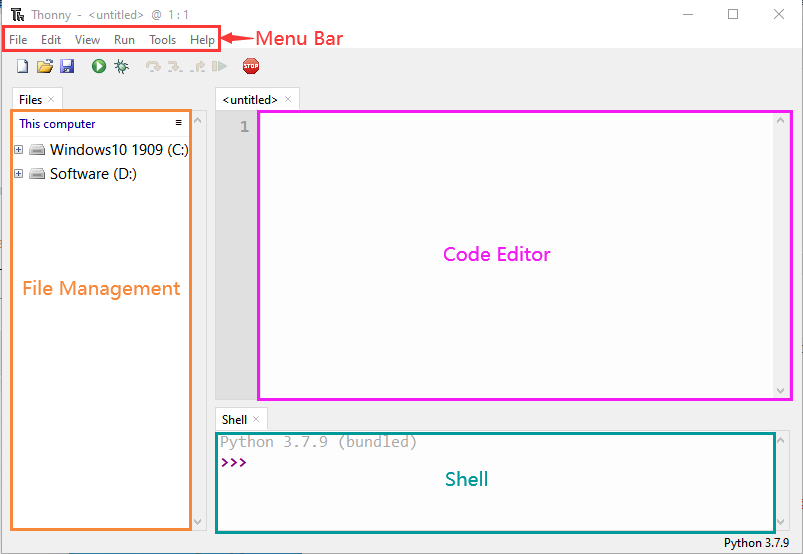
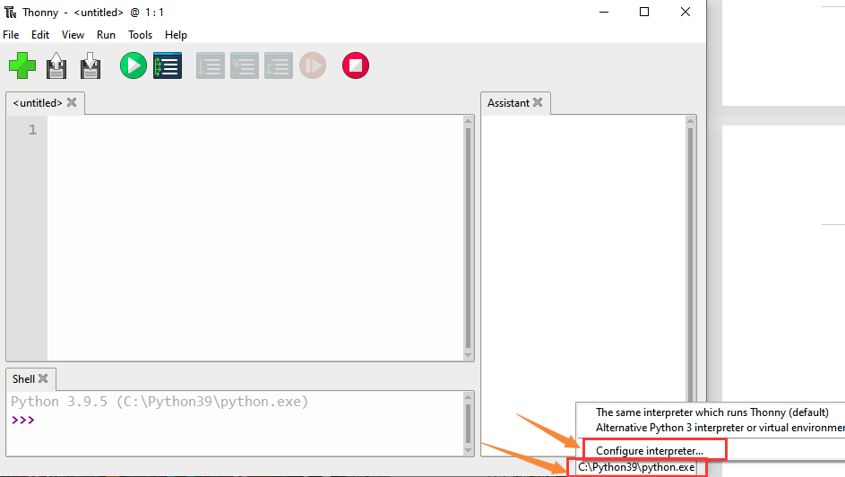
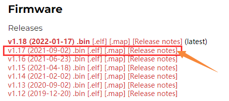
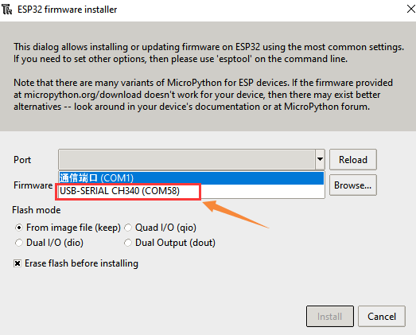
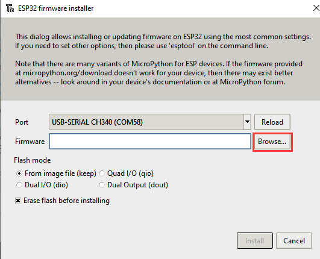
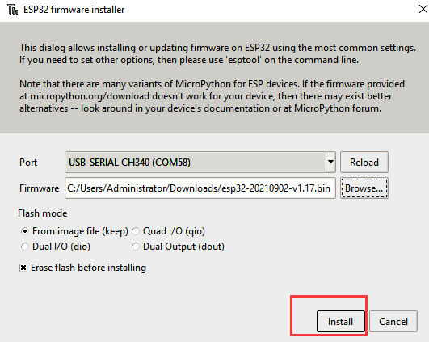
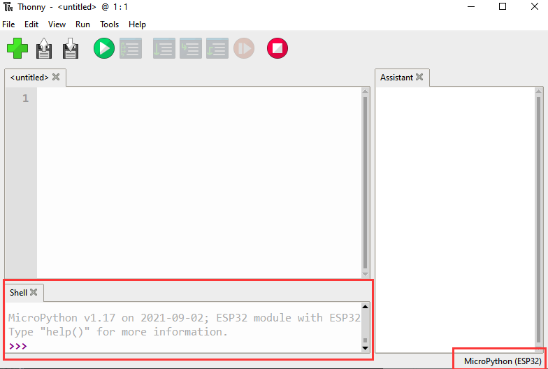

## 6.1 Resource compressiepakket

Het resourcepakket bevat code, libraries, firmware en Thonny-software. Je moet dit resourcepakket hebben om verder te kunnen leren.

[Resource-compression-package](../Resource-compression-package.7z)

## 6.2 Aan de slag met Thonny

---

### 6.2.1 Open het Thonny-pakket

Raadpleeg de onderstaande map:

---

### 6.2.2 Thonny-interface

Open Thonny

Hoofdfuncties van de interface:

---

### 6.2.3 Selecteer de ESP32-ontwikkelomgeving

Klik op Python.exe, selecteer vervolgens Configure interpreter

Selecteer MicroPython(ESP32) in het Interpreter-venster

---

### 6.2.4 Firmware installeren

Downloadlink：\ https://micropython.org/download/esp32/

Kies om versie V1.17 te downloaden

Natuurlijk leveren wij ook de gedownloade firmware, zoals hieronder weergegeven.

MicroPython-firmware flashen

Verbind het smart home met je computer via USB.

Klik op Install or update firmware

Selecteer Port

Klik op Browser om de gedownloade firmwareversie V1.17 te vinden

Klik op Install

Kies Port of WebREPL als driver voor het ESP32-mainboard CH340(COM)

De ESP32-omgeving is geïnstalleerd.

Thonny-interface

