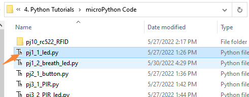
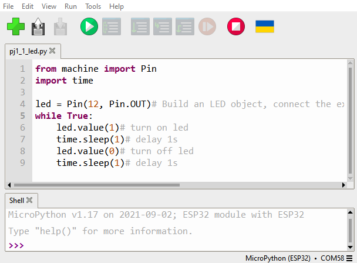
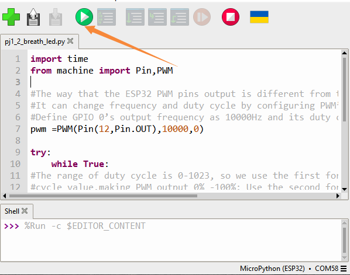

### Project 1: Control LED

we will first learn how to control LED.


**Working Principle**

LED is also the light-emitting diode, which can be made into an
electronic module. It will shine if we control pins to output high
level, otherwise it will be off.

**Parameters**

| **Working voltage** | **DC 3~5V** |
| --- | --- |
| **Working current** | **<20mA** |
| **Power** | **0.1W** |

**Control Pin**

| Yellow LED | 12 |
| --- | --- |
| \ |   |


#### Project 1.1 LED Flashing

**Description**

We can make the LED pin output high level and low level to make the LED
flash.

**Test Code**

```python
from machine import Pin
import time

led = Pin(12, Pin.OUT)# Build an LED object, connect the external LED light to pin 0, and set pin 0 to output mode
while True:
    led.value(1)# turn on led
    time.sleep(1)# delay 1s
    led.value(0)# turn off led
    time.sleep(1)# delay 1s
```
Open the sample code





**Test Result**

Click the button


We can see that the yellow LED is flashing .


#### Project 1.2 Breathing LED

**Description**

A“breathing LED”is a phenomenon where an LED's brightness smoothly
changes from dark to bright and back to dark, continuing to do so and
giving the illusion of an LED“breathing. However, how to control LED’s
brightness?

It makes sense to take advantage of PWM. Output the number of high level
and low level in unit time, the more time the high level occupies, the
larger the PWM value, the brighter the LED.


**Test Code**

```python
import time
from machine import Pin,PWM

#The way that the ESP32 PWM pins output is different from traditionally controllers.
#It can change frequency and duty cycle by configuring PWM’s parameters at the initialization stage.
#Define GPIO 0’s output frequency as 10000Hz and its duty cycle as 0, and assign them to PWM.
pwm =PWM(Pin(12,Pin.OUT),10000)

try:
    while True:
#The range of duty cycle is 0-1023, so we use the first for loop to control PWM to change the duty
#cycle value,making PWM output 0% -100%; Use the second for loop to make PWM output 100%-0%.
        for i in range(0,1023):
            pwm.duty(i)
            time.sleep_ms(1)

        for i in range(0,1023):
            pwm.duty(1023-i)
            time.sleep_ms(1)
except:
#Each time PWM is used, the hardware Timer will be turned ON to cooperate it. Therefore, after each use of PWM,
#deinit() needs to be called to turned OFF the timer. Otherwise, the PWM may fail to work next time.
    pwm.deinit()
```
**Test Result**

Click the button.



The LED gradually gets dimmer then brighter, cyclically, like human
breathe.

