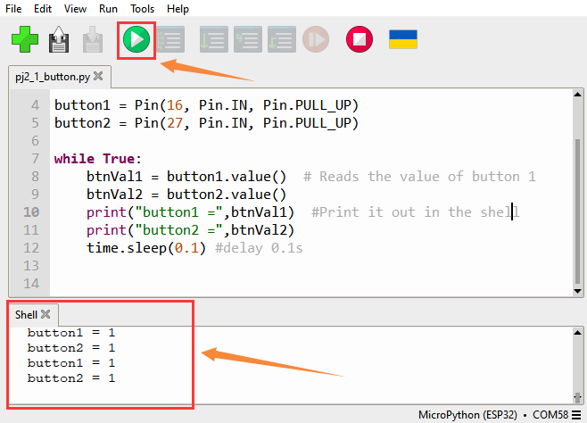
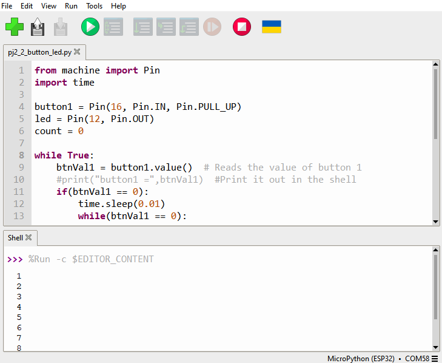

### Progetto 2: Lampada da tavolo

**Descrizione**

La comune lampada da tavolo usa luci LED e pulsanti, che possono controllare l'accensione e lo spegnimento premendo il pulsante.

**Principio del pulsante**

Il modulo pulsante è un sensore digitale, che può leggere solo 0 o 1. Quando il modulo non è premuto, è in stato ad alto livello, cioè 1; quando è premuto, è a basso livello 0.


**Pin del pulsante**

| **Pulsante 1** | **16** |
| --- | --- |
| **Pulsante 2** | **27** |


#### Progetto 2.1 Leggere il pulsante

**Descrizione**

Lavoreremo per leggere il valore di stato del pulsante e visualizzarlo sul monitor seriale, in modo da vederlo in modo intuitivo.

**Codice di prova**

```python
from machine import Pin
import time

button1 = Pin(16, Pin.IN, Pin.PULL_UP)
button2 = Pin(27, Pin.IN, Pin.PULL_UP)

while True:
    btnVal1 = button1.value()  # Reads the value of button 1
    btnVal2 = button2.value()
    print("button1 =",btnVal1)  #Print it out in the shell
    print("button2 =",btnVal2)
    time.sleep(0.1) #delay 0.1s
```
**Risultato del test**

Clicca il pulsante di esecuzione, poi vedrai i valori di stato di button1 e button2 stampati nella shell. Premi il pulsante e vedrai la variazione dei valori di stato.




#### Progetto 2.2. Lampada da tavolo

**Descrizione**

Per una comune lampada da tavolo semplice, premendo il pulsante si accende, premendolo di nuovo si spegne.

**Codice di prova**

Calcolando il numero di volte che il pulsante è stato premuto e prendendo il resto della divisione per 2, si ottengono i due stati 0 o 1.

```python
from machine import Pin
import time

button1 = Pin(16, Pin.IN, Pin.PULL_UP)
led = Pin(12, Pin.OUT)
count = 0

while True:
    btnVal1 = button1.value()  # Reads the value of button 1
    #print("button1 =",btnVal1)  #Print it out in the shell
    if(btnVal1 == 0):
        time.sleep(0.01)
        while(btnVal1 == 0):
            btnVal1 = button1.value()
            if(btnVal1 == 1):
                count = count + 1
                print(count)
    val = count % 2
    if(val == 1):
        led.value(1)
    else:
        led.value(0)
    time.sleep(0.1) #delay 0.1s
```
**Risultato del test**

La shell stamperà il numero di volte che il pulsante è stato premuto; premendo il pulsante una volta, il LED si accende; premendolo di nuovo, si spegne.

