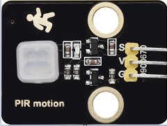
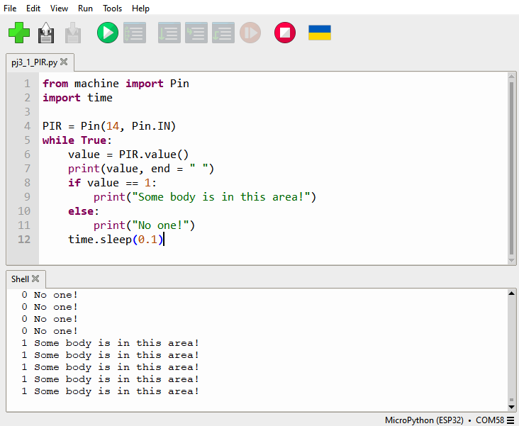

### Project 3: PIR Motion Sensor

**Description**

The PIR motion sensor has many application scenarios in daily life, such
as automatic induction lamp of stairs, automatic induction faucet of
washbasin, etc.

It is also a digital sensor like buttons, which has two state values 0
or 1. And it will be sensed when people are moving.



**Control Pin**

| PIR motion sensor | 14 |
| --- | --- |
| \ |   |


#### Project 3.1 Read the PIR Motion Sensor

We will print out the value of the PIR motion sensor through the serial
monitor.

**Test Code**

```python
from machine import Pin
import time

PIR = Pin(14, Pin.IN)
while True:
    value = PIR.value()
    print(value, end = " ")
    if value == 1:
        print("Some body is in this area!")
    else:
        print("No one!")
    time.sleep(0.1)
```
**Test Result**

When you stand still in front of the sensor, the reading value is 0,
move a little, it will change to 1.




#### Project 3.2 PIR Motion Sensor

If someone moves in front of the sensor, the LED will light up.

**Test Code**

```python
from machine import Pin
import time

PIR = Pin(14, Pin.IN)
led = Pin(12, Pin.OUT)

while True:
    value = PIR.value()
    print(value)
    if value == 1:
        led.value(1)# turn on led
    else:
        led.value(0)
    time.sleep(0.1)
```
**Test Result**

Move your hand in front of the sensor, the LED will turn on. After a few
seconds of immobility, the LED will turn off.

