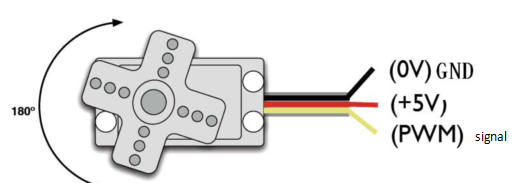

### Project 5: Automatic Doors and Windows

**Description**

Automatic doors and windows need power device, which will become more
automatic with a 180 degree servo and some sensors. Adding a raindrop
sensor, you can achieve the effect of closing windows automatically when
raining. If adding a RFID, we can realize the effect of swiping to open
the door and so on.

**Component Knowledge**

**Servo:**

Servo is a position servo driver device consists of a housing, a circuit
board, a coreless motor, a gear and a position detector.

Its working principle is that the servo receives the signal sent by MCU
or receiver and produces a reference signal with a period of 20ms and
width of 1.5ms, then compares the acquired DC bias voltage to the
voltage of the potentiometer and obtain the voltage difference output.

The IC on the circuit board judges the direction of rotation, and then
drives the coreless motor to start rotation. The power is transmitted to
the swing arm through the reduction gear, and the signal is sent back by
the position detector to judge whether the positioning has been reached,
which is suitable for those control systems that require constant angle
change and can be maintained.

When the motor speed is constant, the potentiometer is driven to rotate
through the cascade reduction gear, which leads that the voltage
difference is 0, and the motor stops rotating. Generally, the angle
range of servo rotation is 0° --180 °.

The pulse period of the control servo is 20ms, the pulse width is 0.5ms
~ 2.5ms, and the corresponding position is -90°~ +90°. Here is an
example of a 180° servo:


In general, servo has three lines in brown, red and orange. The brown
wire is grounded, the red one is a positive pole line and the orange one
is a signal line.




**Pin**

| The servo of the window | 5 |
| --- | --- |
| The servo of the door | 13 |


#### Project 5.1 Control the Door

**Test Code**

```python
from machine import Pin, PWM
import time
pwm = PWM(Pin(13))
pwm.freq(50)

'''
Duty cycle corresponding to the Angle
0°----2.5%----25
45°----5%----51.2
90°----7.5%----77
135°----10%----102.4
180°----12.5%----128
'''
angle_0 = 25
angle_90 = 77
angle_180 = 128

while True:
    pwm.duty(angle_0)
    time.sleep(1)
    pwm.duty(angle_90)
    time.sleep(1)
    pwm.duty(angle_180)
    time.sleep(1)
```
**Test Result**

The servo of the door turns with the door, back and forth


#### Project 5.2 Close the Window

**Description**

We will work to use a servo and a raindrop sensor to make an device
closing windows automatically when raining.

**Component Knowledge**

**Raindrop Sensor:** This is an analog input module, the greater the
area covered by water on the detection surface, the greater the value
returned (range 0~4096).

**Test Code**

```python
# Import Pin, ADC and DAC modules.
from machine import ADC,Pin,DAC,PWM
import time
pwm = PWM(Pin(5))
pwm.freq(50)

# Turn on and configure the ADC with the range of 0-3.3V
adc=ADC(Pin(34))
adc.atten(ADC.ATTN_11DB)
adc.width(ADC.WIDTH_12BIT)

# Read ADC value once every 0.1seconds, convert ADC value to DAC value and output it, and print these data to “Shell”.
try:
    while True:
        adcVal=adc.read()
        dacVal=adcVal//16
        voltage = adcVal / 4095.0 * 3.3
        print("ADC Val:",adcVal,"DACVal:",dacVal,"Voltage:",voltage,"V")
        if(voltage > 0.6):
            pwm.duty(46)
        else:
            pwm.duty(100)
        time.sleep(0.1)
except:
    pass
```
**Test Result**

At first, the window opens automatically, and when you touch the
raindrop sensor with your hand (which has water on the skin), the window
will close.

