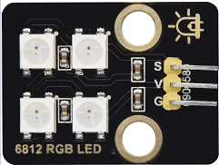

### Project 6: Atmosphere Lamp

**Description**

The atmosphere lamp of smart home is 4 SK6812RGB LEDs. RGB LED belongs
to a simple luminous module, which can adjust the color to bring out the
lamp effect of different colors. Furthermore, it can be widely used in
buildings, bridges, roads, gardens, courtyards, floors and other fields
of decorative lighting and venue layout, Christmas, Halloween,
Valentine's Day, Easter, National Day as well as other festivals during
the atmosphere and other scenes.

In this experiment, we will make various lighting effects.

**Component Knowledge**

From the schematic diagram, we can see that these four RGB LEDs are all
connected in series. In fact, no matter how many they are, we can use a
pin to control a RGB LED and let it display any color. Each RGBLED is an
independent pixel, composed of R, G and B colors, which can achieve 256
levels of brightness display and complete the full true color display of
16777216 colors.

What’s more, the pixel point contains a data latch signal shaping
amplifier drive circuit and a signal shaping circuit, which effectively
ensures the color of the pixel point light is highly consistent.




**Pin**

| SK6812 | 26 |
| --- | --- |
| \ |   |


#### Project 6.1 RGB Sk6812

We will control SK6812 to display various lighting effects.

**Test Code**

```python
#Import Pin, neopiexl and time modules.
from machine import Pin
import neopixel
import time

#Define the number of pin and LEDs connected to neopixel.
pin = Pin(26, Pin.OUT)
np = neopixel.NeoPixel(pin, 4)

#brightness :0-255
brightness=100
colors=[[brightness,0,0],                    #red
        [0,brightness,0],                    #green
        [0,0,brightness],                    #blue
        [brightness,brightness,brightness],  #white
        [0,0,0]]                             #close

#Nest two for loops to make the module repeatedly display five states of red, green, blue, white and OFF.
while True:
    for i in range(0,5):
        for j in range(0,4):
            np[j]=colors[i]
            np.write()
            time.sleep_ms(50)
        time.sleep_ms(500)
    time.sleep_ms(500)
```
**Test Result**

The atmosphere lamps of the smart home will display red,greenish blue as
well as white.


#### Project 6.2 Button Control Sk6812

**Description**

There are two switch buttons to change the color of the atmosphere lamp.

**Test Code**

```python
#Import Pin, neopiexl and time modules.
from machine import Pin
import neopixel
import time

button1 = Pin(16, Pin.IN, Pin.PULL_UP)
button2 = Pin(27, Pin.IN, Pin.PULL_UP)
count = 0

#Define the number of pin and LEDs connected to neopixel.
pin = Pin(26, Pin.OUT)
np = neopixel.NeoPixel(pin, 4)

#brightness :0-255
brightness=100
colors=[[0,0,0],
        [brightness,0,0],                    #red
        [0,brightness,0],                    #green
        [0,0,brightness],                    #blue
        [brightness,brightness,brightness]  #white
        ]                             #close

def func_color(val):
    for j in range(0,4):
        np[j]=colors[val]
        np.write()
        time.sleep_ms(50)

#Nest two for loops to make the module repeatedly display five states of red, green, blue, white and OFF.
while True:
    btnVal1 = button1.value()  # Reads the value of button 1
    #print("button1 =",btnVal1)  #Print it out in the shell
    if(btnVal1 == 0):
        time.sleep(0.01)
        while(btnVal1 == 0):
            btnVal1 = button1.value()
            if(btnVal1 == 1):
                count = count - 1
                print(count)
                if(count <= 0):
                    count = 0

    btnVal2 = button2.value()
    if(btnVal2 == 0):
        time.sleep(0.01)
        while(btnVal2 == 0):
            btnVal2 = button2.value()
            if(btnVal2 == 1):
                count = count + 1
                print(count)
                if(count >= 4):
                    count = 4

    if(count == 0):
        func_color(0)
    elif(count == 1):
        func_color(1)
    elif(count == 2):
        func_color(2)
    elif(count == 3):
        func_color(3)
    elif(count == 4):
        func_color(4)
```
**Test Result**

We can switch the color of the atmosphere lamp by clicking buttons 1 and
2.

