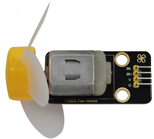

### Projekt 7: Lüfter

**Beschreibung**

In diesem Projekt lernen wir, wie man einen kleinen Lüfter baut.

**Komponentenkenntnisse**

Der kleine Lüfter verwendet einen 130 DC-Motor und sichere Lüfterblätter. Sie können den PWM-Ausgang verwenden, um die Lüftergeschwindigkeit zu steuern.



**Steuerungsmethode**

Zum Steuern des Lüftermotors werden zwei Pins benötigt, einer für INA und einer für INB. Der PWM-Wertbereich ist 0~255. Wenn der PWM-Ausgang der beiden Pins unterschiedlich ist, kann sich der Lüfter drehen.

| INA - INB <= -45 | Dreht im Uhrzeigersinn |
| --- | --- |
| INA - INB >= 45 | Dreht gegen den Uhrzeigersinn |
| INA ==0, INB == 0 | Stoppen |

**Steuerpins**

| INA | 19 |
| --- | --- |
| INB | 18 |


#### Projekt 7.1 Lüfter

Wir können die Drehgeschwindigkeit des Lüfters gegen den Uhrzeigersinn und im Uhrzeigersinn steuern.

**Test Code**

```python
from machine import Pin,PWM
import time
#Two pins of the motor
INA =PWM(Pin(19,Pin.OUT),10000)#INA corresponds to IN+
INB =PWM(Pin(18,Pin.OUT),10000)#INB corresponds to IN-

try:
    while True:
        #Counterclockwise 2s
        INA.duty(0) #The range of duty cycle is 0-1023
        INB.duty(700)
        time.sleep(2)
        #stop 1s
        INA.duty(0)
        INB.duty(0)
        time.sleep(1)
        #Turn clockwise for 2s
        INA.duty(600)
        INB.duty(0)
        time.sleep(2)
        #stop 1s
        INA.duty(0)
        INB.duty(0)
        time.sleep(1)
except:
    INA.duty(0)
    INB.duty(0)
    INA.deinit()
    INB.deinit()
```
**Testergebnis**

Der Lüfter dreht sich mit unterschiedlichen Geschwindigkeiten im Uhrzeigersinn und gegen den Uhrzeigersinn.


#### Projekt 7.2 Tastersteuerung des Lüfters

Taster 1 steuert den Lüfter.

**Test Code**

```python
from machine import Pin,PWM
import time
#Two pins of the motor
INA =PWM(Pin(19,Pin.OUT),10000)#INA corresponds to IN+
INB =PWM(Pin(18,Pin.OUT),10000)#INB corresponds to IN-
button1 = Pin(16, Pin.IN, Pin.PULL_UP)
count = 0

try:
    while True:
        btnVal1 = button1.value()  # Reads the value of button 1
        if(btnVal1 == 0):
            time.sleep(0.01)
            while(btnVal1 == 0):
                btnVal1 = button1.value()
                if(btnVal1 == 1):
                    count=count + 1
                    print(count)
        val = count % 2
        if(val == 1):
            INA.duty(0) #The range of duty cycle is 0-1023
            INB.duty(700)
        else:
            INA.duty(0)
            INB.duty(0)
except:
    INA.duty(0)
    INB.duty(0)
    INA.deinit()
    INB.deinit()
```
**Testergebnis**

Drücken Sie Taster 1, dann beginnt der Lüfter zu drehen. Drücken Sie Taster 1 erneut, stoppt der Lüfter.