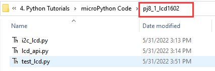
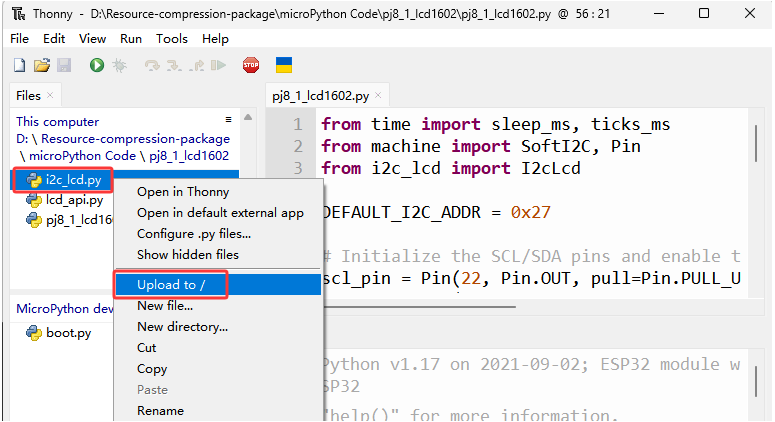
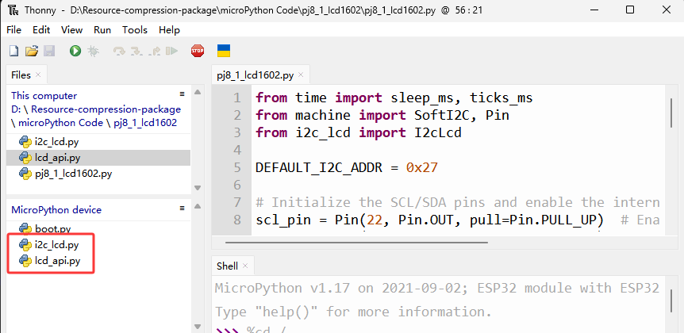

### Proyecto 8: Pantalla LCD1602

**Descripción**

Como todos sabemos, la pantalla es una de las mejores formas para que las personas interactúen con dispositivos electrónicos.

**Conocimientos del componente**

1602 es una línea que puede mostrar 16 caracteres. Hay dos líneas, que usan el protocolo de comunicación IIC.


**Pines de control**

| SDA | SDA |
| --- | --- |
| SCL | SCL |


#### Proyecto 8.1 LCD 1602 Mostrar caracteres

**Descripción**

Usaremos los archivos de librería i2c_lcd.py y lcd_api.py, los cuales deben guardarse en la memoria del ESP32.



**Operaciones**

Abra “Thonny”, haga clic en “This computer”→“D:”→“2. Python Projects”→“pj8_1_lcd1602”. Seleccione “i2c_lcd.py”, haga clic derecho y seleccione “\ **Upload to /**\ ”, espere a que “i2c_lcd.py” se cargue en ESP32; y luego seleccione “lcd_api.py”, haga clic derecho y seleccione “\ **Upload to /**\ ”, espere a que “lcd_api.py” se cargue en ESP32.




Los nombres guardados son i2c_lcd.py y lcd_api.py



**Test Code**

```python
from time import sleep_ms, ticks_ms
from machine import I2C, Pin
from i2c_lcd import I2cLcd

DEFAULT_I2C_ADDR = 0x27

i2c = I2C(scl=Pin(22), sda=Pin(21), freq=400000)
lcd = I2cLcd(i2c, DEFAULT_I2C_ADDR, 2, 16)

lcd.move_to(1, 0)
lcd.putstr('Hello')
lcd.move_to(1, 1)
lcd.putstr('keyestudio')

# The following line of code should be tested
# using the REPL:

# 1. To print a string to the LCD:
#    lcd.putstr('Hello world')
# 2. To clear the display:
#lcd.clear()
# 3. To control the cursor position:
# lcd.move_to(2, 1)
# 4. To show the cursor:
# lcd.show_cursor()
# 5. To hide the cursor:
#lcd.hide_cursor()
# 6. To set the cursor to blink:
#lcd.blink_cursor_on()
# 7. To stop the cursor on blinking:
#lcd.blink_cursor_off()
# 8. To hide the currently displayed character:
#lcd.display_off()
# 9. To show the currently hidden character:
#lcd.display_on()
# 10. To turn off the backlight:
#lcd.backlight_off()
# 11. To turn ON the backlight:
#lcd.backlight_on()
# 12. To print a single character:
#lcd.putchar('x')
# 13. To print a custom character:
#happy_face = bytearray([0x00, 0x0A, 0x00, 0x04, 0x00, 0x11, 0x0E, 0x00])
#lcd.custom_char(0, happy_face)
#lcd.putchar(chr(0))
```
**Resultado de la prueba**

La primera línea del LCD1602 muestra hello y la segunda línea muestra keyestudio.


#### Proyecto 8.2 Alarma de gas peligroso

**Descripción**

Cuando un sensor de gas detecta una alta concentración de gas peligroso, el buzzer emitirá una alarma y la pantalla mostrará dangerous.

**Conocimientos del componente**

**Sensor de humo MQ2**:

Es un dispositivo de monitorización de fugas de gas para hogares y fábricas, que es adecuado para gas licuado, benceno, alquilos, alcohol, hidrógeno así como la detección de humo. Nuestro sensor tiene un pin digital D y una salida analógica A, que está conectada a D como sensor digital en este proyecto.


**Pin de control**

| Sensor de gas | 23 |
| --- | --- |
| \ |   |

**Test Code**

```python
from time import sleep_ms, ticks_ms
from machine import SoftI2C, Pin
from i2c_lcd import I2cLcd

DEFAULT_I2C_ADDR = 0x27

scl_pin = Pin(22, Pin.OUT, pull=Pin.PULL_UP)  # GPIO22 with internal pull-up enabled
sda_pin = Pin(21, Pin.OUT, pull=Pin.PULL_UP)  # GPIO21 with internal pull-up enabled

i2c = SoftI2C(scl=Pin(22), sda=Pin(21), freq=100000)
lcd = I2cLcd(i2c, DEFAULT_I2C_ADDR, 2, 16)

from machine import Pin
import time
gas = Pin(23, Pin.IN, Pin.PULL_UP)

while True:
    gasVal = gas.value()  # Reads the value of button 1
    print("gas =",gasVal)  #Print it out in the shell
    lcd.move_to(1, 1)
    lcd.putstr('val: {}'.format(gasVal))
    if(gasVal == 1):
        #lcd.clear()
        lcd.move_to(1, 0)
        lcd.putstr('Safety       ')
    else:
        lcd.move_to(1, 0)
        lcd.putstr('dangerous')
    time.sleep(0.1) #delay 0.1s
```
**Resultado de la prueba**

La pantalla muestra "safety" en estado normal. Sin embargo, cuando el sensor de gas detecta algunos gases peligrosos, como monóxido de carbono, a cierta concentración, el buzzer emitirá una alarma y la pantalla mostrará "dangerous".