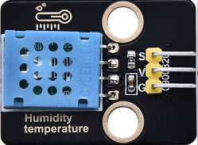

### Projet 9 : Capteur de température et d'humidité

**Informations sur le composant**

Son mode de communication est des données série et un bus unique. La plage de mesure de la température est de -20 à +60℃, précision ±2℃. La plage d'humidité est de 5 à 95%RH, précision ±5%RH.



**Broche de contrôle**

| Capteur de température et d'humidité | 17 |
| --- | --- |
| \ |   |


#### Projet 9.1 Testeur de température et d'humidité

**Code de test**

```python
# Import machine, time and dht modules.
import machine
import time
import dht
from time import sleep_ms, ticks_ms
from machine import SoftI2C, Pin
from i2c_lcd import I2cLcd

#Associate DHT11 with Pin(17).
DHT = dht.DHT11(machine.Pin(17))

DEFAULT_I2C_ADDR = 0x27

i2c = SoftI2C(scl=Pin(22), sda=Pin(21), freq=100000)
lcd = I2cLcd(i2c, DEFAULT_I2C_ADDR, 2, 16)

while True:
    DHT.measure() # Start DHT11 to measure data once.
   # Call the built-in function of DHT to obtain temperature
   # and humidity data and print them in “Shell”.
    print('temperature:',DHT.temperature(),'℃','humidity:',DHT.humidity(),'%')
    lcd.move_to(1, 0)
    lcd.putstr('T= {}'.format(DHT.temperature()))
    lcd.move_to(1, 1)
    lcd.putstr('H= {}'.format(DHT.humidity()))
    time.sleep_ms(1000)
```
**Résultat du test**

Le LCD1602 affiche la température (T = \*\* ° C) et l'humidité (H = \*\* %RH). Lorsque vous soufflez sur le capteur T/H, vous pouvez voir que l'humidité augmente.