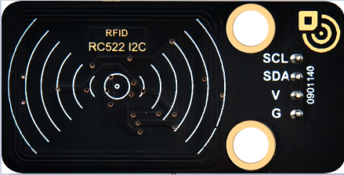
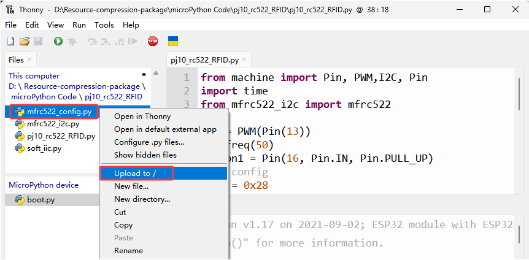
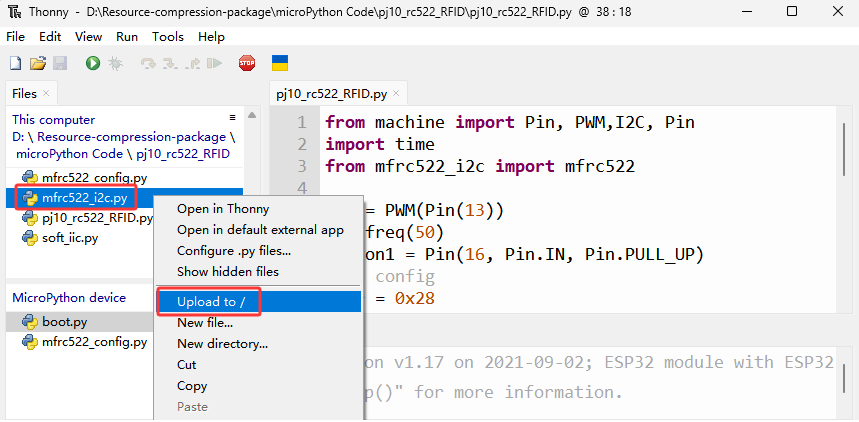
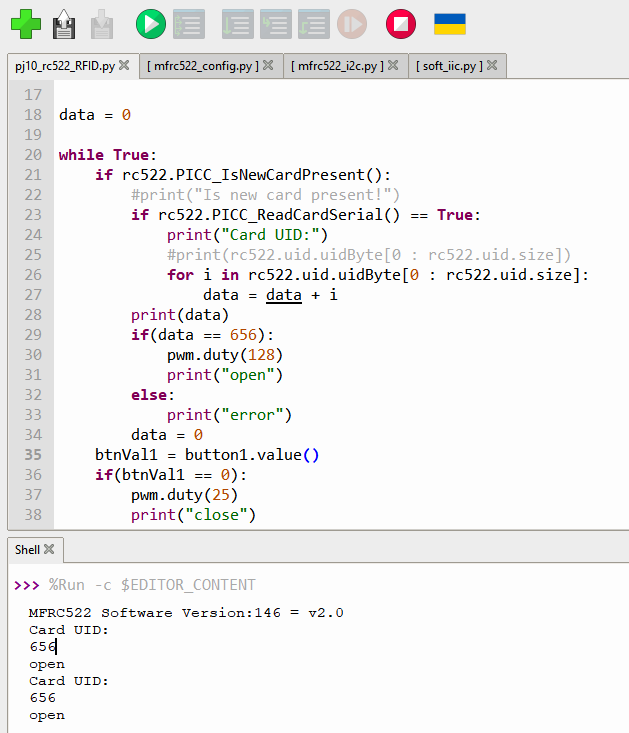

### Projekt 10: RFID RC522 Modul

**Komponentenwissen**

Radiofrequenz-Identifikation: Das Kartenlesegerät besteht aus einem Radiofrequenzmodul und einem hochfrequenten Magnetfeld. Der Tag-Transponder ist ein Sensorsystem, das keine Batterie enthält. Er enthält lediglich kleine integrierte Schaltkreise zur Datenspeicherung und Antennen zum Empfangen und Senden von Signalen.

Um die Daten im Tag zu lesen, bringen Sie ihn zunächst in die Lesereichweite des Kartenlesers. Der Leser erzeugt ein Magnetfeld, das nach dem Lenzschen Gesetz elektrische Energie erzeugen kann; der RFID-Tag versorgt sich dadurch selbst mit Strom und aktiviert so das Gerät.



**Steuerpins**

Verwenden Sie IIC-Kommunikation

| SDA | SDA |
| --- | --- |
| SCL | SCL |


#### Projekt 10.1 Tür öffnen

Öffnen Sie den Ordner, in dem sich mfrc522_config.py, soft_iic.py und mfrc522_i2c.py befinden

Öffnen Sie „Thonny“, klicken Sie auf „This computer“→„D:“→„2. Python Projects“→„pj10_rc522_RFID“. Wählen Sie „mfrc522_config.py“ aus, klicken Sie mit der rechten Maustaste und wählen Sie „\ **Upload to /**\ “, warten Sie, bis „mfrc522_config.py“ auf ESP32 hochgeladen wurde; wählen Sie „soft_iic.py“ aus, klicken Sie mit der rechten Maustaste und wählen Sie „\ **Upload to /**\ “, warten Sie, bis „soft_iic.py“ auf ESP32 hochgeladen wurde; und wählen Sie dann „mfrc522_i2c.py“ aus, klicken Sie mit der rechten Maustaste und wählen Sie „\ **Upload to /**\ “, warten Sie, bis „mfrc522_i2c.py“ auf ESP32 hochgeladen wurde.






Die gespeicherten Namen sind mfrc522_config.py, soft_iic.py und mfrc522_i2c.py.


**Testcode**

```python
from machine import Pin, PWM,I2C, Pin
import time
from mfrc522_i2c import mfrc522


pwm = PWM(Pin(13))
pwm.freq(50)
button1 = Pin(16, Pin.IN, Pin.PULL_UP)
#i2c config
addr = 0x28
scl = 22
sda = 21

rc522 = mfrc522(scl, sda, addr)
rc522.PCD_Init()
rc522.ShowReaderDetails()            # Show details of PCD - MFRC522 Card Reader details

data = 0

while True:
    if rc522.PICC_IsNewCardPresent():
        #print("Is new card present!")
        if rc522.PICC_ReadCardSerial() == True:
            print("Card UID:")
            #print(rc522.uid.uidByte[0 : rc522.uid.size])
            for i in rc522.uid.uidByte[0 : rc522.uid.size]:
                data = data + i
        print(data)
        if(data == 510):
            pwm.duty(128)
            print("open")
        else:
            print("error")
        data = 0
    btnVal1 = button1.value()
    if(btnVal1 == 0):
        pwm.duty(25)
        print("close")
    time.sleep(1)
```
**Testergebnis**

Halten Sie die mitgelieferte Karte an den RFID-Erfassungsbereich, die Tür dreht sich und öffnet sich, und die Konsole zeigt "open" an. Drücken Sie Taste 1 und die Tür dreht sich und schließt. Wenn Sie jedoch mit einem anderen blauen Erkennungsblock wischen, zeigt die Konsole "Error" an.

