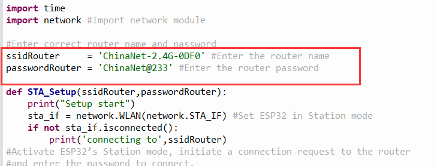

### Project 12: WiFi

The easiest way to access the Internet is to use a WiFi to connect. The
ESP32 main control board comes with a WiFi module, making our smart home
accessible to the Internet easily.


#### Project 12.1 WiFi Station

**Description**

We connect the smart home to a LAN, which is the WiFi in your home or
the hot spot of your phone. After the connection is successful, an
address will be assigned. We will print the assigned address in the
shell.

**Test Code**

Note: ssiD and password in the code should be filled with your own WiFi
name and password.



```python
import time
import network #Import network module

#Enter correct router name and password
ssidRouter     = 'LieBaoWiFi359' #Enter the router name
passwordRouter = 'wmbd315931' #Enter the router password

def STA_Setup(ssidRouter,passwordRouter):
    print("Setup start")
    sta_if = network.WLAN(network.STA_IF) #Set ESP32 in Station mode
    if not sta_if.isconnected():
        print('connecting to',ssidRouter)
#Activate ESP32’s Station mode, initiate a connection request to the router
#and enter the password to connect.
        sta_if.active(True)
        sta_if.connect(ssidRouter,passwordRouter)
#Wait for ESP32 to connect to router until they connect to each other successfully.
        while not sta_if.isconnected():
            pass
#Print the IP address assigned to ESP32 in “Shell”.
    print('Connected, IP address:', sta_if.ifconfig())
    print("Setup End")

try:
    STA_Setup(ssidRouter,passwordRouter)
except:
    sta_if.disconnect()
```
**Test Result**

If the WiFi is connected successfully, the serial monitor will print out
the connected WiFi name and assigned IP address.


