# **Keyestudio IoT Smart Home Kit for ESP32**

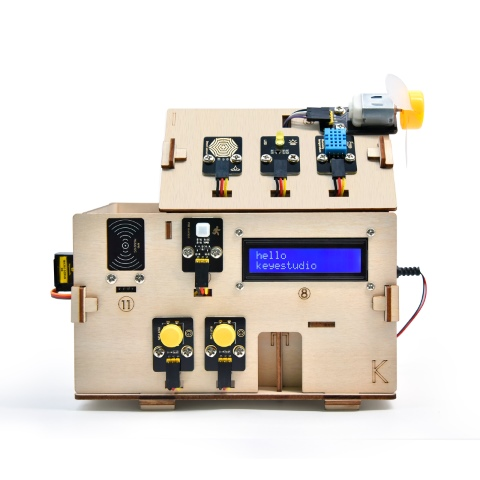

# Description

As the rapid development of the Internet grows, various intelligent devices are gradually integrated into our daily life. For example, we can use RFID to open the door. In addition, the kitchen is equipped with a gas detection alarm, which alerts people to the danger when dangerous gas and large smoke are detected. When it detects rain, it can automatically collect clothes and close windows. All kinds of electrical equipment can be controlled by mobile phone, control lights, fans, air conditioning and so on.

In this connection, we seek to launch this smart home product with ESP32 control, which has a host of sensors and modules as well as networking function, making the relevant knowledge of the Internet more accessible to you.

# Features

1.  Elegant appearance
2.  A host of sensor modules
3.  Mobile phone APP network control
4.  Morse password door
5.  It can automatically close windows
6.  RFID function
7.  C language and MicroPython

# Kit list

| \#   | Picture                                          | Name                                  | QTY               |
| ---- | ------------------------------------------------ | ------------------------------------- | ----------------- |
| 1    | 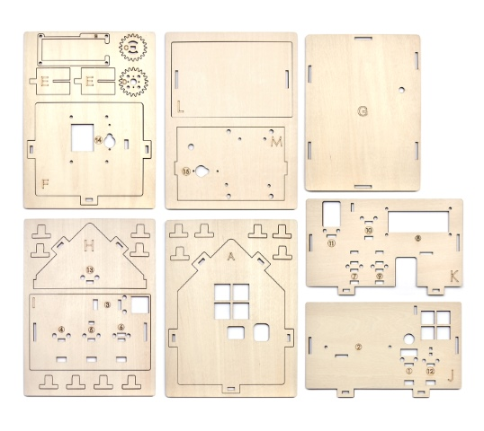 | Wooden Board                          | 1                 |
| 2    | 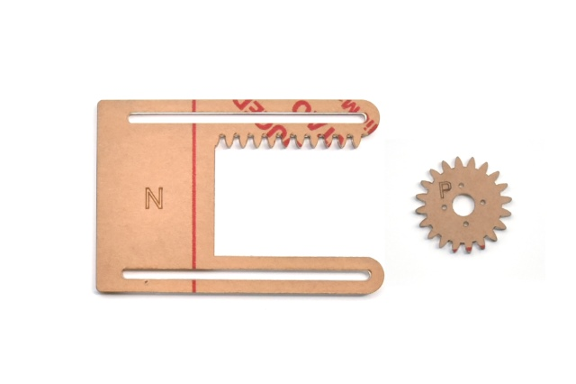 | Acrylic Board                         | 1                 |
| 3    |  | ESP32 PLUS Development Board          | 1                 |
| 4    |   | 6812 RGB Module                       | 1                 |
| 5    |   | Analog Gas Sensor                     | 1                 |
| 6    |   | Button Module                         | 2                 |
| 7    |   | RFID Module                           | 1                 |
| 8    |   | Passive Buzzer Module                 | 1                 |
| 9    | 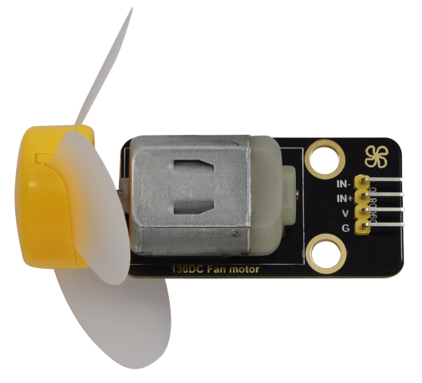  | 130 Motor                             | 1                 |
| 10   | 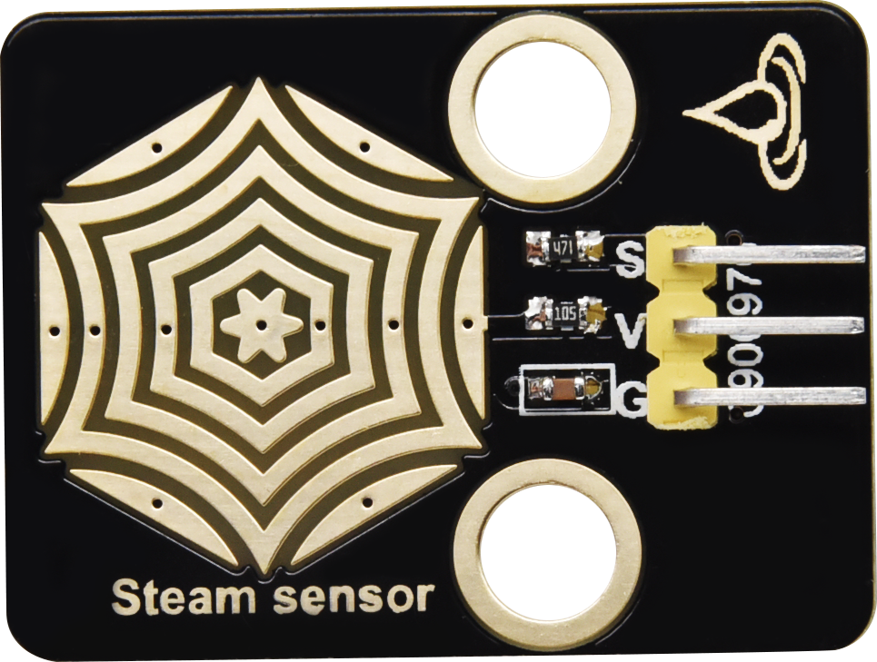  | Steam Sensor                          | 1                 |
| 11   | 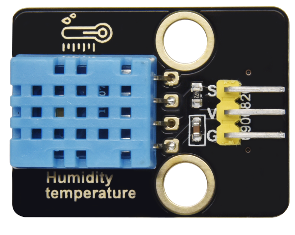  | XHT11 Temperature and Humidity Sensor | 1                 |
| 12   |   | PIR Motion Sensor                     | 1                 |
| 13   | 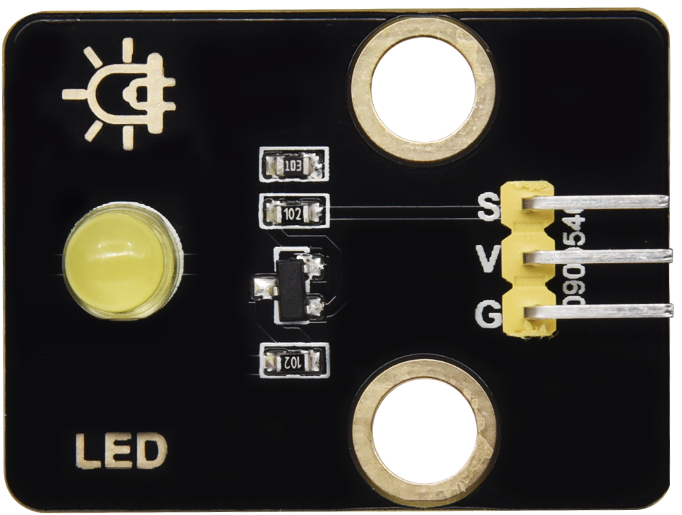  | Yellow LED Module                     | 1                 |
| 14   | 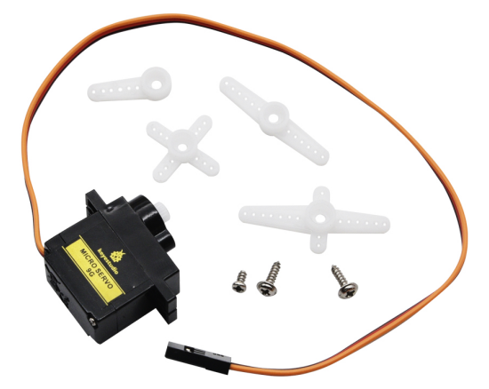  | Servo                                 | 2                 |
| 15   | 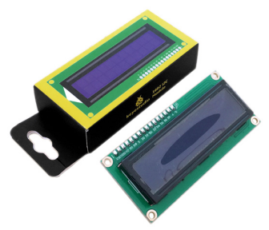  | I2C1602 LCD Module                    | 1                 |
| 16   | 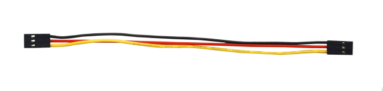  | 3P F-F 150 mm Dupont Wire             | 5                 |
| 17   | 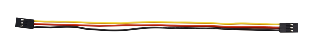  | 3P F-F 200 mm Dupont Wire             | 4                 |
| 18   |   | F-F 200 mm /40P/2.54 Wires            | 0.1 （4 strands） |
| 19   |   | 4P F-F 200 mm Splicing Dupont Wire    | 2                 |
| 20   | 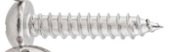  | M1.4\*6MM Round Head Screws           | 10                |
| 21   |   | M3 Nickle-plated Nut(self-locking)    | 5                 |
| 22   |   | M4\*8MM Round Head Screws             | 24                |
| 23   |   | M3\*6MM Round Head Screws             | 9                 |
| 24   |   | M3\*10MM Round Head Screws            | 5                 |
| 25   |   | M2\*12MM Round Head Screws            | 5                 |
| 26   |   | M4 Nickle-plated Nut                  | 24                |
| 27   |   | M3 Nickle-plated Nut                  | 7                 |
| 28   |   | M2 Nickle-plated Nut                  | 6                 |
| 29   |   | M3\*8MM Flat Head Screws              | 3                 |
| 30   | 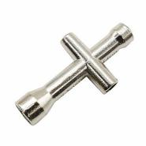 | Cross Wrench                          | 1                 |
| 31   | 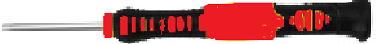  | 3.0\*40MM Screwdriver                 | 1                 |
| 32   |   | 2.0\*40MM Screwdriver                 | 1                 |
| 33   | 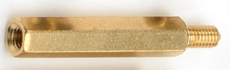  | M3\*10MM Dual-pass Copper Pillar      | 4                 |
| 34   | 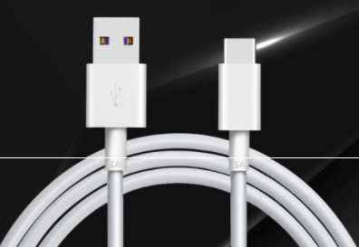  | USB Cable                             | 1                 |
| 35   |   | 6-Slot AA Battery Holder              | 1                 |
| 36   |   | M3\*12MM Round Head Screws            | 4                 |
| 37   |   | White Card                            | 1                 |
| 38   |   | ABS RFID Key                          | 1                 |

