# **Keyestudio IoT Smart Home Kit for ESP32**


# 1. Beschreibung

Mit der rasanten Entwicklung des Internets werden verschiedene intelligente Geräte nach und nach in unser tägliches Leben integriert. Zum Beispiel können wir RFID verwenden, um die Tür zu öffnen. Außerdem ist die Küche mit einem Gaserkennungsalarm ausgestattet, der vor Gefahr warnt, wenn gefährliche Gase und starker Rauch erkannt werden. Wenn Regen erkannt wird, können Wäsche automatisch eingeholt und Fenster geschlossen werden. Verschiedene elektrische Geräte können per Mobiltelefon gesteuert werden, z. B. Lampen, Ventilatoren, Klimaanlagen und so weiter.

In diesem Zusammenhang möchten wir dieses Smart-Home-Produkt mit ESP32-Steuerung vorstellen, das eine Vielzahl von Sensoren und Modulen sowie Netzwerkfunktionen bietet und das relevante Wissen des Internets für Sie zugänglicher macht.


# 2. Eigenschaften

1. Elegantes Erscheinungsbild
1. Eine Vielzahl von Sensormodulen
1. Netzwerksteuerung über Smartphone-App
1. Tür mit Morse-Passwort
1. Kann Fenster automatisch schließen
1. RFID-Funktion
1. Unterstützt C und MicroPython


# 3. Kit-Liste

| # | Bild | Name | Menge |
| --- | --- | --- | --- |
| 1 |  | Wooden Board | 1 |
| 2 | 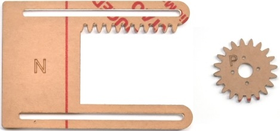 | Acrylic Board | 1 |
| 3 | 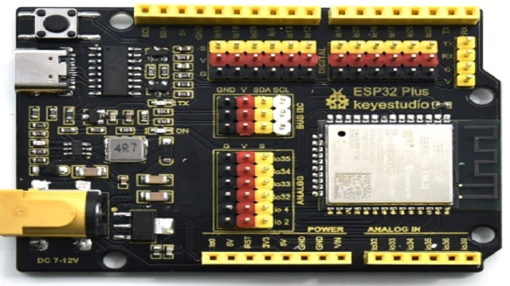 | ESP32 PLUS Development Board | 1 |
| 4 | 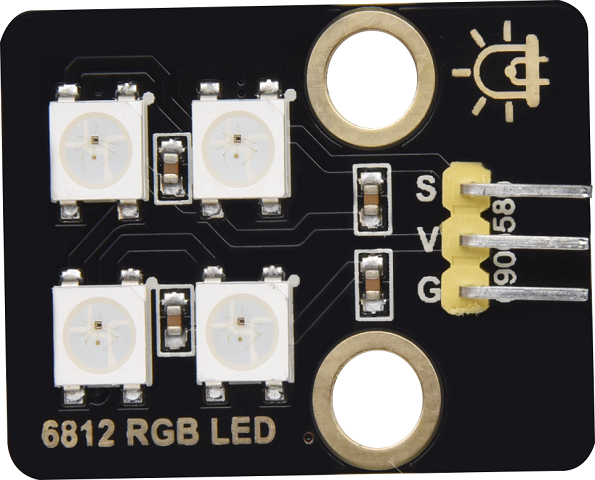 | 6812 RGB Module | 1 |
| 5 | 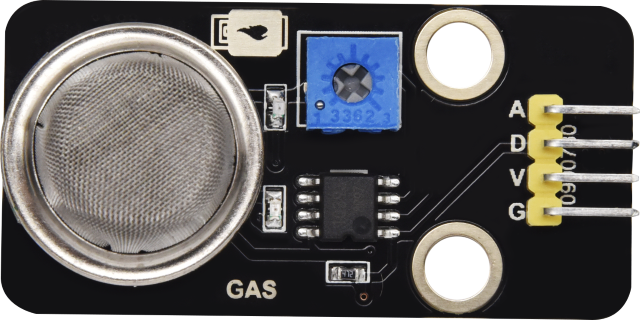 | Analog Gas Sensor | 1 |
| 6 | 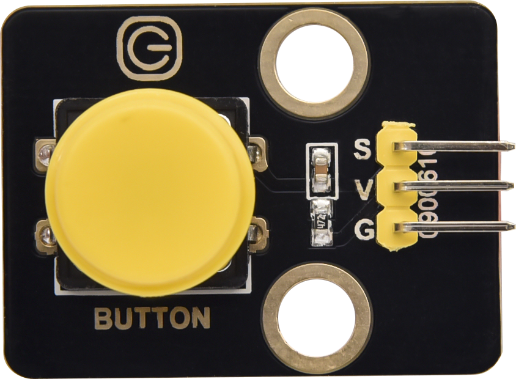 | Button Module | 2 |
| 7 |  | RFID Module | 1 |
| 8 | 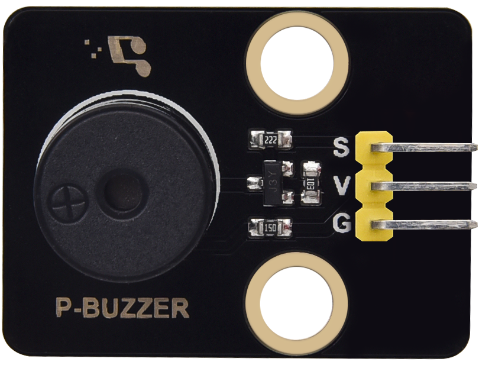 | Passive Buzzer Module | 1 |
| 9 |  | 130 Motor | 1 |
| 10 |  | Steam Sensor | 1 |
| 11 |  | XHT11 Temperature and Humidity Sensor | 1 |
| 12 |  | PIR Motion Sensor | 1 |
| 13 |  | Yellow LED Module | 1 |
| 14 |  | Servo | 2 |
| 15 |  | I2C1602 LCD Module | 1 |
| 16 | 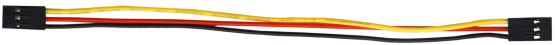 | 3P F-F 150 mm Dupont Wire | 5 |
| 17 |  | 3P F-F 200 mm Dupont Wire | 4 |
| 18 | 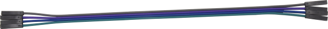 | F-F 200 mm /40P/2.54 Wires | 0.1 （4 strands） |
| 19 |  | 4P F-F 200 mm Splicing Dupont Wire | 2 |
| 20 |  | M1.4*6MM Round Head Screws | 4 |
| 21 |  | M1.2*4MM Round Head Screws | 4 |
| 22 | 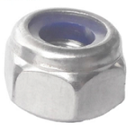 | M3 Nickle-plated Nut(self-locking) | 5 |
| 23 |  | M4*8MM Round Head Screws | 24 |
| 24 |  | M3*6MM Round Head Screws | 9 |
| 25 |  | M3*10MM Round Head Screws | 5 |
| 26 |  | M2*12MM Round Head Screws | 5 |
| 27 |  | M4 Nickle-plated Nut | 24 |
| 28 |  | M3 Nickle-plated Nut | 7 |
| 29 |  | M2 Nickle-plated Nut | 6 |
| 30 |  | M3*8MM Flat Head Screws | 3 |
| 31 |  | Cross Wrench | 1 |
| 32 |  | 3.0*40MM Screwdriver | 1 |
| 33 |  | 2.0*40MM Screwdriver | 1 |
| 34 | 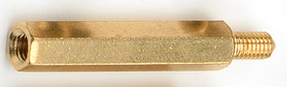 | M3*10MM Dual-pass Copper Pillar | 4 |
| 35 |  | USB Cable | 1 |
| 36 |  | 6-Slot AA Battery Holder | 1 |
| 37 |  | M3*12MM Round Head Screws | 4 |
| 38 |  | White Card | 1 |
| 39 | 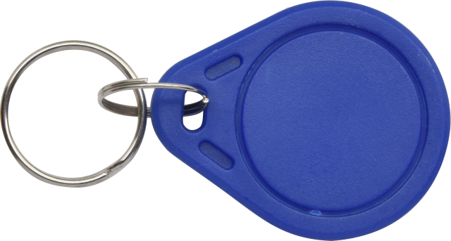 | ABS RFID Key | 1 |


# 4. Wie man das Smart Home installiert

**Schritt 1**
Benötigte Komponenten


Installationsdiagramm


Prototyp

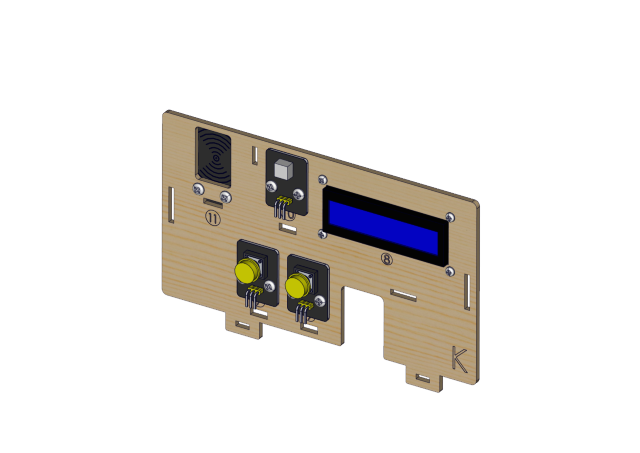

**Schritt 2**

Benötigte Komponenten


Installationsdiagramm

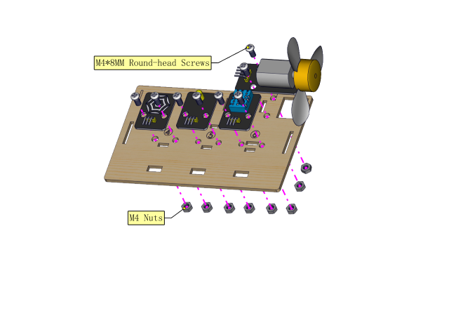

Prototyp

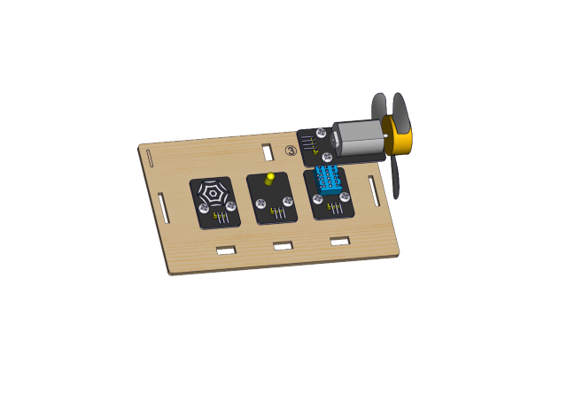

**Schritt 3**

Benötigte Komponenten

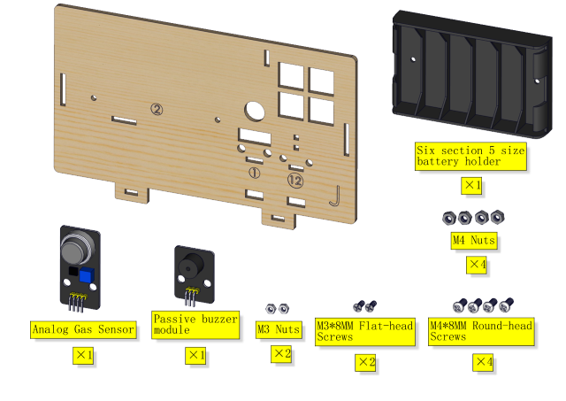

Installation


Prototyp


**Schritt 4**

Benötigte Komponenten


Installationsdiagramm


Prototyp


**Schritt 5**

Benötigte Komponenten


Installationsdiagramm

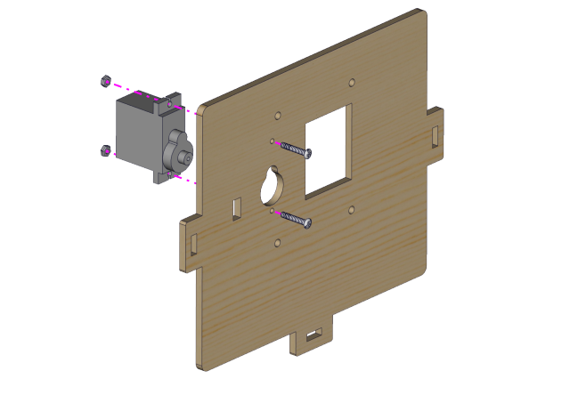

Prototyp


**Schritt 6**
Benötigte Komponenten

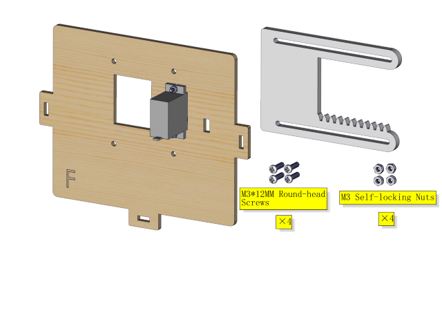

Installation (Ziehen Sie die selbstsichernden Muttern nicht fest)

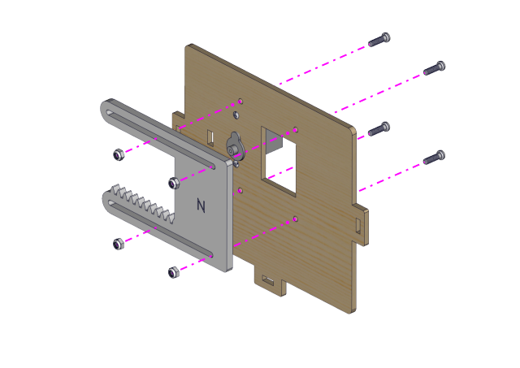

Prototyp

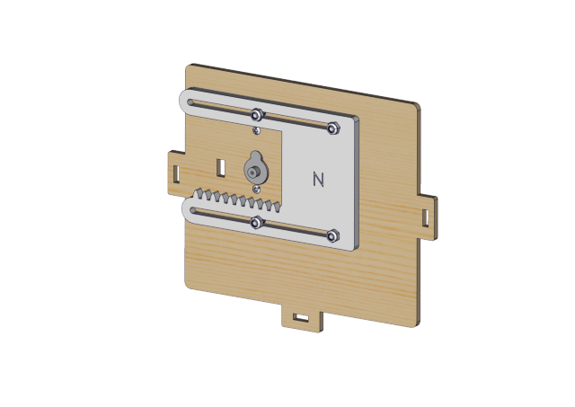

**Schritt 7**

Benötigte Komponenten


⚠️ **Besondere Anmerkung:** Stellen Sie den Fenster-Servo vor der Installation auf 0 Grad ein

| Servo | PCB |
| --- | --- |
| Braunes Kabel | G |
| Rotes Kabel | 5V |
| Oranges Kabel | GPIO5 |

⚠️ **Wichtiger Hinweis:** Die folgenden zwei Methoden können je nach Ihrer Situation frei gewählt werden.

**Methode 1: Arduino-Code**

⚠️ **Besondere Anmerkung:** Bevor Sie den Code schreiben und hochladen, müssen Sie die Arduino IDE installieren. Bitte rufen Sie den Link: `5. Arduino Tutorial <https://docs.keyestudio.com/projects/KS5009/en/latest/docs/Arduino/arduino.html>`__ auf und lesen Sie anschließend den Abschnitt **5.2 Getting started with Arduino**.

Wie erhält man den Code?

Im Ordner **..\\Resource compression package\\arduino Code** öffnen Sie die Datei **Initialization-of-window-servo-angle.ino**, oder kopieren Sie den folgenden Testcode in die Arduino IDE.


```c
#include <ESP32Servo.h>
Servo myservo;
#define servoPin 5

void setup() {
  myservo.attach(servoPin,500,2500);
  myservo.write(0);
  delay(300);
  myservo.write(90);
  delay(300);
  myservo.write(0);
  delay(300);
}

void loop() {
  // put your main code here, to run repeatedly:
}
```
**Methode 2: MicroPython-Code**

⚠️ **Besondere Anmerkung:** Bevor Sie den Code schreiben und hochladen, müssen Sie die MicroPython IDE installieren. Bitte rufen Sie den Link: `6. Python tutorial <https://docs.keyestudio.com/projects/KS5009/en/latest/docs/Python/Python.html>`__ auf und lesen Sie anschließend den Abschnitt **6.2 get starter with Thonny**.

Wie erhält man den Code?

Im Ordner **..\\Resource compression package\\MicroPython Code** öffnen Sie die Datei **Initialization-of-window-servo-angle.py**, oder kopieren Sie den folgenden Testcode in die Thonny IDE.

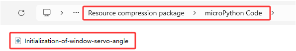

```python
from machine import Pin, PWM
import time
pwm = PWM(Pin(5))
pwm.freq(50)

'''
The duty cycle corresponding to the angle
0°----2.5%----25
45°----5%----51.2
90°----7.5%----77
135°----10%----102.4
180°----12.5%----128
'''
angle_0 = 25
angle_90 = 77
angle_180 = 128

pwm.duty(angle_0)
time.sleep(1)
pwm.duty(angle_90)
time.sleep(1)
pwm.duty(angle_0)
time.sleep(1)

# while True:
```
Nachdem Sie den Winkel des Fenster-Servos auf 0° eingestellt haben, fahren Sie mit der Installation wie im folgenden Bild gezeigt fort)


Installieren Sie M1.4*6MM selbstschneidende Schrauben wie unten gezeigt

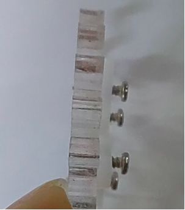

Prototyp


**Schritt 8**

Benötigte Komponenten

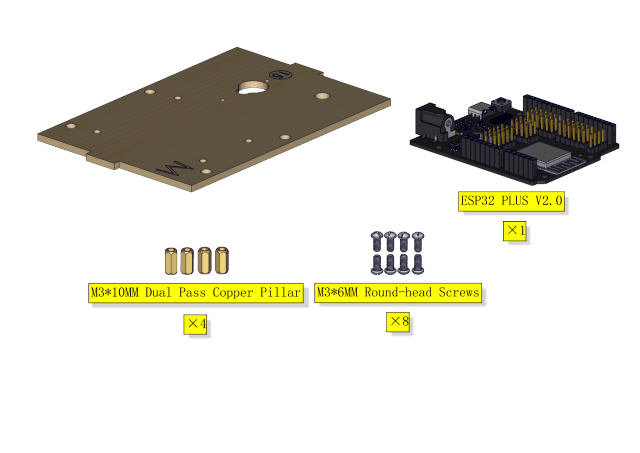

Installationsdiagramm

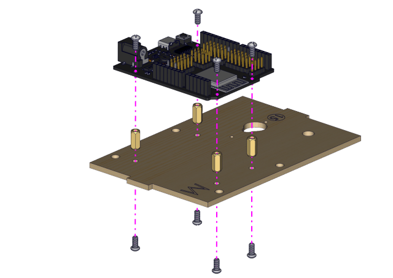

Prototyp

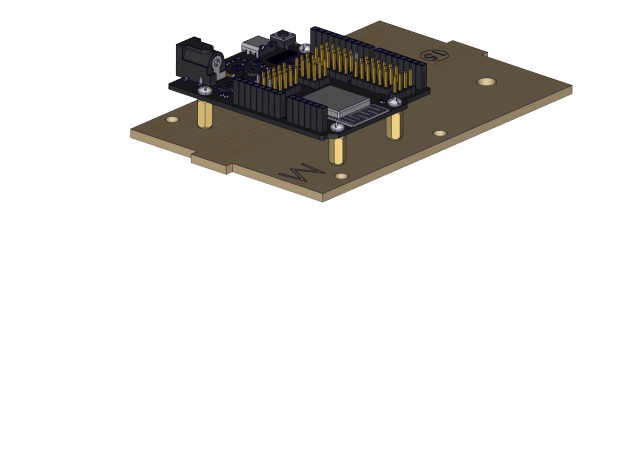

**Schritt 9**

Benötigte Komponenten


Installationsdiagramm

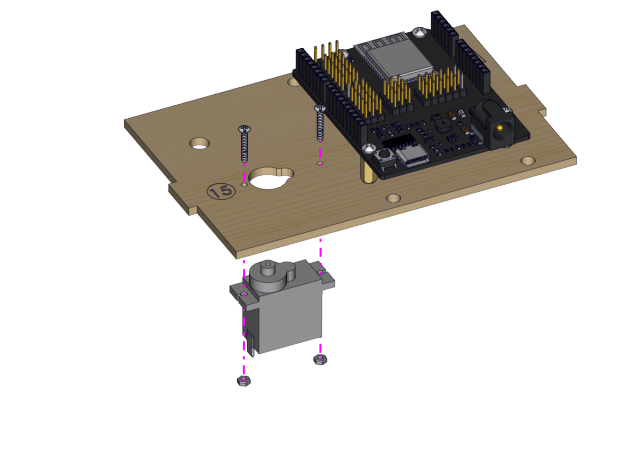

Prototyp

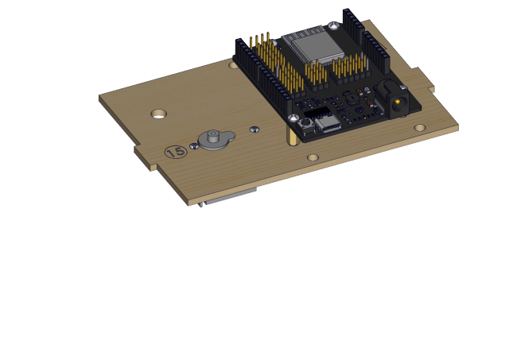

**Schritt 10**
Benötigte Komponenten


Installationsdiagramm

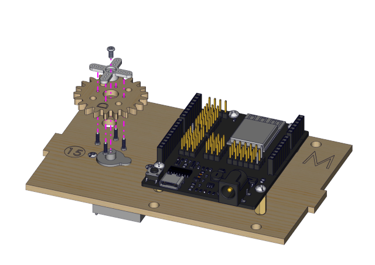

Prototyp


**Schritt 11**

Benötigte Komponenten


Installationsdiagramm


Prototyp

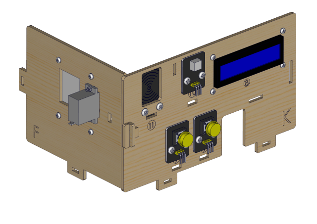

**Schritt 12**

Benötigte Komponenten


Installationsdiagramm


Prototyp

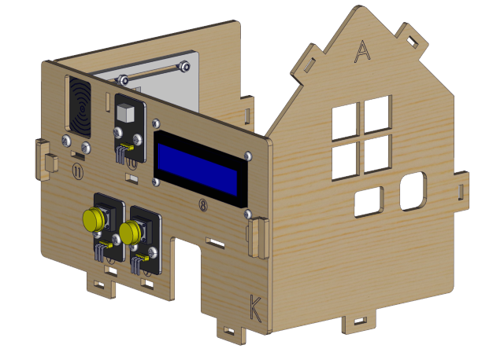

**Schritt 13**

Benötigte Komponenten


Installationsdiagramm

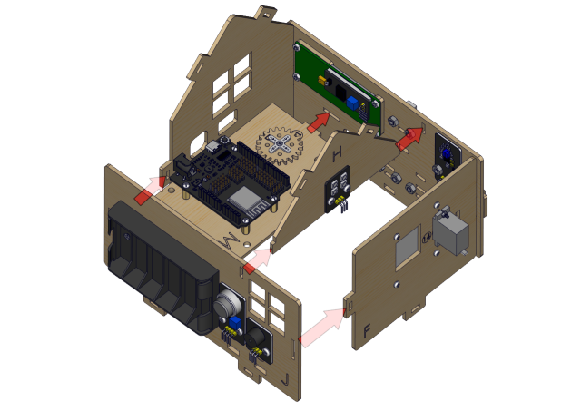

Prototyp

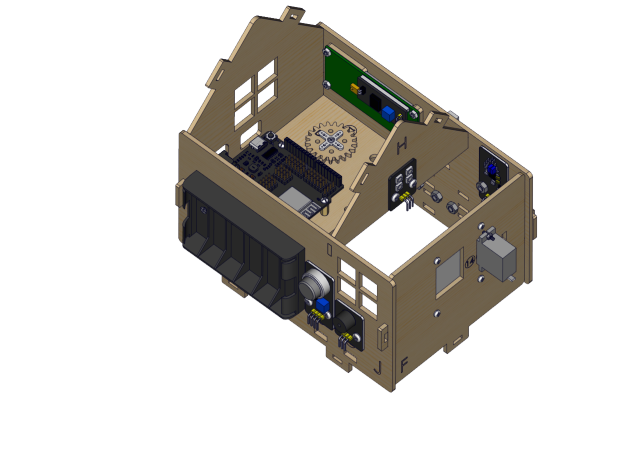

**Schritt 14**

Benötigte Komponenten


Installationsdiagramm

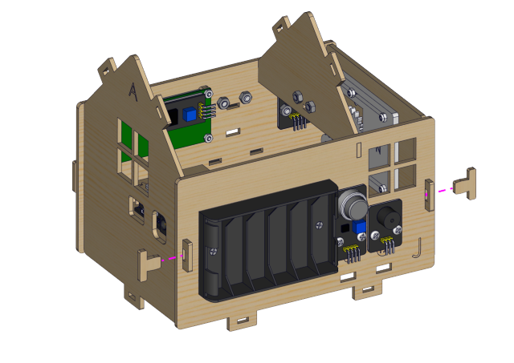

Prototyp

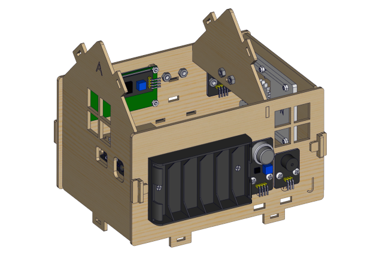

**Schritt 15**

Benötigte Komponenten


Installationsdiagramm

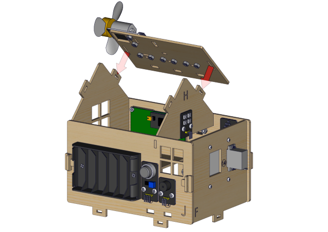

Prototyp

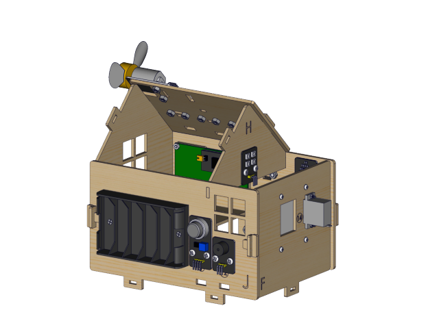

**Schritt 16**

Benötigte Komponenten

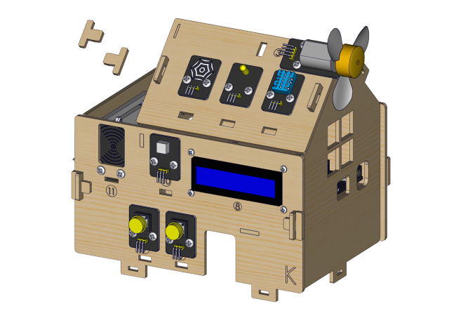

Installationsdiagramm


Prototyp


**Schritt 17**

Benötigte Komponenten


Installationsdiagramm


Prototyp

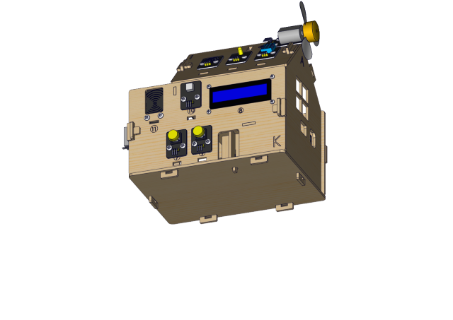

**Schritt 18**

Benötigte Komponenten

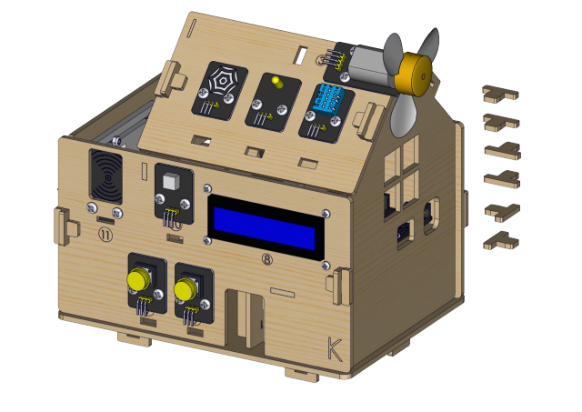

Installationsdiagramm


Prototyp

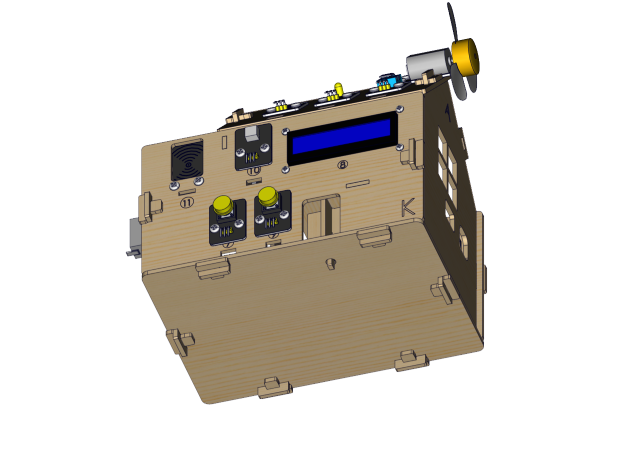

**Schritt 19**

Benötigte Komponenten

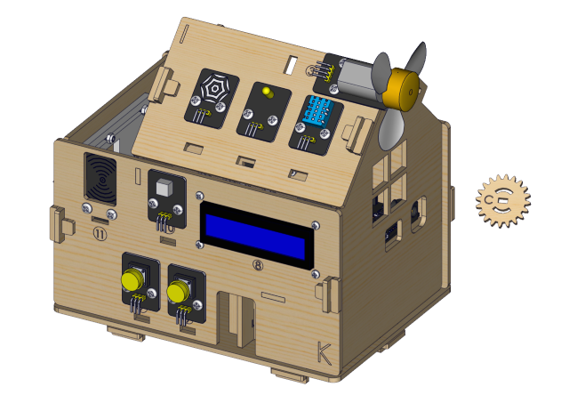

Installationsdiagramm

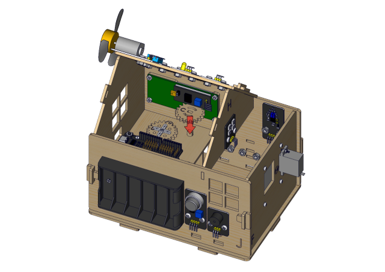

Prototyp


**Verdrahtungsteil**

Temperatur und Luftfeuchtigkeit an io17

3P-Verbindungskabel kurz verwenden: 15cm


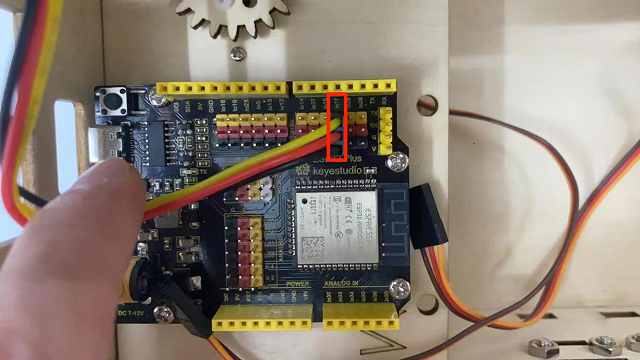

gelbes LED-Modul an io12
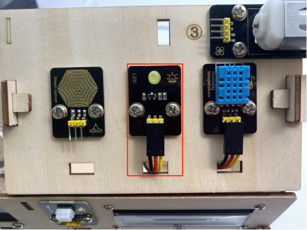

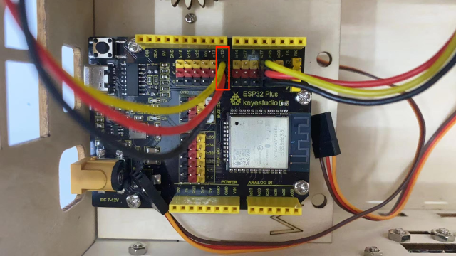

Dampfsensor an io34

3P-Verbindungskabel, kurz: 15cm


Lüfter (IN- an io18，IN+ an io19)

Dupont-Kabel verwendet: 4 Dupont-Kabel verteilt


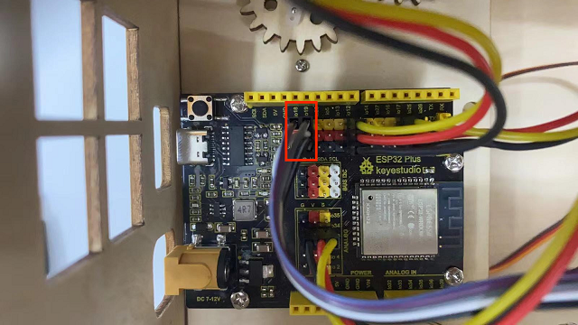

PIR-Bewegungssensor an io14

3P-Verbindungskabel, kurz: 15cm


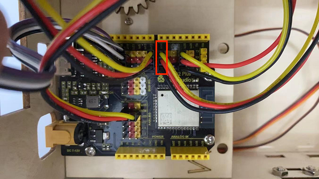

linkes Tastenmodul an io16

3P-Verbindungskabel, lang: 20cm


rechtes Tastenmodul an io27

3P-Verbindungskabel, lang: 20cm


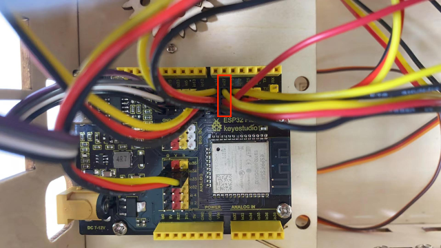

RFID-Modul an die IIC

Die 4P zusammengeführte Leitung

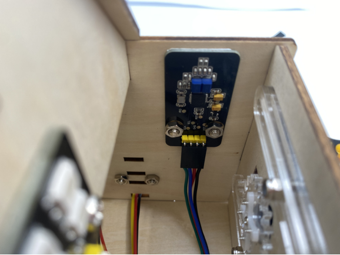


LCD1602-Display an die IIC

Die 4P zusammengeführte Leitung

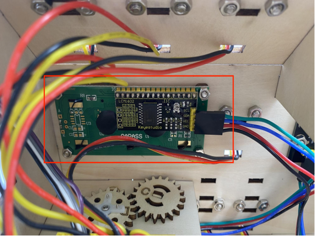

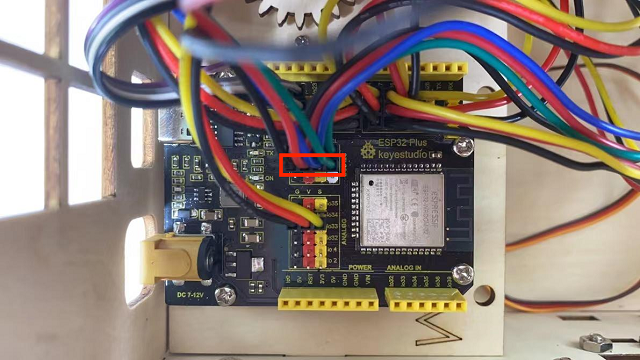

6812RGB-LED an io26

3P-Verbindungskabel, kurz: 15cm


Gassensor an io23

3P-Verbindungskabel, lang: 20cm


Buzzer-Sensor an io25

3P-Verbindungskabel, lang: 20cm


Servo zur Steuerung der Fenster an io5


Servo zur Steuerung der Türen an io13


Stromverkabelung


**Schritt 20**

Benötigte Komponenten


Installationsdiagramm


Prototyp

