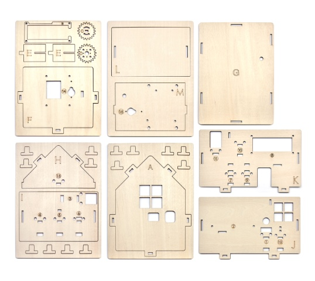
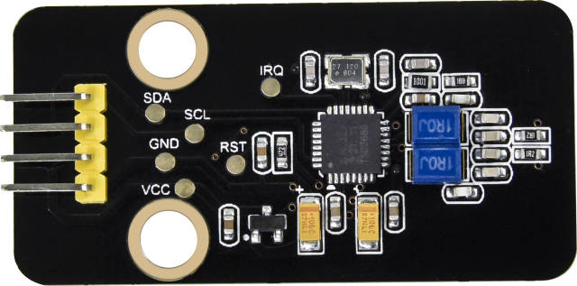
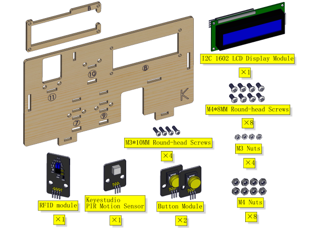
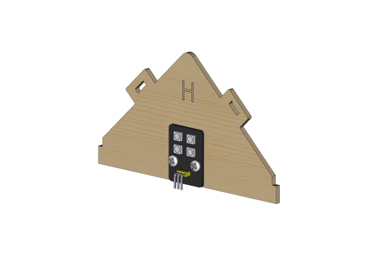
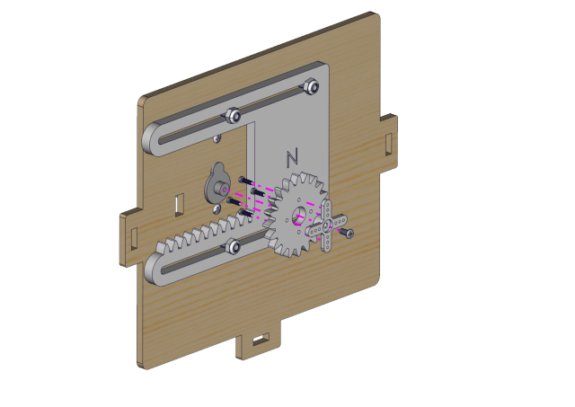
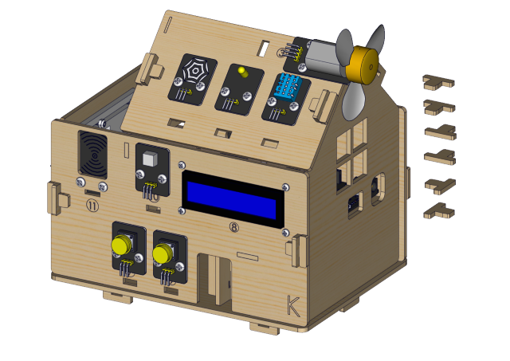
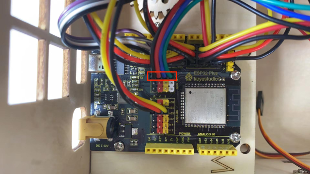
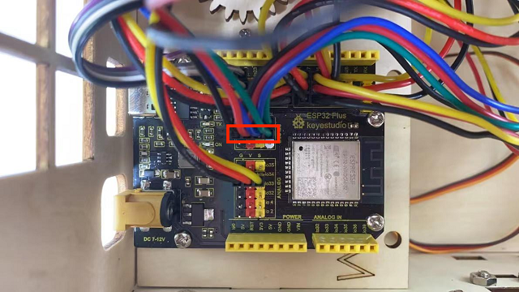
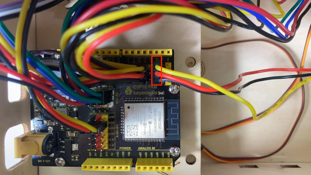
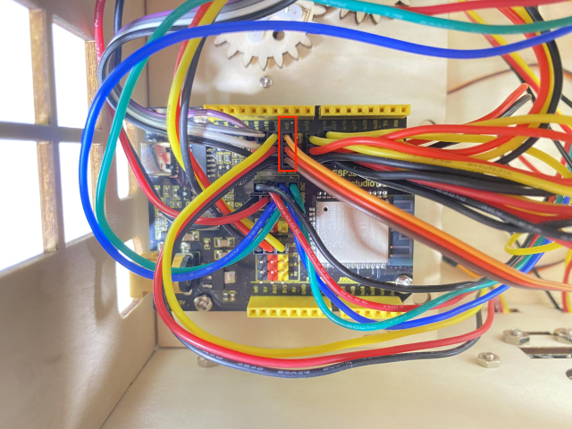

# **Keyestudio IoT Smart Home Kit for ESP32**

# Description

As the rapid development of the Internet grows, various intelligent devices are gradually integrated into our daily life. For example, we can use RFID to open the door. In addition, the kitchen is equipped with a gas detection alarm, which alerts people to the danger when dangerous gas and large smoke are detected. When it detects rain, it can automatically collect clothes and close windows. All kinds of electrical equipment can be controlled by mobile phone, control lights, fans, air conditioning and so on.

In this connection, we seek to launch this smart home product with ESP32 control, which has a host of sensors and modules as well as networking function, making the relevant knowledge of the Internet more accessible to you.

# Features

1.  Elegant appearance
2.  A host of sensor modules
3.  Mobile phone APP network control
4.  Morse password door
5.  It can automatically close windows
6.  RFID function
7.  C language and MicroPython

# Kit list

| \#   | Picture                                          | Name                                  | QTY               |
| ---- | ------------------------------------------------ | ------------------------------------- | ----------------- |
| 1    |  | Wooden Board                          | 1                 |
| 2    |  | Acrylic Board                         | 1                 |
| 3    |  | ESP32 PLUS Development Board          | 1                 |
| 4    |   | 6812 RGB Module                       | 1                 |
| 5    |   | Analog Gas Sensor                     | 1                 |
| 6    |   | Button Module                         | 2                 |
| 7    |   | RFID Module                           | 1                 |
| 8    |   | Passive Buzzer Module                 | 1                 |
| 9    |   | 130 Motor                             | 1                 |
| 10   |   | Steam Sensor                          | 1                 |
| 11   |   | XHT11 Temperature and Humidity Sensor | 1                 |
| 12   |   | PIR Motion Sensor                     | 1                 |
| 13   |   | Yellow LED Module                     | 1                 |
| 14   |   | Servo                                 | 2                 |
| 15   |   | I2C1602 LCD Module                    | 1                 |
| 16   |   | 3P F-F 150 mm Dupont Wire             | 5                 |
| 17   |   | 3P F-F 200 mm Dupont Wire             | 4                 |
| 18   |   | F-F 200 mm /40P/2.54 Wires            | 0.1 （4 strands） |
| 19   |   | 4P F-F 200 mm Splicing Dupont Wire    | 2                 |
| 20   |   | M1.4\*6MM Round Head Screws           | 10                |
| 21   |   | M3 Nickle-plated Nut(self-locking)    | 5                 |
| 22   |   | M4\*8MM Round Head Screws             | 24                |
| 23   |   | M3\*6MM Round Head Screws             | 9                 |
| 24   |   | M3\*10MM Round Head Screws            | 5                 |
| 25   |   | M2\*12MM Round Head Screws            | 5                 |
| 26   |   | M4 Nickle-plated Nut                  | 24                |
| 27   |   | M3 Nickle-plated Nut                  | 7                 |
| 28   |   | M2 Nickle-plated Nut                  | 6                 |
| 29   |   | M3\*8MM Flat Head Screws              | 3                 |
| 30   |  | Cross Wrench                          | 1                 |
| 31   |   | 3.0\*40MM Screwdriver                 | 1                 |
| 32   |   | 2.0\*40MM Screwdriver                 | 1                 |
| 33   |   | M3\*10MM Dual-pass Copper Pillar      | 4                 |
| 34   |   | USB Cable                             | 1                 |
| 35   |   | 6-Slot AA Battery Holder              | 1                 |
| 36   |   | M3\*12MM Round Head Screws            | 4                 |
| 37   |   | White Card                            | 1                 |
| 38   |   | ABS RFID Key                          | 1                 |

# How to install the smart home

 Step 1                                                                                                                     

 Components Required 

              
 Installation Diagram                                          

              
 Prototype                                                     

              
 Step 2                                                                                                                     
 Components Required                                           

              
 Installation Diagram                                          

              
 Prototype                                                     

              
 Step 3                                                                                                                     
 Components Required                                           

              
 Installation                                                  

              
 Prototype                                                     

              
 Step 4                                                                                                                     
 Components Required                                           

              
 Installation Diagram                                          

              
 Prototype                                                     

              
 Step 5                                                                                                                     
 Components Required                                           

              
 Step 1                                                        

              
 Prototype                                                     

              
 Step 6                                                                                                                     
 Components Required                                           

              
 Installation(Don’t tighten the self-locking nuts)             

              
 Prototype                                                     

              
 Step 7                                                                                                                     
 Components Required                                           

              
 Adjust the angle of the servo,adjust servo of the window to 0 degree before installation    
 Installation (As shown in the picture)                        

              
 Prototype                                                     

              
 Step 8                                                                                                                     
 Components Required                                           

              
 Installation Diagram                                          

              
 Prototype                                                     

              
 Step 9                                                                                                                     
 Components Required                                           

              
 Installation Diagram                                          

              
 Prototype                                                     

              
 Step 10                                                                                                                    
 Components Required                                           

              
 Installation Diagram                                          

              
 Prototype                                                     

              
 Step 11                                                                                                                    
 Components Required                                           

              
 Installation Diagram                                          

              
 Prototype                                                     

              
 Step 12                                                                                                                    
 Components Required                                           

              
 Installation Diagram                                          

              
 Prototype                                                     

              
 Step 13                                                                                                                    
 Components Required                                           

              
 Installation Diagram                                          

              
 Prototype                                                     

              
 Step 14                                                                                                                    
 Components Required                                           

              
 Installation Diagram                                          

              
 Prototype                                                    

               
 Step 15                                                                                                                    
 Components Required                                           

              
 Installation Diagram                                          

              
 Prototype                                                     

              
 Step 16                                                                                                                    
 Components Required                                           

              
 Installation Diagram                                          

              
 Prototype                                                     

              
 Step 17                                                                                                                    
 Components Required                                           

              
 Installation Diagram                                          

              
 Prototype                                                    

               
 Step 18                                                                                                                    
 Components Required                                           

              
 Installation Diagram                                         

               
 Prototype                                                     

              
 Step 19                                                                                                                    
 Components Required                                           

              
 Installation Diagram                                         

               
 Prototype                                                     

              
 Wiring Part                                                                                                                
 temperature and humidity  to  io17                            

              
 yellow led module to io12                                     

              
 steam sensor to the io34                                      

              
 fan (IN- to io18，IN+ to io19)                                

              
 PIR motion sensor to the io14                                 

              
 left button module to the io16                                

              
 right button module to the io27                               

              
 RFID module to the IIC                                        

              
 LCD1602 display to the IIC                                    

              
 6812RGB LED to the io26                                       

              
 gas sensor to the io23                                        

              
 buzzer sensor to the io25                                     

              
 servo controlling windows to  io5                             

              
 servo controlling doors to the io13                           

              
 power wiring                                                  

             
 Step 20                                                                                                                    
 Components Required                                           

              
 Installation Diagram                                          

              
 Prototype                                                     

              
