**Keyestudio IoT Smart Home Kit for ESP32**
===========================================

|image1|

.. _1-description:

1. Description
==============

As the rapid development of the Internet grows, various intelligent
devices are gradually integrated into our daily life. For example, we
can use RFID to open the door. In addition, the kitchen is equipped with
a gas detection alarm, which alerts people to the danger when dangerous
gas and large smoke are detected. When it detects rain, it can
automatically collect clothes and close windows. All kinds of electrical
equipment can be controlled by mobile phone, control lights, fans, air
conditioning and so on.

In this connection, we seek to launch this smart home product with ESP32
control, which has a host of sensors and modules as well as networking
function, making the relevant knowledge of the Internet more accessible
to you.

.. _2-features:

2. Features
===========

1. Elegant appearance
2. A host of sensor modules
3. Mobile phone APP network control
4. Morse password door
5. It can automatically close windows
6. RFID function
7. C language and MicroPython

.. _3-kit-list:

3. Kit list
===========

== ========= ===================================== =================
#  Picture   Name                                  QTY
== ========= ===================================== =================
1  |image2|  Wooden Board                          1
2  |image3|  Acrylic Board                         1
3  |image4|  ESP32 PLUS Development Board          1
4  |image5|  6812 RGB Module                       1
5  |image6|  Analog Gas Sensor                     1
6  |image7|  Button Module                         2
7  |image8|  RFID Module                           1
8  |image9|  Passive Buzzer Module                 1
9  |image10| 130 Motor                             1
10 |image11| Steam Sensor                          1
11 |image12| XHT11 Temperature and Humidity Sensor 1
12 |image13| PIR Motion Sensor                     1
13 |image14| Yellow LED Module                     1
14 |image15| Servo                                 2
15 |image16| I2C1602 LCD Module                    1
16 |image17| 3P F-F 150 mm Dupont Wire             5
17 |image18| 3P F-F 200 mm Dupont Wire             4
18 |image19| F-F 200 mm /40P/2.54 Wires            0.1 （4 strands）
19 |image20| 4P F-F 200 mm Splicing Dupont Wire    2
20 |image21| M1.4*6MM Round Head Screws            4
21 |img|     M1.2*4MM Round Head Screws            4
22 |image22| M3 Nickle-plated Nut(self-locking)    5
23 |image23| M4*8MM Round Head Screws              24
24 |image24| M3*6MM Round Head Screws              9
25 |image25| M3*10MM Round Head Screws             5
26 |image26| M2*12MM Round Head Screws             5
27 |image27| M4 Nickle-plated Nut                  24
28 |image28| M3 Nickle-plated Nut                  7
29 |image29| M2 Nickle-plated Nut                  6
30 |image30| M3*8MM Flat Head Screws               3
31 |image31| Cross Wrench                          1
32 |image32| 3.0*40MM Screwdriver                  1
33 |image33| 2.0*40MM Screwdriver                  1
34 |image34| M3*10MM Dual-pass Copper Pillar       4
35 |image35| USB Cable                             1
36 |image36| 6-Slot AA Battery Holder              1
37 |image37| M3*12MM Round Head Screws             4
38 |image38| White Card                            1
39 |image39| ABS RFID Key                          1
== ========= ===================================== =================

.. _4-how-to-install-the-smart-home:

4. How to install the smart home
================================

| **Step1**
| Components Required

|image40|

Installation Diagram

|image41|

Prototype

|image42|

**Step 2**

Components Required

|image43|

Installation Diagram

|image44|

Prototype

|image45|

**Step 3**

Components Required

|image46|

Installation

|image47|

Prototype

|image48|

**Step 4**

Components Required

|image49|

Installation Diagram

|image50|

Prototype

|image51|

**Step 5**

Components Required

|image52|

Installation Diagram

|image53|

Prototype

|image54|

**Step 6**

Components Required

|image55|

Installation(Don’t tighten the self-locking nuts)

|image56|

Prototype

|image57|

**Step 7**

Components Required

|image58|

⚠️ **Special note:** Adjust servo of the window to 0 degree before
installation

=========== =====
Servo       PCB
=========== =====
Brown line  G
Red line    5V
Orange line GPIO5
=========== =====

⚠️ **Especially Remind:** The following two methods can be chosen freely
according to your own situation.

**Method 1：Arduino code**

⚠️ **Special note:** Before you write the code and upload it, you must
install the Arduino IDE, please go to the the link: `5. Arduino
Tutorial <https://docs.keyestudio.com/projects/KS5009/en/latest/docs/Arduino/arduino.html>`__\ ，and
then to see the part of **5.2 Getting started with Arduino** .

How to get the code ?

In folder **..\\Resource compression package\\arduino Code** , open file
**Initialization-of-window-servo-angle.ino** , or copy and paste the
following test code into the Arduino IDE.

|Img|

.. code:: c

   #include <ESP32Servo.h>
   Servo myservo;
   #define servoPin 5

   void setup() {
     myservo.attach(servoPin,500,2500);
     myservo.write(0);
     delay(300);
     myservo.write(90);
     delay(300);
     myservo.write(0);
     delay(300);
   }

   void loop() {
     // put your main code here, to run repeatedly:
   }

**Method 2：MicroPython code**

⚠️ **Special note:** Before you write the code and upload it, you must
install the MicroPython IDE, please go to the the link: `6. Python
tutorial <https://docs.keyestudio.com/projects/KS5009/en/latest/docs/Python/Python.html>`__,
and then to see the part of **6.2 get starter with Thonny** .

How to get the code?

In folder **..\\Resource compression package\\microPython Code** , open
file **Initialization-of-window-servo-angle.py** , or copy and paste the
following test code into the Thonny IDE.

|image59|

.. code:: python

   from machine import Pin, PWM
   import time
   pwm = PWM(Pin(5))  
   pwm.freq(50)

   '''
   The duty cycle corresponding to the angle
   0°----2.5%----25
   45°----5%----51.2
   90°----7.5%----77
   135°----10%----102.4
   180°----12.5%----128
   '''
   angle_0 = 25
   angle_90 = 77
   angle_180 = 128

   pwm.duty(angle_0)
   time.sleep(1)
   pwm.duty(angle_90)
   time.sleep(1)
   pwm.duty(angle_0)
   time.sleep(1)

   # while True:

After adjusting the angle of the window servo to 0°, proceed to install
as shown in the following picture)

|image60|

Install M1.4*6MM self-tapping screws as shown below

|image61|

Prototype

|image62|

**Step 8**

Components Required

|image63|

Installation Diagram

|image64|

Prototype

|image65|

**Step 9**

Components Required

|image66|

Installation Diagram

|image67|

Prototype

|image68|

**Step 10**

Components Required

|image69|

Installation Diagram

|image70|

Prototype

|image71|

**Step 11**

Components Required

|image72|

Installation Diagram

|image73|

Prototype

|image74|

**Step 12**

Components Required

|image75|

Installation Diagram

|image76|

Prototype

|image77|

**Step 13**

Components Required

|image78|

Installation Diagram

|image79|

Prototype

|image80|

**Step 14**

Components Required

|image81|

Installation Diagram

|image82|

Prototype

|image83|

**Step 15**

Components Required

|image84|

Installation Diagram

|image85|

Prototype

|image86|

**Step 16**

Components Required

|image87|

Installation Diagram

|image88|

Prototype

|image89|

**Step 17**

Components Required

|image90|

Installation Diagram

|image91|

Prototype

|image92|

**Step 18**

Components Required

|image93|

Installation Diagram

|image94|

Prototype

|image95|

**Step 19**

Components Required

|image96|

Installation Diagram

|image97|

Prototype

|image98|

**Wiring Part**

temperature and humidity to io17

3P connection line using short: 15cm

|image99|

|image100|

yellow led module to io12

|image101|

|image102|

steam sensor to the io34

3P connection line using short: 15cm

|image103|

|image104|

fan (IN- to io18，IN+ to io19)

Dupont wires used: 4 dupont wires spread out

|image105|

|image106|

PIR motion sensor to the io14

3P connection line using short: 15cm

|image107|

|image108|

left button module to the io16

3P connection line using long wire: 20cm

|image109|

|image110|

right button module to the io27

3P connection line using long wire: 20cm

|image111|

|image112|

RFID module to the IIC

The 4P merged line

|image113|

|image114|

LCD1602 display to the IIC

The 4P merged line

|image115|

|image116|

6812RGB LED to the io26

3P connection line using short: 15cm

|image117|

|image118|

gas sensor to the io23

3P connection line using long wire: 20cm

|image119|

|image120|

buzzer sensor to the io25

3P connection line using long wire: 20cm

|image121|

|image122|

servo controlling windows to io5

|image123|

|image124|

servo controlling doors to the io13

|image125|

|image126|

power wiring

|image127|

**Step 20**

Components Required

|image128|

Installation Diagram

|image129|

Prototype

|image130|

.. |image2| image:: media/Wooden-Board.jpeg

.. |image4| image:: media/ESP32-Board.jpeg

.. |image7| image:: media/Button-Module.png
.. |image8| image:: media/RFID-Module.png
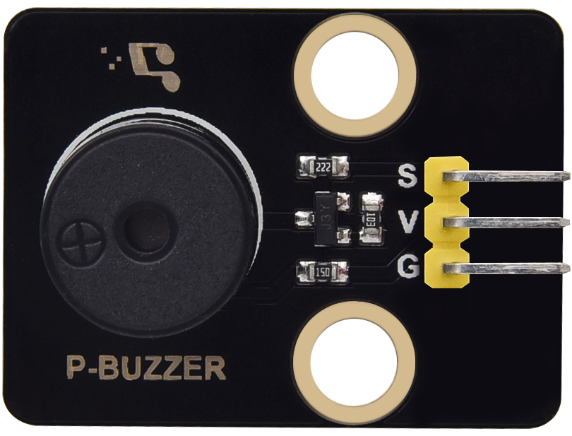
.. |image10| image:: media/Motor.png
.. |image11| image:: media/Steam-Sensor.png
.. |image12| image:: media/XHT11.png
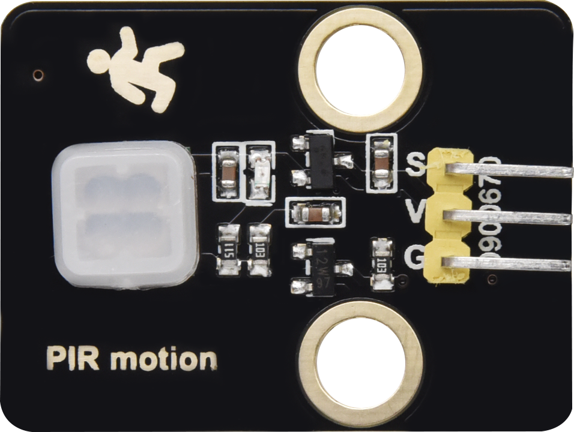
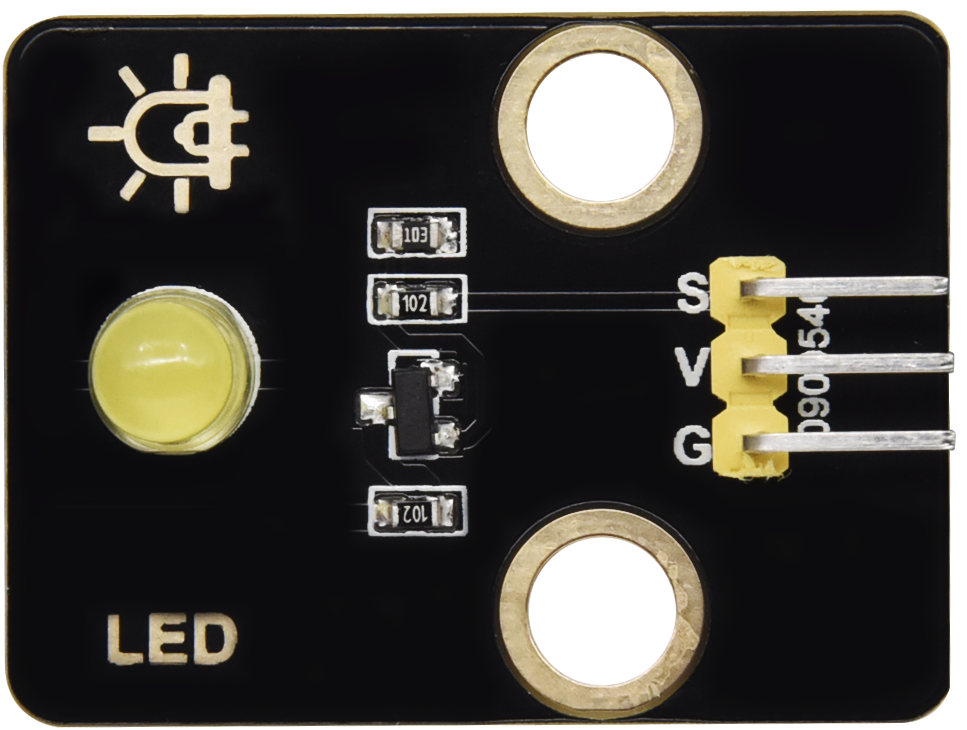
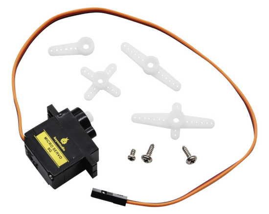
.. |image16| image:: media/I2C1602-LCD.png

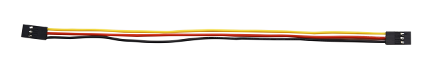
.. |image19| image:: media/F-F-200-mm.png
.. |image20| image:: media/4P-200-mm-Wire.png

.. |img| image:: media/wps1.jpg
.. |image22| image:: media/M3-Nickle-plated.png
.. |image23| image:: media/M4-8MM-Screws.png
.. |image24| image:: media/M3-6MM-Screws.png
.. |image25| image:: media/M3-6MM-Screws.png
.. |image26| image:: media/M3-6MM-Screws.png
.. |image27| image:: media/M4-Nut.png
.. |image28| image:: media/M4-Nut.png
.. |image29| image:: media/M4-Nut.png

.. |image32| image:: media/3.0-40MM-Screwdriver.png
.. |image33| image:: media/2.0-40MM-Screwdriver.png

.. |image36| image:: media/AA-Battery-Holder.png
.. |image37| image:: media/M3-6MM-Screws.png

.. |image40| image:: media/A01.png

.. |image43| image:: media/A04.png
.. |image44| image:: media/A05.png

.. |image46| image:: media/A07.png
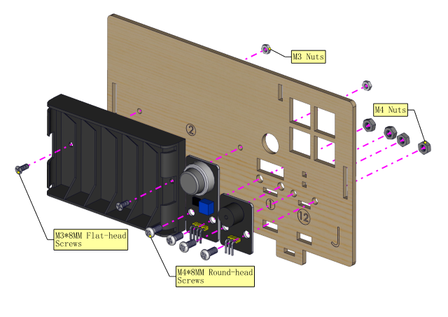

.. |image49| image:: media/A10.png
.. |image50| image:: media/A11.png
.. |image51| image:: media/A12.png
.. |image52| image:: media/A13.png
.. |image53| image:: media/A14.png
.. |image54| image:: media/A15.png

.. |image56| image:: media/A17.png

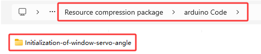
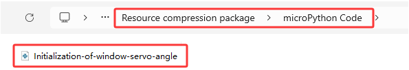

.. |image62| image:: media/A22.png
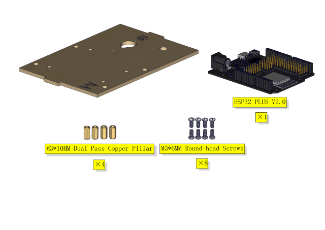
.. |image64| image:: media/A24.png

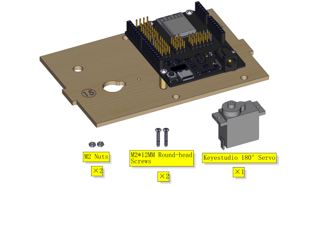

.. |image68| image:: media/A28.png
.. |image69| image:: media/A29.png
.. |image70| image:: media/A30.png
.. |image71| image:: media/A31.png

.. |image73| image:: media/A33.png
.. |image74| image:: media/A34.png
.. |image75| image:: media/A35.png
.. |image76| image:: media/A36.png
.. |image77| image:: media/A37.png
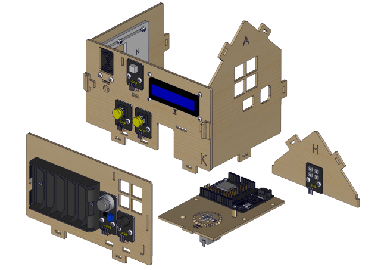
.. |image79| image:: media/A39.png
.. |image80| image:: media/A40.png

.. |image82| image:: media/A43.png

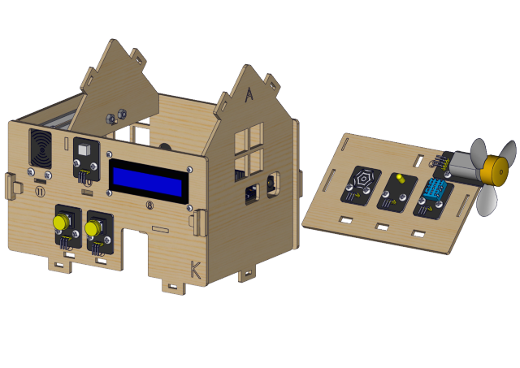
.. |image85| image:: media/A46.png
.. |image86| image:: media/A47.png
.. |image87| image:: media/A48.png
.. |image88| image:: media/A49.png
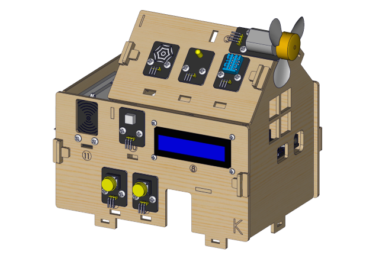
.. |image90| image:: media/A51.png
.. |image91| image:: media/A52.png

.. |image93| image:: media/A54.png
.. |image94| image:: media/A55.png
.. |image95| image:: media/A56.png
.. |image96| image:: media/A57.png
.. |image97| image:: media/A58.png
.. |image98| image:: media/A59.png

.. |image106| image:: media/A63.png

.. |image110| image:: media/A65.png
.. |image111| image:: ./media/A66-1.png
.. |image112| image:: media/A66.png

.. |image114| image:: media/A67.png

.. |image116| image:: media/A68.png

.. |image118| image:: media/A69.png

.. |image120| image:: media/A70.png
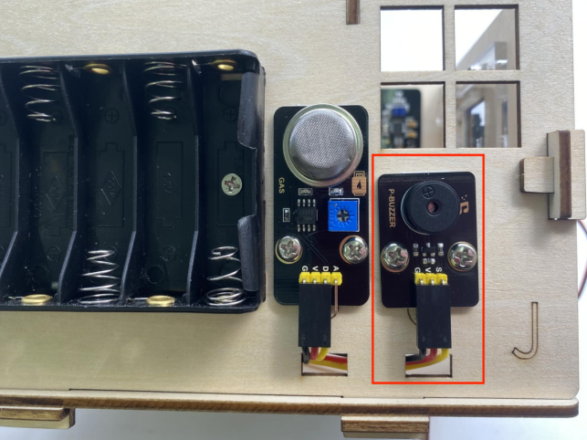
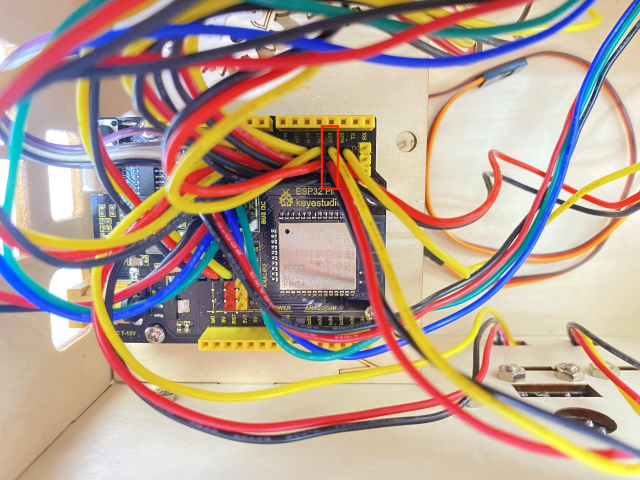

.. |image124| image:: media/A72.png
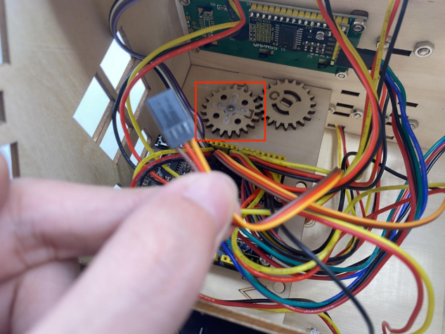
.. |image126| image:: media/A73.png
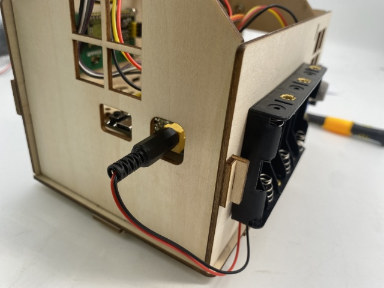

.. |image130| image:: media/A77.png
