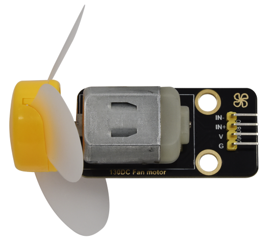
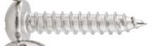
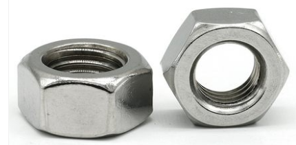
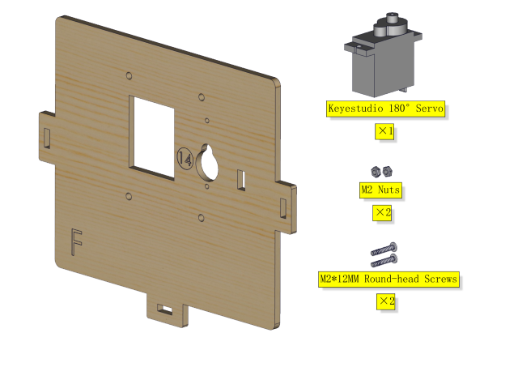
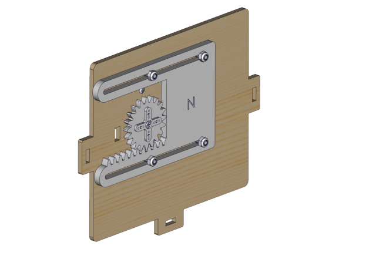
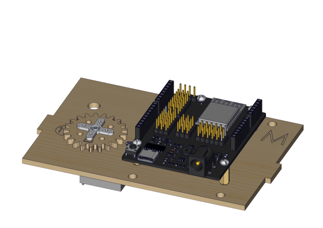
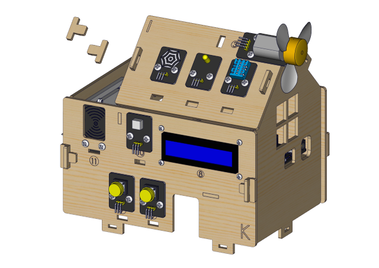

.. _**Keyestudio-IoT-Smart-Home-Kit-for-ESP32**:

**Keyestudio IoT Smart Home Kit for ESP32**
===========================================

.. image:: media/3095ddd50f970bde24971d42e000cbc6.jpeg

.. _1.-Description:

1. Description
==============

As the rapid development of the Internet grows, various intelligent
devices are gradually integrated into our daily life. For example, we
can use RFID to open the door. In addition, the kitchen is equipped with
a gas detection alarm, which alerts people to the danger when dangerous
gas and large smoke are detected. When it detects rain, it can
automatically collect clothes and close windows. All kinds of electrical
equipment can be controlled by mobile phone, control lights, fans, air
conditioning and so on.

In this connection, we seek to launch this smart home product with ESP32
control, which has a host of sensors and modules as well as networking
function, making the relevant knowledge of the Internet more accessible
to you.

.. _2.-Features:

2. Features
===========

#. Elegant appearance
#. A host of sensor modules
#. Mobile phone APP network control
#. Morse password door
#. It can automatically close windows
#. RFID function
#. C language and MicroPython

.. _3.-Kit-list:

3. Kit list
===========

.. container:: table-wrapper

   == ========= ===================================== =================
   #  Picture   Name                                  QTY
   == ========= ===================================== =================
   1  |image1|  Wooden Board                          1
   2  |image2|  Acrylic Board                         1
   3  |image3|  ESP32 PLUS Development Board          1
   4  |image4|  6812 RGB Module                       1
   5  |image5|  Analog Gas Sensor                     1
   6  |image6|  Button Module                         2
   7  |image7|  RFID Module                           1
   8  |image8|  Passive Buzzer Module                 1
   9  |image9|  130 Motor                             1
   10 |image10| Steam Sensor                          1
   11 |image11| XHT11 Temperature and Humidity Sensor 1
   12 |image12| PIR Motion Sensor                     1
   13 |image13| Yellow LED Module                     1
   14 |image14| Servo                                 2
   15 |image15| I2C1602 LCD Module                    1
   16 |image16| 3P F-F 150 mm Dupont Wire             5
   17 |image17| 3P F-F 200 mm Dupont Wire             4
   18 |image18| F-F 200 mm /40P/2.54 Wires            0.1 （4 strands）
   19 |image19| 4P F-F 200 mm Splicing Dupont Wire    2
   20 |image20| M1.4*6MM Round Head Screws            4
   21 |img|     M1.2*4MM Round Head Screws            4
   22 |image21| M3 Nickle-plated Nut(self-locking)    5
   23 |image22| M4*8MM Round Head Screws              24
   24 |image23| M3*6MM Round Head Screws              9
   25 |image24| M3*10MM Round Head Screws             5
   26 |image25| M2*12MM Round Head Screws             5
   27 |image26| M4 Nickle-plated Nut                  24
   28 |image27| M3 Nickle-plated Nut                  7
   29 |image28| M2 Nickle-plated Nut                  6
   30 |image29| M3*8MM Flat Head Screws               3
   31 |image30| Cross Wrench                          1
   32 |image31| 3.0*40MM Screwdriver                  1
   33 |image32| 2.0*40MM Screwdriver                  1
   34 |image33| M3*10MM Dual-pass Copper Pillar       4
   35 |image34| USB Cable                             1
   36 |image35| 6-Slot AA Battery Holder              1
   37 |image36| M3*12MM Round Head Screws             4
   38 |image37| White Card                            1
   39 |image38| ABS RFID Key                          1
   == ========= ===================================== =================

.. _4.-How-to-install-the-smart-home:

4. How to install the smart home
================================

Step 1

Components Required

| |image39|
| Installation Diagram

| |image40|
| Prototype

| |image41|
| Step 2
| Components Required

| |image42|
| Installation Diagram

| |image43|
| Prototype

| |image44|
| Step 3
| Components Required

| |image45|
| Installation

| |image46|
| Prototype

| |image47|
| Step 4
| Components Required

| |image48|
| Installation Diagram

| |image49|
| Prototype

| |image50|
| Step 5
| Components Required

| |image51|
| Installation Diagram

| |image52|
| Prototype

| |image53|
| Step 6
| Components Required

| |image54|
| Installation(Don’t tighten the self-locking nuts)

| |image55|
| Prototype

| |image56|
| Step 7
| Components Required

| |image57|
| Adjust the angle of the servo,adjust servo of the window to 0 degree
  before installation
| Installation (As shown in the picture)

.. image:: media/wps1-17473763871941.jpg
   :alt: img

Install M1.4*6MM self-tapping screws as shown below

| |image58|
| Prototype

| |image59|
| Step 8
| Components Required

| |image60|
| Installation Diagram

| |image61|
| Prototype

| |image62|
| Step 9
| Components Required

| |image63|
| Installation Diagram

| |image64|
| Prototype

| |image65|
| Step 10
| Components Required

| |image66|
| Installation Diagram

| |image67|
| Prototype

| |image68|
| Step 11
| Components Required

| |image69|
| Installation Diagram

| |image70|
| Prototype

| |image71|
| Step 12
| Components Required

| |image72|
| Installation Diagram

| |image73|
| Prototype

| |image74|
| Step 13
| Components Required

| |image75|
| Installation Diagram

| |image76|
| Prototype

| |image77|
| Step 14
| Components Required

| |image78|
| Installation Diagram

| |image79|
| Prototype

| |image80|
| Step 15
| Components Required

| |image81|
| Installation Diagram

| |image82|
| Prototype

| |image83|
| Step 16
| Components Required

| |image84|
| Installation Diagram

| |image85|
| Prototype

| |image86|
| Step 17
| Components Required

| |image87|
| Installation Diagram

| |image88|
| Prototype

| |image89|
| Step 18
| Components Required

| |image90|
| Installation Diagram

| |image91|
| Prototype

| |image92|
| Step 19
| Components Required

| |image93|
| Installation Diagram

| |image94|
| Prototype

| |image95|
| Wiring Part
| temperature and humidity to io17

| |image96|
| yellow led module to io12

| |image97|
| steam sensor to the io34

| |image98|
| fan (IN- to io18，IN+ to io19)

| |image99|
| PIR motion sensor to the io14

| |image100|
| left button module to the io16

| |image101|
| right button module to the io27

| |image102|
| RFID module to the IIC

| |image103|
| LCD1602 display to the IIC

| |image104|
| 6812RGB LED to the io26

| |image105|
| gas sensor to the io23

| |image106|
| buzzer sensor to the io25

| |image107|
| servo controlling windows to io5

| |image108|
| servo controlling doors to the io13

| |image109|
| power wiring

| |image110|
| Step 20
| Components Required

| |image111|
| Installation Diagram

| |image112|
| Prototype

.. |image1| image:: media/b560f7be0ce2c2d7534576d950528260.jpeg
.. |image2| image:: media/74a3a377c2bcfed83365320e364fd482.jpeg
.. |image3| image:: media/1a7d4155e125e37cd0dcb90dbc91ec5c.jpeg
.. |image4| image:: media/3a6b4ad25421aaa86fa120bea64cf6eb.png
.. |image5| image:: media/2b0ca5300e76049aca5cc4eff15633f0.png
.. |image6| image:: media/1f9f1fc55c50387418fbca20eb2ada99.png
.. |image7| image:: media/0016b6f83c18cda6804a1ef58c4300b2.png
.. |image8| image:: media/b5c96bec0fabc393395428791ae81358.png

.. |image10| image:: media/90bec429f8b84d8446c5107a86c0a0da.png

.. |image12| image:: media/63b47a2f4ef533a41a14d65d490cad06.png
.. |image13| image:: media/80b8e979df120788f2c56ffa0801e974.png
.. |image14| image:: media/78bcbf50389079a2b773538794e925cd.png
.. |image15| image:: media/9e333cb91eb0e585e50e21c6eb31aaca.png
.. |image16| image:: media/a6f94cd448d58a53f41b2a1fa2204863.png
.. |image17| image:: media/6fc873ea0e2d30ef6c65c48192777b2c.png
.. |image18| image:: media/8d8d7ecea527ea96266c5a30a23adc49.png
.. |image19| image:: media/4de60c3b32470ba75de2c6d2b39dfabb.png

.. |image21| image:: media/2921490c73e7ec456e68d03f26cd638d.png
.. |image22| image:: media/90f262e52991756983f29416b65889de.png
.. |image23| image:: media/de8991dc2b94e7a9a01e24239cf77500.png
.. |image24| image:: media/90f262e52991756983f29416b65889de.png
.. |image25| image:: media/90f262e52991756983f29416b65889de.png

.. |image29| image:: media/2991c80d0f141474a234a1b915866506.png
.. |image30| image:: media/e8e1c04d2c03b995842b0bd92e2fdf72.jpeg
.. |image31| image:: media/f353b46e6c2c0597c3268d5aa137fd99.png
.. |image32| image:: media/aa12dd0fe16e3f122e1822f671b3c0c7.png
.. |image33| image:: media/71338bc1f531d68fa7747582b8f2b073.png
.. |image34| image:: media/a2785e36ab41cea44f41ddf2d87c8ead.png
.. |image35| image:: media/119770f24627eed3c13c3008eb926888.png
.. |image36| image:: media/90f262e52991756983f29416b65889de.png
.. |image37| image:: media/ac4d8bcad35658ce6ec738d4aaa555c7.png
.. |image38| image:: media/cfc5265d05b7b1cd89f9853bca223fb3.png
.. |image39| image:: media/8dd604409369919ccf6f88ce6b4f8ef4.png
.. |image40| image:: media/5635e47e50d2d3c59396f0493248fbe1.png
.. |image41| image:: media/3c6f079bf7c6d4b6467d75683c2ab6e0.png
.. |image42| image:: media/40193f8b74566b51329f60c7af843380.png
.. |image43| image:: media/deb26849635d49c3f6a3d650d335e1ba.png
.. |image44| image:: media/1dd06d0e20d6e82c3d40de86499595ec.png

.. |image46| image:: media/f99d8208a13cb6ec7b37d92ea6bf44d4.png
.. |image47| image:: media/3e41a27e6450b4b465ce6adf7442e981.png
.. |image48| image:: media/dc3d7d2ad06a95ff0073cca27257d8ba.png
.. |image49| image:: media/89102eccb6e6074de12c1887f869d710.png
.. |image50| image:: media/3cb7b1cad3e2d2f4c4b5444d9d660c7e.png

.. |image52| image:: media/4e0d6c06490d59a969ab4991098918e1.png
.. |image53| image:: media/71080dc63e65195e7dc28d94f3041319.png
.. |image54| image:: media/d4f07269d100e0f46851252e28ba8383.png
.. |image55| image:: media/553ac0654da4c14ad9b958ac16c46ccd.png
.. |image56| image:: media/60e168e21936ccdd39883ec5259a5dcf.png
.. |image57| image:: media/4842582f892bcb0ab270554ca1487c42.png
.. |image58| image:: media/wps2.jpg

.. |image60| image:: media/d2a9dbb7352038e6c8d06037d8479849.png
.. |image61| image:: media/56e79d6d0d0bbe904516a0dff5e0b065.png
.. |image62| image:: media/4ded3da1546a1a96288a013fe3b50cd6.png
.. |image63| image:: media/3615bf486cb4295bf7c35119a2cb531c.png
.. |image64| image:: media/8cc78358bed8e02d11207bb843c37294.png

.. |image66| image:: media/be5af4990413c71bbecf8ceee1e36890.png

.. |image69| image:: media/61a63240fef3eeab555697282a45e5aa.png
.. |image70| image:: media/28962cc5cc630fdcde317015db012493.png
.. |image71| image:: media/0adad38a8057430d3079a1a8b83b6aa0.png

.. |image73| image:: media/1b66b8276b5bf2ddb2c0250b7747a680.png

.. |image75| image:: media/99e6ac3da48de02825ea132ce16f0d65.png
.. |image76| image:: media/6de404a9bf8bcf588d797bfc8aad25c3.png

.. |image78| image:: media/e9e83216afd5f55d907f3814e434bdff.png
.. |image79| image:: media/a918ecc2c9abb3cbbce1fe32b45a7aae.png
.. |image80| image:: media/5d6482b761491738bbce0362dbef31e9.png
.. |image81| image:: media/2c4a8d81449ce6c6a294c9535bd7244b.png

.. |image83| image:: media/988ca4ff3040d709012588dcb3b2c2d5.png

.. |image86| image:: media/718bb1c9b50fb5ac328ab74a1114c0f7.png
.. |image87| image:: media/d5d400670d0d36caa3a08cb59e0a8892.png
.. |image88| image:: media/2a8634f2a50fb7bf1ef20e1949378e3c.png
.. |image89| image:: media/df39c9789513ea5e13043cfaa1e687c3.png
.. |image90| image:: media/f9ae11d160ca4fa1ab7a517bf538036b.png
.. |image91| image:: media/e50de39b9c9805b808933b266458eed4.png

.. |image94| image:: media/9637cad77c563081c78bd014920d44d8.png
.. |image95| image:: media/85f68b8b0880c6834105a23c21c3ba00.png
.. |image96| image:: media/b20fffd8e6d99fdea58ac47ab4b339a5.png
.. |image97| image:: media/8f254931280578d7829b16344a9e2bda.png
.. |image98| image:: media/db35422182a8b02ed371bcecbf4640b8.png

.. |image100| image:: media/6572ce6a6ddfc8bf17945fc71897d9fb.png

.. |image103| image:: media/142fd5fdd102aa25eb3f8406e257ccaf.png
.. |image104| image:: media/518e6c496b5c22b7d4b0c4de40acc80e.png
.. |image105| image:: media/4edea8aa5ff83d17fa8cab9173760c12.png
.. |image106| image:: media/ed22723361dc2dc2bc0eb6b80c36ce28.png
.. |image107| image:: media/77e7f24ef8d39732a6ae6a9150e86243.png
.. |image108| image:: media/4f4c7f0ea162c7de24f1263dafad9075.png
.. |image109| image:: media/c6334d6486a50808300936aef00a55e8.png
.. |image110| image:: media/66217ef904b5256055eb20b2f8c95678.jpeg
.. |image111| image:: media/981c1d00ec6ffa26832828c3bb50cff2.png
.. |image112| image:: media/103f079c5a1bbdee286d00e98463fe89.png
